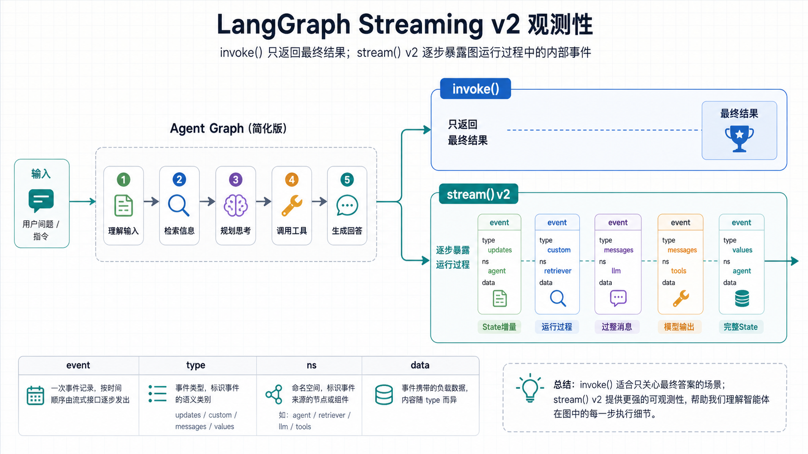

# 用LangGraph Streaming v2来看清graph内部在搞什么

以前写LangGraph时，经常用invoke()

```python
result = graph.invoke(input_state)
```

invoke就是等把图跑完，然后把最终结果一次性给出来。

但Agent Graph一旦变复杂了，那只看最终结果还不够，最好还需要知道下面的这些东西：

- 它先跑了哪个节点？
- 哪个节点改了啥状态？
- 模型什么时候开始输出？
- 中间有没有卡住？
- 为什么最后得到这个答案？

用LangGraph Streaming的价值就在这：**不只看结果，还要看见图运行过程。**

---

## 1. stream返回的是事件流

stream()边跑边吐事件

```python
for event in graph.stream(
    input_state,
    stream_mode="updates",
    version="v2",
):
    print(event)
```

注意：

```text
graph.stream(...) 返回的是事件流，for循环里的每一条event都是一个事件。
```

---

## 2. 为什么推荐version="v2"

Streaming建议显式写：version="v2"

v2的作用是统一事件格式。每条事件大致长这样：

```python
{
    "type": "updates",
    "ns": (),
    "data": {...},
}
```

旧格式的问题是：单个stream_mode和多个stream_mode时，返回结构可能不一样。单个mode可能直接返回数据，多个mode可能返回元组：

```text
旧格式：{"node_a": {"status": "done"}}
旧格式：("updates", {"node_a": {"status": "done"}})
v2：{"type": "updates", "ns": (), "data": {"node_a": {"status": "done"}}}
```

所以后面只需要看：

```python
event["type"]
event["data"]
```

这就是v2最实用的地方：开几个mode，解析方式都一样，不用懵逼。



---

逐一看一下stream_mode的4个模式都是什么玩意

## 3. updates：看节点写回了什么

LangGraph的节点通常会返回一段State更新：

```python
def check_payment(state):
    return {"payment_status": "paid"}
```

开启updates后，就能看到这个节点return回了什么，return了什么，就是updates的功效

```python
stream_mode="updates"
```

```python
{
    "type": "updates",
    "data": {
        "check_payment": {
            "payment_status": "paid"
        }
    }
}
```

---

## 4. custom：节点主动发过程消息

有些信息不适合写进State，但你又想在运行时看到，比如：

- 正在读取数据
- 正在调用工具
- 正在生成报告


这类信息可以用custom。节点里用get_stream_writer()来配合者发事件：

```python
from langgraph.config import get_stream_writer


def run_task(state):
    writer = get_stream_writer()
    writer({"message": "正在处理"})

    return {"status": "done"}
```

外层订阅custom：

```python
for event in graph.stream(
    input_state,
    stream_mode="custom",
    version="v2",
):
    print(event["data"])
```

看清他俩的边界：

```text
writer({...}) 发custom事件，不写State。
return {...} 写State，产生updates事件。
```

如果同时开启`stream_mode=["custom", "updates"]`，同一个节点就可能同时产生：

```text
custom：正在处理
updates：status = done
```

---

## 5. messages：看模型逐token输出

如果某个节点**调用了聊天模型**，可以用messages看模型流式输出：

```python
for event in graph.stream(
    input_state,
    stream_mode="messages",
    version="v2",
):
    chunk, metadata = event["data"]
    print(chunk.content, end="")
```

messages的data通常包含两部分：

```text
message_chunk：模型输出片段
metadata：这段输出来自哪个节点、哪一步
```

---

## 6. values：看完整State

updates只看增量，values看每一步之后的完整State。

```python
for event in graph.stream(
    input_state,
    stream_mode="values",
    version="v2",
):
    print(event["data"])
```

简单区分：

```text
updates：看节点刚刚改了什么。
values：看当前node完整状态是什么。
```

values输出更多，但适合排查状态是否被覆盖、遗漏或污染。

---

## 7. 多个mode可以一起开

实际调试时，经常需要同时看多种事件：

```python
for event in graph.stream(
    input_state,
    stream_mode=["custom", "updates", "messages"],
    version="v2",
):
    if event["type"] == "custom":
        print("进度：", event["data"])
    elif event["type"] == "updates":
        print("状态：", event["data"])
    elif event["type"] == "messages":
        chunk, _ = event["data"]
        print(chunk.content, end="")
```

这也是v2有用的地方：不管开几个mode，都按type/ns/data这套结构处理。

---
搞清下面几个概念和对应的效果：

- invoke：只看最终结果
- stream：看运行过程
- version="v2"：统一事件格式
- updates：看State增量
- custom：看过程消息
- messages：看模型输出
- values：看完整State

---

```text
GitHub 仓库：
https://github.com/yauld/ai-forge

完整实验文章：
labs/langgraph/foundations/18 | LangGraph Streaming：用 v2 格式看见图每一步怎么跑.ipynb
```
