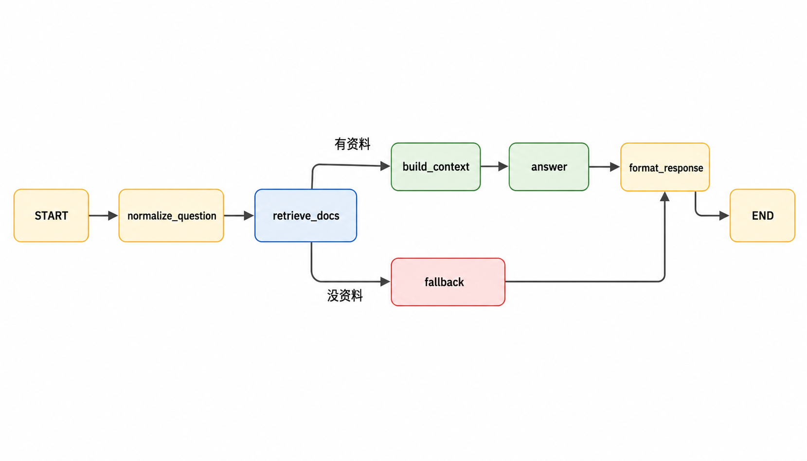
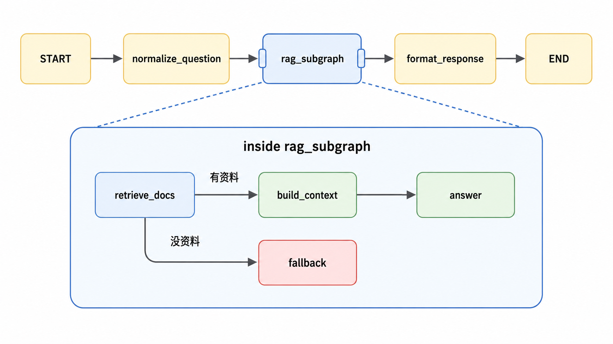

# 11 | LangGraph子图：别把复杂Agent全塞进一张图

上一篇演示了把最小RAG接进了LangGraph。

（上集回顾：用LangGraph写一个小RAG）

这篇把RAG这段相对完整、内部稳定的流程，拆出来

封装成父图里的一个子图来使用，看看效果。

## 1. 父图和子图
封装成子图【前】的结构



封装成子图【后】的结构




rag_subgraph只是一张子图，逻辑还是之前那些逻辑，只是它被父图当成一个节点来使用了。

分成上下两层看

```text
上层是父图：
START -> normalize_question -> rag_subgraph -> format_response -> END

下层是rag_subgraph内部：
retrieve_docs（有资料） -> build_context -> answer
retrieve_docs（没资料） -> fallback
```

- 父图视角：rag_subgraph是一个节点

- 展开视角：rag_subgraph内部仍然是一张图

## 2. 子图怎么写

先要单独构建子图：

```python
def build_rag_subgraph():
    builder = StateGraph(RagState, context_schema=RagContext)

    builder.add_node("retrieve_docs", retrieve_docs)
    builder.add_node("build_context", build_context)
    builder.add_node("answer", answer)
    builder.add_node("fallback", fallback)

    builder.add_edge(START, "retrieve_docs")
    builder.add_conditional_edges(
        "retrieve_docs",
        route_after_retrieve,
        {"build_context": "build_context", "fallback": "fallback"},
    )
    builder.add_edge("build_context", "answer")
    builder.add_edge("fallback", END)

    return builder.compile(name="rag_subgraph")
```

父图里把编译后的子图当节点加入，再正常接边

```python
rag_subgraph = build_rag_subgraph()

builder.add_node("rag_subgraph", rag_subgraph)

builder.add_edge("normalize_question", "rag_subgraph")
builder.add_edge("rag_subgraph", "format_response")
```

核心就三句话

```text
1、子图先compile
2、父图add_node时把编译后的子图加进去
3、父图正常给它接边
```

这里面有几个重要的点也需要知道下：state、namespace和checkpoint。

## 3. State负责传数据

父图和子图会共用同一份State。数据流是

1、父图写入normalized_question

2、子图读取normalized_question

3、子图写入retrieved_docs、context、route、answer

4、父图读取这些结果，写入final_response

父图和子图能共享数据，是因为它们共用同一个State结构，不是因为checkpoint。

checkpoint只是保存State快照，这个点很容易被误解，要分清。

## 4. namespace负责标识层级

运行时要知道一件事：

```text
当前节点是在父图里跑，还是在子图里跑？
```

namespace就是这个层级标记。

```text
父图节点：namespace为空
子图内部节点：namespace类似rag_subgraph:xxx
```

上面的“rag_subgraph”这个名字是我们自己可以定义的节点名，在add node时候可以指定的

```python
builder.add_node("rag_subgraph", rag_subgraph)
```

## 5. checkpoint负责存快照

checkpoint是State的快照，开启checkpointer后，LangGraph会保存运行过程中的State，方便之后查看、恢复和调试

```python
checkpointer = InMemorySaver()
graph = build_parent_graph(checkpointer)
```

通过这个特性，父图和子图内部都可以留下了State快照。

知道【checkpoint namespace不是用来共享State的，而是告诉你这份快照属于父图还是子图的】就可以。

## 6. 一般什么情况下该拆成子图

适合拆子图的情况：

```
一组节点有共同目标；父图只关心输入和输出；内部已经有分支、fallback或多步状态更新；未来可能复用。
```

如果业务只有一两个简单节点，或者拆完以后字段交接更难懂，别硬拆。

子图的价值不是让代码看起来多牛逼，而是让复杂Agent有层次感。

---

```text
GitHub仓库：
https://github.com/yauld/ai-forge

完整实验文章：
labs/langgraph/foundations/25 | LangGraph 子图：把复杂 Agent 拆成模块.md

实验代码：
labs/langgraph/foundations/experiments/25_rag_subgraph_checkpoint/
```