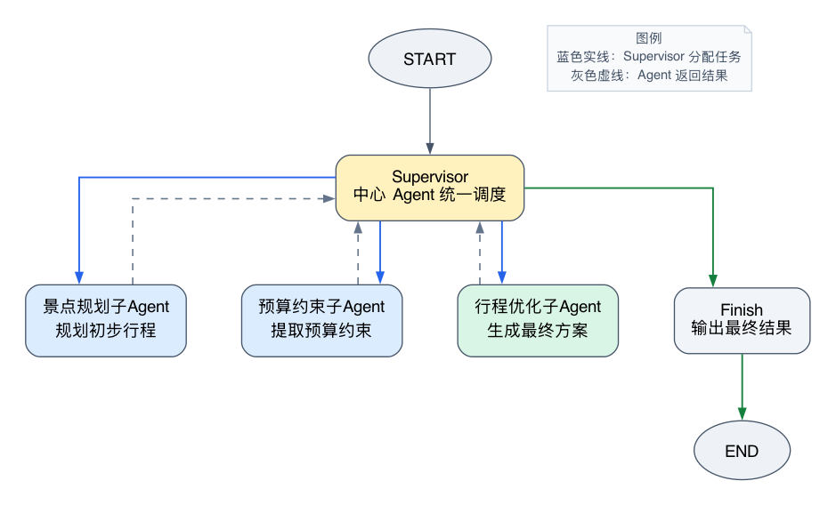
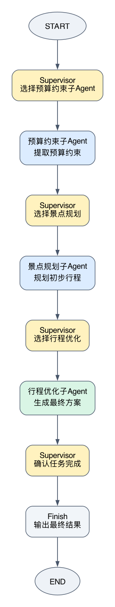

# LangGraph Supervisor 之 Multi-Agent

多Agent协同处理的ai应用怎么个实现原理，浅浅的一探究竟。

至少要有2种类型的Agent：

1、一个Supervisor Agent
```
负责全局调度：看当前State、判断哪些子Agent已经完成、决定下一步再调用哪个agent、什么时候整个图应该结束，等等。
```

2、N个专业子Agent
```
每个子Agent只处理自己擅长的一块逻辑任务，处理完了就把结果交回给Supervisor，由Supervisor再决定下一步怎么做。
```

这两种agent之间的控制权关系类似：
```
Supervisor -> 子Agent
子Agent完成工作 -> Supervisor
Supervisor -> 下一个子Agent
```

---

用一个旅游规划的多agnet示例来演示

用户问题：

> 想带家人去云南旅行5天，预算10000元，希望行程轻松一些，适合老人。

这个需求里，除了要有一个Supervisor Agent外，还会被拆成三个子Agent：

```text
景点规划 子Agent：规划初步景点和每日行程
预算约束 子Agent：只提取预算、节奏和舒适度约束，不计算实际费用
行程优化 子Agent：综合前两个agent给出的结果，生成最终方案
```

逻辑图大致类似这样



## 1. 先瞥一眼需求示例的完整的控制流

```
用户需求
  ↓
写入初始TravelState（一份大家共用的"工作表"，下一节详细讲）
  ↓
Supervisor读取当前State
  ↓
程序先圈定"现在能做的事有哪几件"（也就是"合法候选"的子Agent有哪些），
模型只能在这几件里选一个作为next_step需要用的专业子Agent
  ↓
条件边路由到被选中的专业子Agent
  ↓
子Agent调用模型，完成他自己的任务，生成结构化结果
  ↓
子Aegnt将结果写回State，并记录"我已经做完了"
  ↓
返回Supervisor，继续读取最新State并做下一次调度
  ↓
（景点规划、预算约束Agent都做完他们的活后）行程优化子Agent生成optimized_plan（最终优化方案）
  ↓
Supervisor发现所有子Agent都做完了，选择finish，Graph进入END
```

中心思想就是：

1、Supervisor负责决定下一步

2、专业子Agent负责埋头干好局部工作

3、State负责在角色之间传递结果

4、LangGraph负责真正执行"从这个节点跳到那个节点"这个动作。

## 2. 先设计State：一张持续更新的工作表

多个Agent要协作，那他们之间就必须有一份共同的工作记录（我习惯把state理解成共享的数据容器池）

这份记录在LangGraph里就是State，示例里的定义为TravelState

```python
class TravelState(TypedDict, total=False):
    request: str  # 用户的原始旅行需求，所有专业子Agent都可以读取。
    attraction_plan: dict  # 景点规划子Agent产出的初步方案。
    budget_constraints: dict  # 预算约束子Agent提取出的约束。
    optimized_plan: dict  # 行程优化子Agent生成的最终方案。
    completed_agents: Annotated[list[str], operator.add]  # 已完成的子Agent，新完成的会追加进这个列表。
    decisions: Annotated[list[str], operator.add]  # Supervisor每一次调度决定的记录，方便事后复盘。
    trace: Annotated[list[str], operator.add]  # 运行过程中的日志轨迹，方便调试。
    next_step: str  # Supervisor选择的下一个节点名字。
```

## 3. 三个专业子Agent

先知道一下子Agent是什么形式的，在我们的演示示例里

```
一个子Agent = 一个LangGraph节点 = 一次模型调用 + 结构化输出
```

叫子Agent是因为它们在业务职责上扮演了专业角色，本质上是通过 add_node() 注册进去的普通节点函数，

但在真实业务里，子Agent完全可以更复杂
```
一个子Agent
= 一个子图
= 多个节点 + 工具调用 + 条件边 + 循环 + 自己的局部State
```

### 3.1 景点规划 子Agent

作用：

只负责根据用户需求给出初步的景点和行程安排，不管别的

```python
def attractions_agent(state: TravelState) -> TravelState:
    """只负责根据需求提出初步景点和行程，不负责全局调度。"""
    request = require_request(state)
    prompt = [
        SystemMessage(
            content=(
                "你是景点规划子Agent。请根据用户需求规划一个轻松的初步行程。"
                "必须返回至少 3 个景点、覆盖 5 天的每日行程，以及大于 0 的预计总花费。"
                "每天只安排一条简短行程，内容要照顾老人并控制行程强度。"
            )
        ),
        HumanMessage(content=f"用户需求：{request}"),
    ]

    attraction_model = model.with_structured_output(AttractionPlan)
    attraction_result = attraction_model.invoke(prompt)
    result = AttractionPlan.model_validate(attraction_result)

    return {
        "attraction_plan": result.model_dump(),
        "completed_agents": ["attractions_agent"],
    }
```

- with_structured_output(AttractionPlan)，保证了模型的输出一定是"景点、每日行程、预计费用"这几个字段，后续节点可以放心读取，不用担心格式跑偏。

- return就是更新state，它把结果存进attraction_plan字段，把自己的名字加进completed_agents。


### 3.2 预算约束 子Agent

作用：

只提取用户需求里的约束条件，不做任何费用计算

```python
def budget_constraint_agent(state: TravelState) -> TravelState:
    """只从用户需求提取预算约束，具体方案的花费由优化子Agent综合判断。"""
    request = require_request(state)
    prompt = [
        SystemMessage(
            content=(
                "你是预算约束提取子Agent。只从用户需求提取预算上限、行程节奏和舒适度约束。"
                "当前可能还没有景点方案，所以不要声称已经完成费用核算。"
                "不要修改行程，不要判断是否超预算，也不要决定下一个子Agent。"
            )
        ),
        HumanMessage(content=f"用户需求：{request}"),
    ]

    budget_model = model.with_structured_output(BudgetConstraints)
    budget_result = budget_model.invoke(prompt)
    result = BudgetConstraints.model_validate(budget_result)

    return {
        "budget_constraints": result.model_dump(),
        "completed_agents": ["budget_constraint_agent"],
    }
```

没有把它叫"预算分析子Agent"，是因为当前示例里根本没有真的去计算总费用、也没有拿预计费用和预算上限做比较。它能做的只有一件事：

```text
提取用户约束 -> 写入budget_constraints -> 交回Supervisor
```

### 3.3 行程优化 子Agent

作用：

前两个子Agent各自完成局部工作后，行程优化子Agent读取它们写进State的结果，然后生成最终方案。

```python
def optimizer_agent(state: TravelState) -> TravelState:
    """根据前两个子Agent的结果调整方案，并产出最终行程。"""
    request = require_request(state)
    attraction_plan = require_state_dict(state, "attraction_plan")
    budget_constraints = require_state_dict(state, "budget_constraints")
    prompt = [
        SystemMessage(
            content=(
                "你是行程优化子Agent。综合用户需求、景点规划和预算约束，"
                "调整出适合老人的轻松旅行方案，并给出关键调整。"
                "final_plan必须包含5天逐日行程、总预算和老人出行建议。"
            )
        ),
        HumanMessage(
            content=(
                f"用户需求：{request}\n"
                f"景点规划：{json.dumps(attraction_plan, ensure_ascii=False)}\n"
                f"预算约束：{json.dumps(budget_constraints, ensure_ascii=False)}"
            )
        ),
    ]

    optimizer_model = model.with_structured_output(OptimizedPlan)
    optimized_result = optimizer_model.invoke(prompt)
    result = OptimizedPlan.model_validate(optimized_result)

    return {
        "optimized_plan": result.model_dump(),
        "completed_agents": ["optimizer_agent"],
    }
```

以上，三个子Agent已经能各自独立完成工作，但它们谁都不知道的是：我做完之后该轮到谁了？

接下来看管这件事的Supervisor。

## 4. Supervisor：程序划范围，模型做选择

示例中的Supervisor也是一个普通的Graph节点函数，只不过它的工作不是干活，而是决定接下来谁去干活，分两步：

1、用普通代码划定"现在能选的范围"

2、把这个范围交给模型去选

### 4.1 第一步：用代码划定"合法候选"

这一段纯粹if/elif的判断，约定的是景点规划和预算约束可以先后做

但行程优化必须等前两个、都做完才能finish

```python
def supervisor(state: TravelState) -> TravelState:
    """由中心 Agent 根据当前 State 选择下一个专业子Agent。"""
    completed = state.get("completed_agents", [])

    # 先由程序确定哪些节点现在合法，再让模型在候选中选择。
    if "attractions_agent" not in completed and "budget_constraint_agent" not in completed:
        candidates = ["attractions_agent", "budget_constraint_agent"]
    elif "attractions_agent" not in completed:
        candidates = ["attractions_agent"]
    elif "budget_constraint_agent" not in completed:
        candidates = ["budget_constraint_agent"]
    elif "optimizer_agent" not in completed:
        candidates = ["optimizer_agent"]
    else:
        candidates = ["finish"]
```

上面这段划定的候选范围，意思是

- 如果景点规划、预算约束两个都没做 → 那它俩都可以选（谁先谁后无所谓）
- 只剩景点规划没做？ → 只能选它
- 只剩预算约束没做？ → 只能选它
- 前两个都做完了，行程优化还没做？ → 只能选行程优化
- 三个都做完了？ → 只能选finish

这段规划没有全部交给模型决策，是因为模型决策可能会

```
1、前两个没做完，就提前调用行程优化
2、某个子Agent已经做完，又重复调用
3、结果还不完整，就直接finish
4、输出不存在的节点名，导致路由失败
5、每次运行路径不稳定，难调试
6、等
```

所以我们用传统if/elif来约定核心的逻辑。在实际业务里，如果某段业务流程是固定的，也是会通过类似形式的硬编码片段约束部分路线的。

### 4.2 第二步：让模型在候选范围里做选择

候选范围确定后，才轮到模型登场

代码把当前State和子agent的候选列表一起交给模型：

```python
prompt = [
    SystemMessage(
        content=(
            "你是旅行规划Supervisor，负责统一调度三个专业子Agent。"
            "你不负责亲自规划行程，只负责根据当前状态选择下一步。"
            "attractions_agent只负责规划景点和初步行程；"
            "budget_constraint_agent只负责提取预算、节奏和舒适度约束；"
            "optimizer_agent负责综合前两个结果生成最终方案。"
            "必须从候选列表中选择一个next_step。"
        )
    ),
    HumanMessage(
        content=(
            f"用户需求：{request}\n"
            f"已经完成的子Agent：{completed}\n"
            f"当前状态：{json.dumps(state, ensure_ascii=False, default=str)}\n"
            f"候选next_step：{candidates}\n"
        )
    ),
]

decision_model = model.with_structured_output(SupervisorDecision)
decision_result = decision_model.invoke(prompt)
decision = SupervisorDecision.model_validate(decision_result)
next_step = decision.next_step if decision.next_step in candidates else candidates[0]

return {
    "next_step": next_step,
    "decisions": [f"Supervisor -> {next_step}: {decision.reason}"],
    "trace": [f"[Supervisor] 决定下一步：{next_step}"],
}
```

即：

1、程序：规定不同阶段哪些agent路径合法允许使用的

2、模型：在合法路径中选择下一步用哪个agent

3、LangGraph：执行被选中的路径

## 5. 把节点连接成Graph

前面已经定义好了Supervisor和三个子Agent

现在要用LangGraph把它们真正连起来

```python
from langgraph.graph import END, START, StateGraph


def route_from_supervisor(state: TravelState) -> str:
    """把Supervisor的结构化决定转换为图上的节点名。"""
    next_step = state.get("next_step")
    if next_step is None:
        raise RuntimeError("Supervisor没有写入 next_step，无法继续路由。")
    return next_step


def build_graph():
    builder = StateGraph(TravelState)
    builder.add_node("supervisor", supervisor)
    builder.add_node("attractions_agent", attractions_agent)
    builder.add_node("budget_constraint_agent", budget_constraint_agent)
    builder.add_node("optimizer_agent", optimizer_agent)
    builder.add_node("finish", finish)

    builder.add_edge(START, "supervisor")
    builder.add_conditional_edges(
        "supervisor",
        route_from_supervisor,
        {
            "attractions_agent": "attractions_agent",
            "budget_constraint_agent": "budget_constraint_agent",
            "optimizer_agent": "optimizer_agent",
            "finish": "finish",
        },
    )
    builder.add_edge("attractions_agent", "supervisor")
    builder.add_edge("budget_constraint_agent", "supervisor")
    builder.add_edge("optimizer_agent", "supervisor")
    builder.add_edge("finish", END)
    return builder.compile(name="Supervisor Travel Planner")
```

整个Graph的跳转关系，浓缩起来就是这几行

```text
START -> supervisor
supervisor -> 某个子Agent（由条件边路由，走哪条看next_step）
子Agent -> supervisor（做完了，无条件回到Supervisor）
supervisor -> 下一个子Agent或finish
finish -> END
```

值得注意的一个点：

```
所有子Agent做完之后，走的都是普通边、无条件地回到supervisor
```

## 6. 跑起来，看Supervisor实际怎么调度

类似下面这样的调度轨迹



对应的执行记录大致如下

```
[Supervisor] next=attractions_agent reason=根据用户需求，需要先规划适合老人的云南5天行程和景点，再提取预算、节奏和舒适度约束，因此应优先启动景点规划子Agent。

[景点规划子Agent] places=['昆明滇池公园', '大理古城', '丽江古城'] cost=8500

[Supervisor] next=budget_constraint_agent reason=景点规划已完成，接下来应由budget_constraint_agent提取用户提出的预算、节奏和舒适度约束，但不进行费用计算或超预算判断。

[预算约束子Agent] limit=10000 pace=轻松

[Supervisor] next=optimizer_agent reason=景点规划和预算约束提取均已完成后，可以调用optimizer_agent生成最终行程方案。

[行程优化子Agent] changes=['将行程调整为更轻松的节奏，减少步行距离', '增加休息时间，确保老人体力充足', '选择有电梯的住宿，方便老人出入', '优化交通安排，减少换乘和等待时间', '调整景点游览顺序，避免高原反应', '增加餐饮预算，保证营养均衡']

[Supervisor] next=finish reason=所有子Agent均已完成任务，行程规划、预算约束提取和最终方案优化均已结束，无需继续执行其他步骤。

[Finish] Supervisor确认所有专业子Agent已完成

```

Supervisor的调度轨迹：

```
[Supervisor] 决定下一步：attractions_agent
[景点规划子Agent] 完成初步行程规划

[Supervisor] 决定下一步：budget_constraint_agent
[预算约束子Agent] 完成预算约束提取

[Supervisor] 决定下一步：optimizer_agent
[行程优化子Agent] 完成最终行程优化

[Supervisor] 决定下一步：finish
[Finish] 输出最终旅行方案
```

最后回顾下Supervisor之Multi-Agent的核心控制权

```
1、Supervisor掌握全局调度权
2、专业子Agent负责局部任务
3、State负责传递业务结果
4、LangGraph负责执行状态转移
```

---

实验代码
```
仓库地址：https://github.com/yauld/ai-forge
对应目录：labs/langgraph/foundations/experiments/26_supervisor_travel_planner/
```