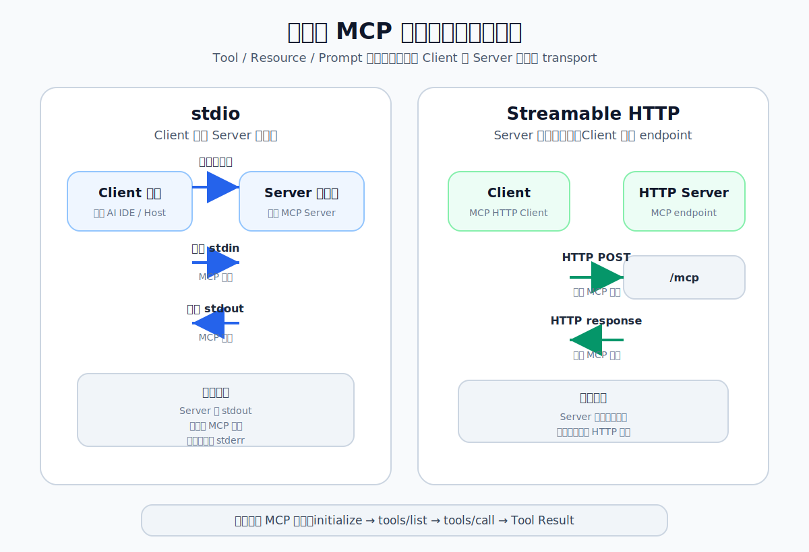

上一篇我们已经看过 MCP 里的几类消息：

```text
initialize
tools/list
tools/call
```

这些消息本身是 JSON-RPC。它们描述的是“Client 想让 Server 做什么”。

但还有一个问题容易被忽略：

> 这些消息到底是怎么从 Client 到达 Server 的？

这就是 MCP transport 要回答的问题。

## 1. Transport 是什么

可以先把 transport 理解成“消息走哪条路”。

同一条 MCP 消息，可以通过不同方式传递：

- 通过本地子进程的 stdin/stdout。
- 通过一个 HTTP endpoint。

消息内容没有变，变化的是传输通道。

所以 MCP 里要分清两层：

```text
Data layer：消息表达什么，比如 initialize、tools/list、tools/call。
Transport layer：消息怎么传，比如 stdio 或 Streamable HTTP。
```

这篇文章只关注第二层。



## 2. stdio：把 Server 当成本地子进程

stdio 是 standard input / output 的缩写，也就是标准输入和标准输出。

在 stdio 模式下，可以这样理解：

```text
Client 进程启动一个 Server 子进程；
Client 进程把 MCP 请求消息写入 Server 子进程的 stdin；
Server 子进程从自己的 stdin 读取请求；
Server 子进程处理后，把 MCP 响应消息写入自己的 stdout；
Client 进程再从 Server 子进程的 stdout 读取响应。
```

所以 stdio 模式下，通常不需要你提前手动启动 Server。Client 会启动它，用完后再关闭它。

这很适合本地工具场景。比如一个 AI IDE 想调用你电脑上的本地脚本，stdio 就很自然：每个 Host 管理自己的 Server 子进程，边界简单，也不需要额外暴露网络服务。

不过 stdio 有一个很重要的规则：

> Server 子进程的 stdout 是 MCP 协议通道，不能随便打印普通日志。

为什么？因为 Client 会从 Server 子进程的 stdout 里读取 MCP 消息。如果 Server 往 stdout 打印了一句普通日志，Client 可能会把这句日志当成 JSON-RPC 解析。

例如：

```python
print("这是一条普通日志")
```

在 Python 里，这其实等价于：

```python
print("这是一条普通日志", file=sys.stdout)
```

也就是写入当前进程的 stdout。

如果这个进程正是 stdio 模式下的 MCP Server，那么这行日志就污染了协议通道。

正确做法是把普通日志写到 stderr：

```python
print("Server 已启动", file=sys.stderr)
```

一句话总结 stdio：

> Client 启动 Server 子进程，并通过 Server 子进程的 stdin/stdout 交换 MCP 消息；普通日志写 stderr。

## 3. Streamable HTTP：把 Server 当成 HTTP 服务

Streamable HTTP 的思路不同。Server 不再由 Client 临时启动，而是先作为 HTTP 服务独立运行。

关系变成：

```text
先启动 MCP HTTP Server；
Server 暴露一个 endpoint，比如 http://127.0.0.1:8000/mcp；
Client 连接这个 endpoint；
Client 通过 HTTP 请求发送 MCP 消息；
Server 通过 HTTP 响应返回 MCP 消息。
```

所以 Streamable HTTP 模式下，运行顺序通常是：

```text
先启动 Server
再运行 Client
```

它适合这些场景：

- Server 需要长期运行。
- 多个 Client 要访问同一个 Server。
- Client 和 Server 可能不在同一台机器。
- 需要通过网关、认证、监控等方式管理访问。

这里最关键的变化不是 Tool 变了，而是 Server 的存在方式变了：stdio 里，Server 更像一个本地命令行工具；Streamable HTTP 里，Server 更像一个网络服务。

## 4. Tool 没有变，变的是通道

假设 Server 提供一个 Tool：

```text
get_order(order_id="O-1001")
```

无论通过 stdio 还是 Streamable HTTP 调用，MCP 语义都是一样的：

```text
Client 初始化连接
Client 发现 Tools
Client 调用 get_order
Server 返回订单结果
```

变化的是底层传输方式：

| 观察项 | stdio | Streamable HTTP |
| --- | --- | --- |
| Server 运行方式 | Client 启动 Server 子进程 | Server 独立监听 HTTP endpoint |
| 消息载体 | stdin / stdout | HTTP 请求 / 响应 |
| 普通日志 | 写 stderr，避免污染 stdout | 走 Server 日志系统 |
| 适合场景 | 本地工具、桌面应用、命令行集成 | 独立服务、远程访问、多 Client 访问 |

所以不要把 transport 和 Tool 设计混在一起。

Tool、Resource、Prompt 是 MCP 的能力层。stdio、Streamable HTTP 是 MCP 的传输层。传输层变了，不代表能力层要重写。

## 5. 什么时候选哪一个

优先考虑 stdio：

- Server 只服务当前 Host 或当前用户。
- Server 由 Host 启动和管理。
- 能力来自本地脚本、本地文件或本地工具。
- 不需要远程访问。

优先考虑 Streamable HTTP：

- Server 需要独立部署。
- 多个 Client 需要访问同一个 Server。
- Client 和 Server 可能在不同机器。
- 需要接入认证、网关、监控或伸缩。

一个简单判断是：

> 如果 Server 像一个本地工具，优先 stdio；如果 Server 像一个服务，优先 Streamable HTTP。

## 6. 完整文章与实验代码

公众号只保留核心理解。完整文章和实验代码放在 GitHub：

```text
https://github.com/yauld/ai-forge
```

进入仓库后看这两个位置：

```text
完整文章：
labs/mcp/foundations/05 | MCP Transport：stdio 与 Streamable HTTP 如何传递消息.md

实验代码：
labs/mcp/foundations/examples/
```

## 7. 小结

这篇文章只想建立一个直觉：

> MCP 消息的内容和 MCP 消息的传输方式，是两件事。

stdio 通过 Server 子进程的 stdin/stdout 传递消息。

Streamable HTTP 通过 HTTP endpoint 传递消息。

同一组 Tool、Resource、Prompt，可以运行在不同 transport 之上。

理解这层分离之后，再看 MCP Server 的启动方式、Client 的连接方式、以及后续的部署和安全问题，就不会混在一起了。

完整实验代码和运行说明放在 GitHub 版本中。
