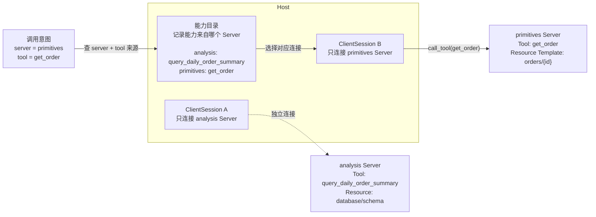

前几篇我们一直在看 MCP Server：

- Server 怎么暴露 Tool、Resource、Prompt。
- MCP 消息怎么从 `initialize` 走到 `tools/call`。
- stdio 和 Streamable HTTP 怎么传递同一组消息。

但真正做 AI 应用时，问题不会停在 Server 侧。

Host 还要回答一组更实际的问题：

```text
我怎么连接 MCP Server？
我怎么知道 Server 有哪些能力？
我怎么调用 Tool、读取 Resource、获取 Prompt？
如果有多个 Server，我怎么知道该把调用发给谁？
```

这些问题都落在 MCP Client 这一层。

所以这篇文章想讲清楚一个核心问题：

> MCP Client 到底在 Host 里做什么？

## 1. MCP Client 不是模型

先把角色放准。

MCP Client 不是大模型，也不是外部系统。它是 Host 内部负责连接某个 MCP Server 的协议组件。

可以这样理解：

```text
Host
├─ MCP Client A → Server A
└─ MCP Client B → Server B
```

模型负责理解用户意图、生成内容或产生工具调用意图。

MCP Server 负责把外部系统能力暴露出来。

MCP Client 负责在 Host 和 Server 之间建立协议连接，完成初始化、发现能力、发起调用、接收结果。

所以不要把 MCP Client 理解成“模型的工具列表”。

它更像 Host 里的连接管理层。



## 2. 第一件事：连接 Server 并初始化

Host 要使用一个 MCP Server，第一步不是直接调用 Tool，而是建立连接。

如果 Server 通过 stdio 运行，关系大概是：

```text
Host 启动 Server 子进程
→ Client 通过 stdin/stdout 和 Server 交换 MCP 消息
→ Client 创建会话
→ Client 发送 initialize
```

`initialize` 很重要。

它不是业务调用，而是一次握手：

```text
Client：我是谁，我支持什么协议版本。
Server：我是谁，我支持哪些能力。
Client：初始化完成。
```

完成这一步后，Host 才能继续发现 Tool、Resource 和 Prompt。

也就是说，MCP Client 的第一项职责是：

> 建立连接，并完成初始化。

## 3. 第二件事：发现 Server 提供了什么

初始化完成后，Host 需要知道这个 Server 能做什么。

于是 Client 会发起几类发现请求：

```text
tools/list
resources/list
resources/templates/list
prompts/list
```

在实验里，订单分析 Server 提供：

```text
tools:
- query_daily_order_summary
- list_orders_by_status

resources:
- shop://database/schema
- shop://business/metrics

prompts:
- daily_order_analysis_report
```

另一个订单详情 Server 提供：

```text
tools:
- get_order
- search_orders

resource_templates:
- shop://orders/{order_id}

prompts:
- analyze_one_order
```

这些信息不是给模型直接执行的。

更准确地说，它们先进入 Host 的能力目录。Host 再决定哪些能力展示给用户，哪些能力提供给模型，哪些能力需要权限确认，哪些能力可以直接调用。

所以 MCP Client 的第二项职责是：

> 发现 Server 能力，并把结果交给 Host 管理。

## 4. 第三件事：调用 Tool、读取 Resource、获取 Prompt

发现能力之后，Host 才能真正使用这些能力。

这里要注意三类 primitive 的语义不同。

Tool 表达“执行动作”。

例如：

```text
query_daily_order_summary
```

它会查询订单数据，返回一段时间内的订单汇总。

Resource 表达“读取上下文”。

例如：

```text
shop://database/schema
```

它提供订单数据库结构，帮助 Host 或模型理解字段含义，但它本身不是一次业务查询。

Prompt 表达“获取任务模板”。

例如：

```text
daily_order_analysis_report
```

它返回一组分析日报的任务消息，但不会自动读取 Resource，也不会自动调用 Tool。

MCP Client 在这里做的是协议调用：

```text
call_tool
read_resource
get_prompt
```

至于调用结果要不要交给模型、怎么交给模型、是否需要用户确认，那是 Host 的职责。

所以 MCP Client 的第三项职责是：

> 按协议调用 Tool、Resource 和 Prompt，并把结果返回给 Host。

## 5. 第四件事：多 Server 场景下保留来源

真实 Host 往往不会只连一个 Server。

它可能同时连接：

```text
订单 Server
文档 Server
代码仓库 Server
浏览器 Server
数据库 Server
```

这时一个常见错误是：只维护一张工具名列表。

比如：

```text
query_daily_order_summary
list_orders_by_status
get_order
search_orders
```

这张列表看起来简单，但它丢掉了一个关键信息：

> 这个 Tool 来自哪个 Server？

一旦多个 Server 出现同名 Tool，例如都叫 `search`，Host 就不知道该把调用发给谁。

所以 Host 更应该维护带来源的能力目录：

```text
shop-order-analysis
├─ tools
│  ├─ query_daily_order_summary
│  └─ list_orders_by_status
└─ resources
   ├─ shop://database/schema
   └─ shop://business/metrics

shop-order-primitives
├─ tools
│  ├─ get_order
│  └─ search_orders
└─ resource_templates
   └─ shop://orders/{order_id}
```

这份目录不是 MCP 协议里的新概念，而是 Host 自己维护的运行时索引。

它解决的是一个工程问题：

> 能力发现之后，Host 怎么保存来源，后续怎么路由调用？

## 6. 第五件事：把调用路由到正确连接

假设 Host 已经得到一个调用意图：

```python
intent = {
    "server": "shop-order-primitives",
    "tool": "get_order",
    "arguments": {"order_id": "O-1001"},
}
```

这里最重要的不是单独的 `tool`，而是 `server + tool` 这一组。

Host 路由时至少要做两次判断：

```text
第一步：server 是不是我已经连接的 Server？
第二步：tool 是不是这个 Server 提供的 Tool？
```

通过之后，Host 才能真正执行：

```text
找到 shop-order-primitives 对应的 ClientSession
→ 调用 get_order
→ 把参数 {"order_id": "O-1001"} 发过去
→ 等待 Server 返回结果
```

这就是为什么多 Server MCP 应用不能只把所有工具拍平成一个列表。

能力要带来源，调用也要带来源。

所以 MCP Client 的第五项职责是：

> 在多 Server 场景下，让 Host 能把调用发到正确连接上。

## 7. 为什么这一步先不接真实大模型

真实 AI 应用里，模型可能会参与工具选择。

比如 Host 把 Tool 描述提供给模型，模型返回一个 tool call。然后 Host 再决定是否执行。

但在学习 MCP Client 时，不应该一开始就把问题扩大成完整 Agent。

这一阶段先搞清楚：

```text
Host 如何连接 Server
Host 如何发现能力
Host 如何调用能力
Host 如何保存来源
Host 如何路由到正确 Server
```

至于模型怎么决定调用哪个工具，那是下一层问题。

把这两层混在一起，反而容易误解 MCP：好像 MCP Client 是模型的一部分，或者模型直接连上了所有外部系统。

实际上不是。

MCP Client 是 Host 里的协议连接层。模型产生的是调用意图，真正执行连接、校验、路由和调用的是 Host。

## 8. 完整文章与实验代码

公众号只保留核心理解。完整文章和实验代码放在 GitHub：

```text
https://github.com/yauld/ai-forge
```

进入仓库后看这两个位置：

```text
完整文章：
labs/mcp/foundations/06 | MCP Client：Host 如何发现并调用 Server 能力.md

实验代码：
labs/mcp/foundations/examples/multi_server_client.py
```

## 9. 小结

这篇文章只想建立一个完整一点的直觉：

> MCP Client 是 Host 里的协议连接层。

它至少做五件事：

```text
连接 Server
完成 initialize
发现 Tool、Resource、Prompt
调用能力并接收结果
在多 Server 场景下保留来源并路由调用
```

理解这一点之后，再看 MCP Host、Client、Server 的关系，就不会把模型、工具列表和外部系统混成一团。

模型不直接连接外部系统。

Server 不负责替 Host 做所有决策。

Client 也不是一个简单的工具名数组。

真正的协作关系是：

```text
Server 暴露能力；
Client 连接和调用能力；
Host 管理、筛选、路由和决策；
模型基于 Host 提供的信息生成下一步意图或最终回答。
```
