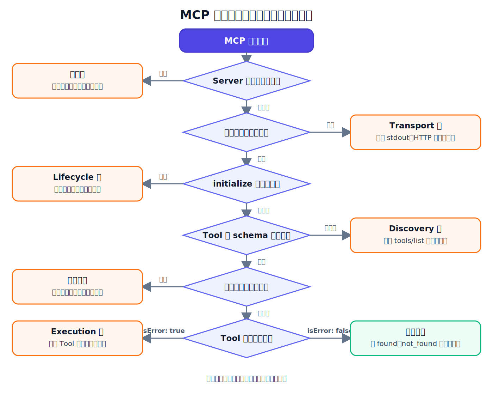

做 MCP 开发时，最让人抓狂的往往不是报错，而是报错看起来都差不多。

```text
连接失败
Tool Result: Error
Failed to fetch
TimeoutError
```

看到这些信息，很多人的第一反应是打开 Tool 代码，或者直接去查数据库。

但一次 MCP 调用要经过进程、Transport、初始化、能力发现和 Tool 执行。请求可能根本没有走到业务代码。

所以这篇文章只回答一个问题：

> MCP 调用失败时，怎么快速判断问题发生在哪一层？

## 1. 不要从报错文本开始猜

以 stdio Server 为例，一次正常调用大致经过：

```text
Host 启动 Server 子进程
→ 建立 stdin/stdout 消息通道
→ 完成 initialize
→ 通过 tools/list 发现能力
→ 通过 tools/call 执行 Tool
→ Host 处理结果
```

排查时也应该沿着同一方向：

```text
进程 → Transport → Lifecycle → Discovery → Execution
```



关键不是一上来收集所有日志，而是先找到：

> 最后一段已经被证明确实正常的链路在哪里？

如果 Server 进程都没有启动，就不用查 Tool。

如果 `initialize` 没完成，就不用查数据库。

如果 `tools/list` 返回的 schema 和实际参数对不上，问题也未必在业务实现。

## 2. 第一个边界：Server 到底启动了吗

先看一种最早发生的失败：Client 尝试启动一个不存在的命令。

```python
await connect(stack, "command-that-does-not-exist", [])
```

结果直接得到：

```text
FileNotFoundError
```

这不是 MCP 协议错误。

操作系统连 Server 进程都没创建出来，MCP 通信还没有开始。

正确写法应该指定真实的可执行程序和 Server 脚本，例如：

```python
session = await connect(
    stack,
    sys.executable,
    ["/absolute/path/to/server.py"],
)
```

所以遇到连接失败，先检查命令、脚本路径、工作目录和环境变量。不要让一个路径错误，把你骗进 Tool 代码里排查半天。

## 3. 第二个边界：Transport 有没有被污染

stdio 模式下，Server 子进程的 stdout 是 MCP 协议通道。

如果 Server 往 stdout 写了一句普通日志：

```python
print("Server 已启动")
```

Client 可能会尝试把它当成 JSON-RPC 消息解析，然后报告：

```text
Failed to parse JSONRPC message from server
Invalid JSON
```

普通日志应该写 stderr。

这个问题有点狡猾：在某些 SDK 中，Client 记录解析错误后，仍可能继续处理后续合法消息。也就是说，最终连上了，不代表 stdout 没被污染。

真正的证据是：Client 收到了一行无法解析成 JSON-RPC 的内容。

## 4. 输入错误、实现错误和业务结果，不是一回事

在 MCP Inspector 等调试界面中看到 Tool Result: Error，不代表所有失败都属于同一类。

最容易混淆的有三种情况。

第一种，输入不符合 schema。

订单编号要求是：

```text
O-1001
```

如果传入：

```text
1001
```

Pydantic 是 Python 中常用的数据校验库。FastMCP 可以根据订单编号的校验规则生成 Tool schema，并在业务函数执行前拒绝非法参数：

```text
String should match pattern '^O-\d{4}$'
```

第二种，输入符合 schema，但 Tool 实现违反了自己的契约。

`O-1001` 明明是合法输入，实现却错误地执行：

```python
int("O-1001")
```

这时参数已经通过校验，错误发生在 Tool 内部。

第三种，调用成功，但业务对象不存在。

查询 `O-9999` 时，数据库工作正常，只是没有这笔订单。Server 返回：

```text
isError: False
status: not_found
```

“订单不存在”是业务结果，不应该伪装成协议故障或数据库宕机。

从用户视角看，这三种情况都可能被描述成“调用失败”，但处理方式完全不同：

```text
输入错误：修正调用参数
实现错误：修复 Tool 代码或公开契约
业务不存在：让 Host 按业务分支继续处理
```

## 5. Tool 执行失败，才去查它的依赖

如果初始化成功、Tool 已发现、参数也通过校验，异常才真正进入执行层。

例如，一个 Tool 在执行查询时抛出：

```text
Error executing tool simulate_database_failure:
模拟数据库查询失败
```

这说明调用已经进入执行层，排查范围可以缩小到：

```text
Tool 实现
数据库连接
SQL 查询
外部 API
业务依赖
```

日志也应该围绕这一层记录：Tool 名、耗时、结果状态和请求标识。

但不要为了调试，把完整订单、数据库连接串、访问令牌和用户隐私全写进日志。日志是证据，不是数据泄露的快捷方式。

## 6. 超时是 Host 的策略

假设 Server 执行一次查询需要一秒：

```python
await asyncio.sleep(1)
```

如果 Host 只愿意等待 0.2 秒：

```python
async with asyncio.timeout(0.2):
    await session.call_tool(...)
```

Host 会触发超时。

这并不自动证明 Server 崩了，也不证明数据库执行失败。它只说明：

> 这次调用超过了 Host 愿意等待的时间。

MCP Inspector 本身也是一个调试 Client。如果它的等待上限大于一秒，这次调用仍会正常返回；上面的 0.2 秒 deadline 只属于设置它的那个 Host，不会自动应用到其他 Client。

所以定位超时时，要同时看两侧：

```text
Host 设置了多长 deadline？
Server 是否收到请求？
Server 实际执行了多久？
取消信号是否传递？
操作是否已经产生副作用？
```

特别是退款、发消息、创建订单这类 Tool，Client 超时不等于操作没有发生。

## 7. 一份够用的 MCP 排查顺序

最后把整条思路压缩成九步：

```text
1. 检查 Server 命令、路径和环境变量
2. 查看进程是否启动、是否提前退出
3. 检查 stdio 解析错误或 HTTP 状态
4. 确认 initialize 是否完成
5. 保存 tools/list 返回的 Tool 和 schema
6. 对照真实 tools/call 参数
7. 区分输入错误、业务结果和执行异常
8. 对照 Host deadline 与 Server 实际耗时
9. 保留最小证据，并对日志脱敏
```

调试 MCP 最有效的方式，不是看到 Error 就扎进最底层。

而是沿调用链逐层证明：

```text
这一层正常
下一层呢？
```

范围每缩小一层，猜测就少一点。

## 8. 完整文章与实验代码

公众号只保留核心判断。完整实验、Inspector 截图和可运行代码放在 GitHub：

```text
https://github.com/yauld/ai-forge
```

进入仓库后查看：

```text
完整实验文章：
labs/mcp/foundations/07 | MCP 调试：从 Server 启动失败到 Tool 调用异常.md

实验 Client：
labs/mcp/foundations/examples/debug_client.py

故障 Server：
labs/mcp/foundations/examples/debug_order_server.py
```

如果只记住一句话，可以记住这个：

> MCP 调用失败时，先判断请求走到了哪一层，再决定该查什么。
