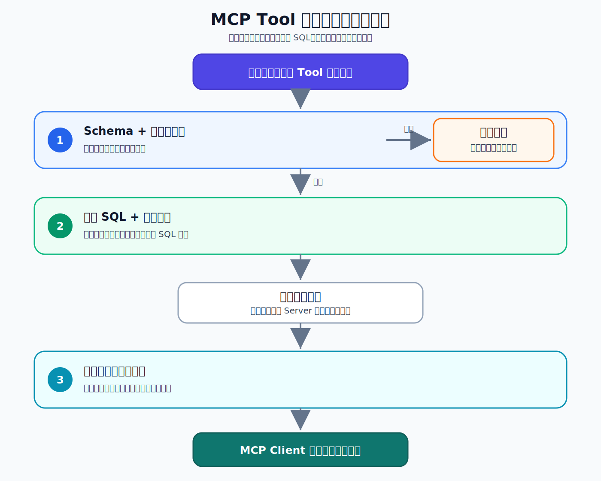

很多人谈 MCP 安全，首先想到的是退款、删除、发消息：

```text
这些危险操作，必须经过用户确认。
```

但一个只读查询 Tool，同样可能暴露业务系统。

在 MCP 应用中，Tool 是 Server 对外提供的可调用能力。模型或应用可以提出调用参数，MCP Client 再把请求发送给 Server。

比如用户问：“帮我查一下已支付订单。”

一次调用可能是：

```text
用户提出问题
  → 模型或应用生成查询参数
  → MCP Client 发送 tools/call
  → MCP Server 使用的 SDK 校验参数
  → 参数合法后执行订单查询
  → Tool 返回结果
```

问题在于：调用者究竟可以控制多少东西？

它可以选择订单状态吗？可以一次查询一万条吗？可以决定返回哪些字段吗？甚至可以直接传入一段 SQL 吗？

这篇文章只回答一个问题：

> MCP Server 如何限制调用者能传入什么，以及能够读走多少数据？

## 1. 先决定哪些参数可以开放

客服查询订单时，调用者真正需要控制的通常只有两项：

- 查询哪种订单状态；
- 最多返回多少条。

SQL、字段名和排序规则不应该交给调用者，而应该由 Server 固定。

实验中的订单查询 Tool 定义如下：

```python
def search_orders_for_support(
    status: Literal["paid", "cancelled", "refunded"],
    limit: Annotated[int, Field(ge=1, le=10)] = 5,
) -> list[dict[str, object]]:
```

它表达了两条明确边界：

- `status` 只能是 `paid`、`cancelled` 或 `refunded`；
- `limit` 只能在 1～10 之间。

这些类型信息会形成 Tool 的 input schema，也就是输入契约。

但需要注意：

> Schema 负责声明边界，真正的安全性还取决于 Server 是否执行校验。

本实验使用 FastMCP。它会通过 Pydantic 根据这些约束校验参数，并在参数不合法时阻止业务函数执行。不能简单地认为“只要 MCP Tool 声明了 Schema，协议就会自动替所有 Server 完成运行时防护”。

## 2. 不要只测试合法输入

如果只提交：

```json
{"status": "paid", "limit": 5}
```

我们最多只能证明 Tool 可以正常工作，不能证明它是安全的。

所以实验主动提交了几组边界和攻击性输入：

- 合法上边界：`limit=10`；
- 枚举外状态：`status="pending"`；
- SQL 注入式文本：`status="paid' OR 1=1 --"`；
- 极端数值：`limit=0` 和 `limit=10000`。

结果很清楚：`limit=10` 可以正常进入查询函数，其余输入都在 FastMCP/Pydantic 参数校验阶段被拒绝。

但只看到错误信息还不够。

错误可能发生在业务函数执行之前，也可能发生在数据库已经查询之后。为了区分这两种情况，我们在主查询函数入口放了一个计数器：函数每执行一次，数字就加一。

恶意调用前后的结果是：

```text
调用前 execution_count=0
提交非法参数
调用后 execution_count=0
```

计数没有变化，说明非法参数没有进入主查询函数，数据库也没有收到这次主查询。

这比“页面显示调用失败”提供了更强的证据。

## 3. Schema 校验和参数绑定不是一回事

正式查询使用的 SQL 是：

```sql
SELECT order_id, status, amount, product
FROM orders
WHERE status = ?
ORDER BY order_id
LIMIT ?
```

SQL 结构由 Server 固定，`status` 和 `limit` 只作为 `?` 对应的参数值传入。

这叫参数绑定。它和字符串拼接有本质区别：

```python
# 危险：输入可能改变 SQL 结构
sql = f"SELECT * FROM orders WHERE status = '{status}'"
```

在正式 Tool 中，`paid' OR 1=1 --` 会先被 `status` 枚举拒绝。但这只能证明枚举校验生效，不能证明参数绑定生效。

为了把两道防线拆开验证，实验增加了一个只用于对照的 Tool：它允许普通字符串进入 SQL 参数，但仍然使用 `WHERE status = ?`。

这不是建议正式 Tool 接受任意状态，而是为了单独观察参数绑定。

当注入式文本真正进入 SQL 参数后，结果是：

```text
matching_count: 0
total_order_count: 14
```

它没有匹配任何订单，样例表仍保持 14 条记录。这个结果与参数绑定的预期一致：整段文本被当成一个普通状态值，而不是 SQL 语句的一部分。

两道防线解决的是不同问题：

- Schema 校验限制业务允许接受哪些值；
- 参数绑定防止输入改变 SQL 结构。

即使 Schema 已经很严格，数据库访问仍然应该使用参数绑定。安全不能建立在“前一道校验永远不会被修改或绕过”之上。

## 4. 输入安全了，输出仍然可能泄露数据

假设调用参数完全合法，但 Tool 返回了：

- 订单号；
- 状态；
- 金额；
- 商品；
- 客户手机号；
- 收货地址；
- 内部风控标记。

这仍然不是一个安全的客服查询 Tool。

客服只需要查看订单状态时，查询语句就只选择：

```sql
SELECT order_id, status, amount, product
```

同时，`limit <= 10` 限制了单次最多返回多少条记录。

实验 Client 还会逐条检查结果，确认每笔订单都只有：

```text
order_id、status、amount、product
```

这就是数据最小化：

> 不是数据库里有什么就返回什么，而是完成当前任务最少需要什么，就只暴露什么。

数量限制控制一次能读走多少记录，字段限制控制每条记录能带走多少信息。两者缺一不可。

## 5. 一次安全查询要经过三道边界

把整个过程放在一起，可以看到三道防线分别守在不同位置：



可以把它们简单记成：

- Schema 和运行时校验管入口；
- 参数绑定管输入如何被数据库解释；
- 数据最小化管出口。

如果 Tool 允许调用者提交任意 SQL、字段名、排序表达式或无限制的 `limit`，那么再详细的 Tool 描述也不能把它变成安全接口。

## 6. 设计只读 Tool 时，检查这八个问题

在把查询能力交给 MCP Client 之前，可以先问：

1. 调用者真正需要控制哪些参数？
2. 字符串能否收紧成枚举？
3. 数字是否有合理的上下界？
4. SQL、字段名和排序规则能否由 Server 固定？
5. Server 是否真的执行了 Schema 对应的运行时校验？
6. 数据库访问是否全部使用参数绑定？
7. 返回数量和字段是否已经最小化？
8. 能否用执行计数或数据库状态证明非法输入没有进入危险路径？

最后一个问题尤其容易被忽略。

“调用报错了”只是现象，不是完整的安全结论。只有找到可观察证据，才能说明边界确实挡住了危险路径。

## 7. 完整实验

完整实验提供了四个可独立运行的场景、真实输出和验收问题，包括：

- 合法边界查询；
- 非法状态攻击；
- 极端 `limit` 攻击；
- SQL 参数绑定对照。

GitHub 仓库：

```text
https://github.com/yauld/ai-forge
```

完整实验文章：

```text
labs/mcp/foundations/08 | MCP 输入安全：参数限制、Schema 与数据最小化.md
```

如果只记住一句话，可以记住：

> 安全的 MCP 查询 Tool，不仅要限制能传入什么，还要固定输入如何被执行，并限制最终能够读走什么。
