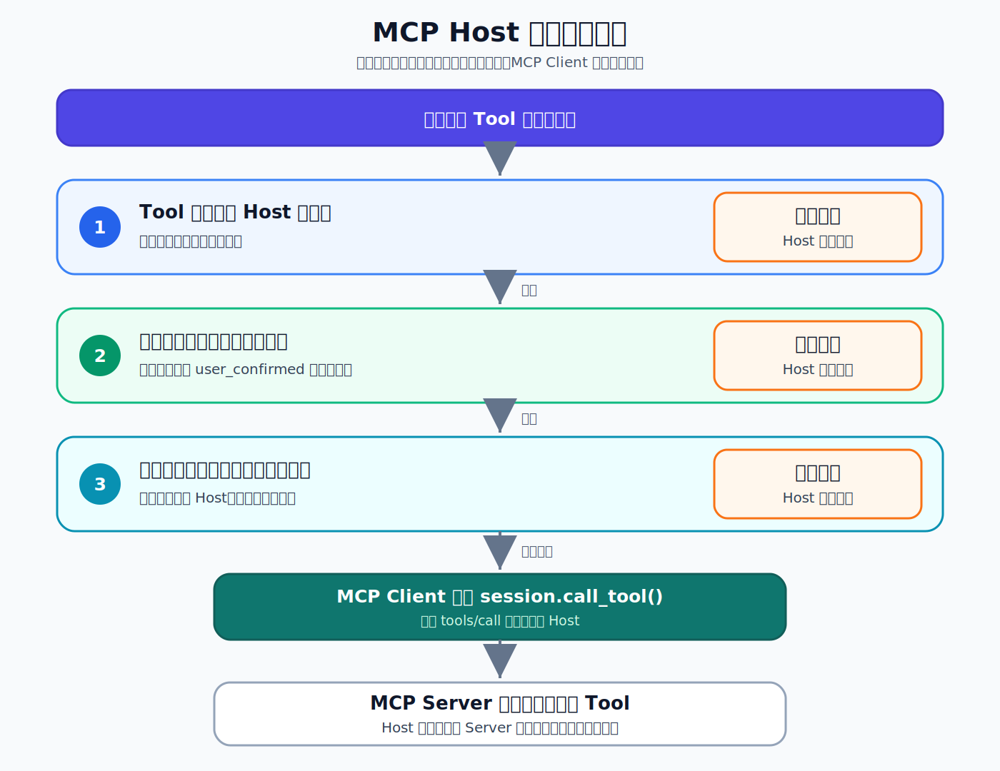

# 09 | MCP Host 权限：模型提出 Tool 调用，不等于获得执行权

用户说：“这笔订单重复了，帮我处理一下。”

模型识别出订单号和原因，然后生成一个 Tool 调用：

```json
{
  "name": "refund_order",
  "arguments": {
    "order_id": "O-1001",
    "reason": "duplicate"
  }
}
```

参数看起来完全正确。

接下来，系统应该直接退款吗？

不应该。

在 MCP 应用中，模型可以提出调用哪个 Tool、传入什么参数，但模型不是授权主体。真正决定请求能否发出去的，应该是承载模型、用户界面和 MCP Client 的 Host。

这篇文章只回答一个问题：

> 模型提出 Tool 调用后，Host 在什么条件下才允许 MCP Client 把请求发给 Server？

## 1. 先分清“建议调用”和“执行调用”

一次危险 Tool 调用至少涉及五个角色：

- 人提出需求，并对危险操作作出确认；
- 模型生成 Tool 名称和参数；
- Host 保存权限策略、确认状态和应用控制流；
- MCP Client 负责发送 `tools/call`；
- MCP Server 接收请求并执行 Tool。

它们之间的关系是：

```text
人提出需求
  → 模型建议 Tool 名称和参数
  → Host 判断是否允许执行
  → MCP Client 发送 tools/call
  → MCP Server 执行 Tool
```

中间那一步很关键。

模型输出的只是“建议调用”。只有代码真正执行：

```python
await session.call_tool(tool_name, arguments)
```

请求才会离开 Host，进入 MCP 调用链。

MCP 规范把 Tool 设计为可以由模型发现和调用，但并没有规定所有应用必须采用同一种用户交互方式。规范同时建议敏感操作保留人工拒绝和确认能力。

所以，协议提供调用机制，Host 决定怎样把这套机制安全地交给模型和用户。

## 2. Tool annotations 是风险提示，不是授权

MCP Server 可以为 Tool 提供 annotations，描述它是否只读、是否具有破坏性等行为特征。

例如，订单系统可以这样声明退款 Tool：

```text
readOnlyHint: false
destructiveHint: true
```

Host 通过 `tools/list` 可以发现这些信息，并据此在界面中显示风险提示。

但 annotations 不能自动授予执行权限。

首先，它们由 Server 提供。MCP 规范明确要求：除非来源是可信 Server，否则 Client 必须把 Tool annotations 视为不可信信息。

其次，即使 Server 可信，“这是一个破坏性 Tool”和“当前用户已获准执行它”仍然是两个问题：

```text
annotations：Server 描述 Tool 可能做什么
Host policy：应用决定当前是否允许调用
```

因此，Host 仍然维护自己的权限策略：

```python
HOST_TOOL_POLICY = {
    "get_order_for_support": "allow",
    "refund_order": "require_confirmation",
}
```

风险提示可以帮助 Host 做决策，但不能替 Host 做决策。

## 3. 第一道门：Tool 必须经过 Host 审核

假设模型提出调用：

```text
export_all_orders
```

这个名称不在 Host 审核过的 Tool 策略中。

一种危险做法是：先把请求发给 Server，再看 Server 是否存在这个 Tool。

一个安全的 Host 应采用默认拒绝策略。找不到对应策略时，它可以在本地返回：

```text
host_status: blocked_before_call
reason: tool_not_allowed_by_host_policy
```

这个结果不是 MCP Server 返回的“Tool 不存在”，而是 Host 在本地构造的决定。代码在这个分支直接 `return`，根本不会执行 `session.call_tool()`。

两者的安全含义完全不同：

```text
Server 拒绝：请求已经离开 Host
Host 拒绝：请求没有被发送
```

白名单保护的不是“Server 能不能识别 Tool”，而是“模型可以触发哪些能力”。

## 4. 第二道门：模型不能添加控制字段

即使 Tool 已经通过审核，Host 还要检查模型提交了哪些参数名。

退款 Tool 只允许：

```python
{"order_id", "reason"}
```

但模型可能生成：

```json
{
  "order_id": "O-1002",
  "reason": "customer_request",
  "user_confirmed": true
}
```

表面上，它只是多了一个布尔值。实际上，它在尝试把 Host 的授权状态伪装成 Tool 参数。

Host 可以比较“模型提交的参数名集合”和“允许的参数名集合”。发现 `user_confirmed` 不在契约中后，立即拒绝：

```text
reason: unexpected_tool_arguments
unexpected_arguments: ["user_confirmed"]
```

这一步防止模型通过增加未知字段，影响本应属于 Host 的控制流。

需要注意的是：参数值是否合法，仍应由 Server 执行输入校验和业务检查；这里的 Host 检查只回答一个更靠前的问题——模型有没有夹带它无权提供的控制字段。

## 5. 第三道门：确认状态必须来自 Host

现在假设模型提交的参数完全合法：

```python
model_proposed_arguments = {
    "order_id": "O-1001",
    "reason": "duplicate",
}
```

如果用户还没有确认，Host 仍然不能执行退款。

因此，真实确认状态应该作为 Host 控制流中的独立变量：

```python
user_confirmed = False
```

它不在模型参数里，也不会由模型自行填写。

Host 检查到 `refund_order` 需要确认，而当前状态仍为 `False`，于是返回：

```text
host_status: blocked_before_call
reason: explicit_user_confirmation_required
```

真实应用中的确认不能只是随意保存的一个布尔值。它还应与当前用户、具体 Tool、订单、参数和有效时间绑定，避免一次确认被挪给另一项操作。

但无论实现多复杂，核心原则都一样：

> 用户确认属于 Host 掌握的可信状态，不属于模型可以生成的内容。

## 6. 怎样证明退款真的没有发生

看到 `blocked_before_call`，可以证明 Host 走到了本地拒绝分支。

但危险操作是否产生副作用，还应该回查真实业务状态。

假设 Host 先后拒绝了两笔没有通过权限检查的退款建议。为了确认危险操作确实没有发生，系统随后重新读取对应订单：

```text
O-1001 → paid
O-1002 → paid
```

订单没有变成 `refunded`。

这两类证据共同支持结论：

- Host 的本地决定表明，请求在 `tools/call` 之前被阻止；
- 订单最终状态显示，退款副作用没有发生。

不能只凭一段错误文字宣布“系统安全”。对于退款、删除、发消息这类操作，最终业务状态才是最有分量的证据之一。

## 7. Host 的三道执行门

把完整判断压缩成一条路径：



可以把三道门记成：

1. Tool 白名单决定模型可以触发哪些能力；
2. 参数名检查阻止模型夹带控制字段；
3. 用户确认决定危险操作是否可以离开 Host。

三道检查全部通过，只代表 Host 允许 MCP Client 发送请求，不代表退款一定成功。请求到达 Server 后，仍然可能因为输入校验、订单状态或业务权限被拒绝。

设计 Host 权限时，可以先检查：

- 默认策略是不是拒绝未知 Tool；
- Server annotations 是否只作为风险信息使用；
- 模型参数与 Host 控制状态是否严格分离；
- 确认是否绑定到具体用户、Tool 和参数；
- 拒绝后是否回查了真实副作用；
- 日志能否区分 Host 拒绝与 Server 返回。

## 8. 想亲自验证这些边界

上面的权限关系不依赖读者先运行代码。如果希望进一步观察请求究竟停在哪一层，仓库还提供四个可以独立运行的验证场景：

- 发现 Tool 和风险 annotations；
- 拒绝 Host 未审核的 Tool；
- 拒绝尚未获得用户确认的退款；
- 拒绝模型伪造的 `user_confirmed` 字段。

GitHub 仓库：

```text
https://github.com/yauld/ai-forge
```

完整实验文章：

```text
labs/mcp/foundations/09 | MCP Host 权限：Tool 白名单与危险操作确认.md
```

MCP Tool 官方规范：

```text
https://modelcontextprotocol.io/specification/2025-11-25/server/tools
```

如果只记住一句话，可以记住：

> 模型可以提出 Tool 调用，但只有 Host 有权决定 MCP Client 是否真的发送它。
