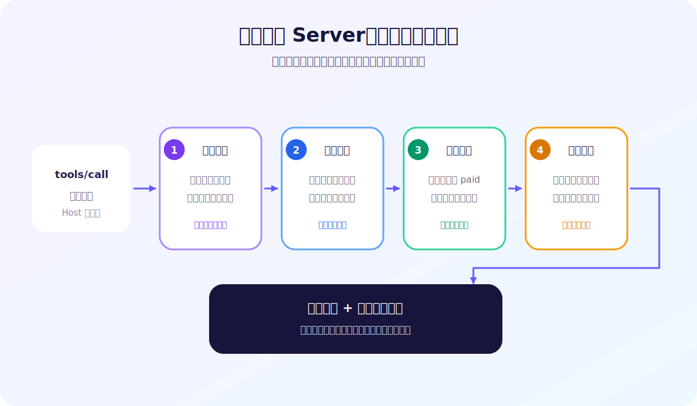

# 10 | MCP 执行安全：请求到了 Server，也不等于应该执行

用户确认了一笔退款，Host 也允许 MCP Client 发出 Tool 调用。

请求终于到达 Server：

```json
{
  "name": "refund_order",
  "arguments": {
    "order_id": "O-1001",
    "reason": "customer_request",
    "idempotency_key": "refund-demo0001"
  }
}
```

这时，Server 是否只要照着参数执行就行？

仍然不行。

Host 的确认只能说明：用户允许系统尝试这次操作。它不能证明订单真实存在、当前状态允许退款、金额符合自动处理规则，也不能保证同一请求没有被执行过。

这篇文章只回答一个问题：

> 危险 Tool 调用到达 MCP Server 后，Server 如何约束真实副作用？

## 1. Host 放行和 Server 执行是两道边界

一次退款调用可以简化成：

```text
用户确认
  → Host 允许发送
  → MCP Client 发出 tools/call
  → MCP Server 检查业务规则
  → 业务系统执行或拒绝退款
```

Host 掌握的是调用上下文，例如当前用户是否确认、这个 Tool 是否在白名单中。Server 掌握的则是可信业务状态，例如订单是否存在、是否已取消、金额是多少、这次退款是否处理过。

两者不能互相代替：

```text
Host：这次请求能不能发出去？
Server：到达的请求现在应不应该执行？
```

MCP 负责让 Client 调用 Server 暴露的 Tool，但不会替业务系统决定一笔订单是否满足退款规则。官方规范也把输入校验和访问控制明确列为 Server 的安全责任。

因此，即使用户已经确认，Server 仍然必须默认不相信请求中的业务结论，只把它当作一项待验证的操作意图。

## 2. 参数合法，不代表业务上可执行

假设 `order_id` 的格式要求是：

```text
O-四位数字
```

`O-9999` 完全符合格式，却可能根本不存在。

同样，`O-1003` 可能确实存在，但已经处于 `cancelled` 状态；`O-1011` 也可能仍是 `paid`，但 2699 元超过了 2000 元的自助退款上限。

这三种请求都能通过参数格式检查，却应该得到不同的业务拒绝：

| 请求 | Server 判断 | 结果 |
| --- | --- | --- |
| O-9999 | 订单不存在 | `order_not_found` |
| O-1003 | 当前不是 `paid` | `order_not_paid` |
| O-1011 | 金额超过自助上限 | `manual_review_required` |

Schema 解决的是“输入长什么样”，业务规则解决的是“当前能不能做”。把两者混成一道检查，很容易让格式合法的危险请求直接穿过执行边界。

更稳妥的做法，是在产生副作用之前依次检查对象、状态和金额：

```text
订单存在？
  → 状态允许？
  → 金额在自动处理范围？
  → 全部通过后才更新订单
```

金额超限也不等于订单永远不能退款。它只是不应走当前自动通道，而应该转入人工审核。这就是业务边界的意义：不仅决定“做或不做”，还决定操作应该进入哪条处理路径。

## 3. 最容易漏掉的边界：重复调用

现在看一个更隐蔽的问题。

Client 发出退款请求，Server 已经成功更新订单，但响应在网络中丢失了。Client 不知道结果，只能重试。

如果 Server 把重试当成新请求，同一个业务意图就可能产生两次副作用。

解决这个问题，需要给一次业务意图分配一个稳定的幂等键：

```text
refund-demo0001
```

“幂等”在这里的意思是：同一业务操作重复提交，最终只生效一次。

第一次请求使用这个键时，Server 执行退款，并记录“这个键已经对应 O-1001 的退款”。网络重试必须继续使用同一个键。Server 查到已有记录后，返回：

```text
status: already_applied
```

而不是再次执行退款。

关键不在于键的名字长什么样，而在于它表示同一次业务意图：

- 新的一次退款意图使用新键；
- 同一次退款的重试复用原键；
- Server 对这个键建立唯一约束。

如果每次重试都生成新键，幂等保护就被绕开了。那些键看起来都“唯一”，却无法告诉 Server：这些请求其实是同一件事。

## 4. 幂等键还必须绑定业务对象

只记录“这个键用过了”仍然不够。

假设 `refund-conflict1` 第一次用于 O-1004，之后又被带到 O-1002。如果 Server 只看到键已存在就返回旧结果，调用方可能误以为 O-1002 也完成了退款；如果允许重新使用，又失去了唯一约束。

所以幂等记录至少要回答：

```text
哪个幂等键
  → 对应哪个业务对象
  → 已产生什么结果
```

同一个键再次用于 O-1004，可以返回 `already_applied`；换绑到 O-1002，则必须拒绝：

```text
reason: idempotency_key_conflict
```

幂等键不是一张可以反复使用的“免检券”，而是一次业务意图的稳定身份。身份和对象对不上，本身就是冲突。

示例 Server 没有保存原始幂等键，而是保存完整的 SHA-256 摘要，并只在结果中展示前 12 位指纹。这减少了原始标识在数据库和输出中的暴露，但摘要仍然要承担唯一约束，不能只保存可能碰撞的短指纹。

## 5. 检查必须发生在副作用之前

把完整路径放在一起：



顺序很重要。

Server 先查幂等记录，才能在第一次退款已经成功后，把重试识别为 `already_applied`。如果先检查订单状态，重试看到订单已经是 `refunded`，只会得到 `order_not_paid`，调用方无法区分“第一次成功后的安全重试”和“一笔本来就不允许退款的订单”。

对象、状态和金额检查也都必须在数据库更新之前完成。否则，即使最后返回一段漂亮的拒绝文案，副作用也可能早已发生。

真正的执行路径应该是：

```text
检查幂等记录
  → 检查对象
  → 检查状态
  → 检查金额
  → 更新订单并写入幂等记录
```

在生产系统中，业务更新和幂等记录还应放进可靠的事务设计中，并考虑并发请求同时到达的情况。本文的 SQLite 示例验证的是核心边界，不等于覆盖了分布式事务和并发控制的全部工程问题。

## 6. 不要只相信返回文案

Server 返回：

```text
reason: manual_review_required
```

这只能证明代码返回了这段结果，不能单独证明订单没有先被修改。

验证危险操作时，应该回查真实业务状态：

```text
超额退款被拒绝后：O-1011 仍为 paid
取消订单被拒绝后：O-1003 仍为 cancelled
```

验证幂等也一样。第二次调用返回 `already_applied` 是一项证据，数据库中只有一条退款操作记录则是更直接的副作用证据：

```text
首次调用：refunded
同键重试：already_applied
最终状态：refunded
退款操作记录数：1
```

安全结论不能只靠系统“说自己拒绝了”。涉及退款、删除、转账或发送消息时，最终状态和操作记录才真正回答了副作用发生了几次。

## 7. 设计危险 Tool 时，检查这五件事

对于会修改外部状态的 MCP Tool，可以先检查：

1. Server 是否重新读取可信业务对象，而不是相信调用方给出的状态；
2. 对象、状态、金额和权限规则是否都在副作用之前检查；
3. 一次业务意图是否拥有稳定幂等键，重试是否复用它；
4. 幂等记录是否绑定具体业务对象，并由唯一约束兜底；
5. 测试是否回查最终状态和操作记录，而不只断言返回文案。

Host 的确认很重要，但它只是第一道门。请求真正到达 Server 后，安全仍然取决于业务系统是否守住执行边界。

## 8. 想亲自验证这些边界

仓库提供五个可独立运行的场景：不存在的订单、错误状态、金额超限、同键重试，以及幂等键换绑。每个拒绝场景都会回查订单状态，重试场景还会检查数据库只写入一条退款记录。

GitHub 仓库：

```text
https://github.com/yauld/ai-forge
```

完整实验文章：

```text
labs/mcp/foundations/10 | MCP 执行安全：业务边界、幂等与重复调用.md
```

MCP Tool 官方规范：

```text
https://modelcontextprotocol.io/specification/2025-11-25/server/tools
```

如果只记住一句话，可以记住：

> Host 决定请求能否发送，Server 决定副作用是否应该发生，而且必须证明它只发生了一次。
