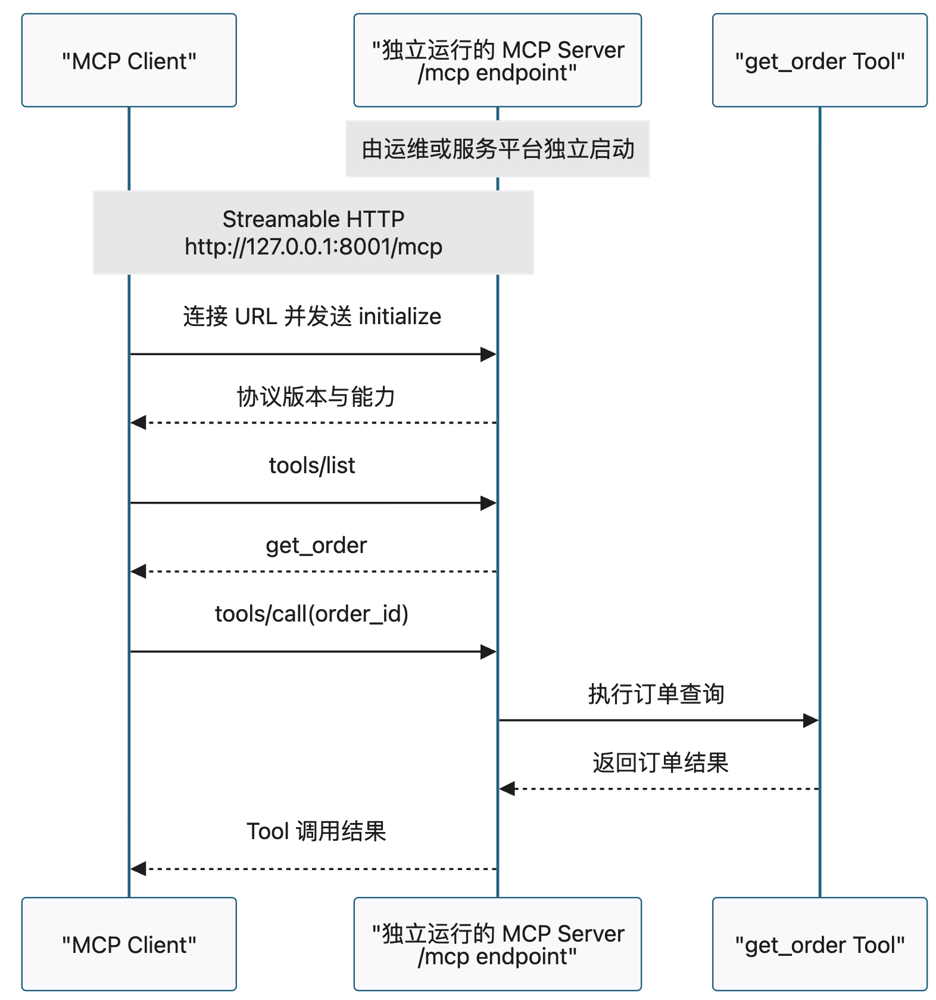

# 12 | 通过 Streamable HTTP 连接远程 MCP Server

提到“远程 MCP Server”，很多人第一反应是：把原来跑在本机的 Server 部署到云上。

但机器放在哪里，只是表面变化。真正改变架构的是：

> Server 开始独立运行，Client 不再负责启动它，而是通过一个完整 URL 建立连接。

这意味着，即使 Server 和 Client 还在同一台电脑上，只要两者是独立进程，Client
通过 HTTP 地址访问 Server，它们就已经具备了远程访问的基本结构。

## 1. 从“启动一个子进程”到“连接一个服务”

本地 MCP 常见的连接方式是 stdio。Client 启动 Server 子进程，再通过标准输入和
标准输出交换消息：

```text
Client
  └─ 启动 Server 子进程
       └─ stdin / stdout
```

换成 Streamable HTTP 后，关系变成：



两种方式传递的仍然是 MCP 消息，Tool 的名称、参数和业务含义也没有因此改变。
变化的是 Server 的生命周期和消息通道：

| 对比项 | stdio | Streamable HTTP |
| --- | --- | --- |
| 谁启动 Server | Client 通常启动子进程 | 运维或服务平台独立启动 |
| Client 连接什么 | 子进程的 stdin/stdout | MCP URL |
| Server 何时退出 | 通常随 Client 一起退出 | 可以持续独立运行 |
| 更常见的场景 | 本机文件、开发工具 | 独立服务、局域网或互联网服务 |

所以，“远程”首先描述的是一种连接关系，不等于“已经暴露在公网”。

## 2. 一个 MCP URL，缺一段都可能连不上

实验中的地址是：

```text
http://127.0.0.1:8001/mcp
```

它包含协议、主机、端口和 endpoint：

```text
http://     127.0.0.1     :8001     /mcp
协议         主机          端口      endpoint
```

Client 需要的是完整地址。只知道“服务在 8001 端口”还不够。

例如把 `/mcp` 写成 `/wrong`，请求仍然可以到达这台机器和这个 HTTP 服务，但服务
会返回 `404 Not Found`。这不是 Tool 坏了，而是请求根本没有进入 MCP endpoint。

到了真实环境，地址可能变成：

```text
https://mcp.example.com/mcp
```

域名、HTTPS、反向代理和网关可以改变入口的外观，但 Client 最终仍要拿到一个正确
的 MCP URL。

## 3. 连上 URL，不等于已经完成 MCP 调用

建立 HTTP 通道只是第一步。一次完整调用还要经过：

```text
连接 MCP URL
→ initialize
→ tools/list
→ tools/call
```

对应的 Python Client 核心代码并不长：

```python
async with streamable_http_client(MCP_URL) as (read, write, _):
    async with ClientSession(read, write) as session:
        initialized = await session.initialize()
        tools = await session.list_tools()
        result = await session.call_tool(
            "get_order",
            {"order_id": "O-1001"},
        )
```

这里有三层职责：

1. URL 告诉 Client 去哪里连接；
2. `streamable_http_client()` 建立 Streamable HTTP 通道；
3. `ClientSession` 在通道上完成初始化、能力发现和 Tool 调用。

没有必要自己用 `http_client.post()` 拼装请求。普通 HTTP Client 只理解 HTTP，
而 MCP SDK 还会处理协议消息和 Session 细节。

实验中，Client 输出的关键证据可以归纳成三项：

```text
协议版本：2025-11-25
发现 Tools：['get_order']
调用结果：订单 O-1001
```

它们分别证明：

- `initialize` 已完成；
- Client 已发现 Server 暴露的能力；
- `tools/call` 已到达 Server 并执行。

只看到端口能够访问，不能替代这三项证据。

## 4. 调用失败，先判断卡在哪一层

远程访问增加了网络入口，也让故障更容易被混在一起。

如果 Server 没启动，Client 会遇到连接失败。此时 TCP 连接都没有建立，还谈不上
MCP 初始化。

如果主机和端口正确，但 endpoint 写错，Server 会返回 `404`。此时应该检查 URL
路径，而不是修改 Tool 代码。

如果 Client 已经拿到协议版本和 Tool 列表，说明进程、网络、endpoint 和 MCP
初始化都已通过。之后的参数校验或业务异常，才属于 Tool 执行层。

因此，排查顺序可以固定下来：

```text
Server 是否运行
→ 主机和端口是否可达
→ endpoint 是否正确
→ initialize 是否成功
→ Tool、参数和业务是否正确
```

这条顺序的价值，在于每一步都只检查当前层，不会一看到“调用失败”就直接钻进业务
代码。

## 5. 真正部署到远程机器，还缺什么

把 Server 从 `127.0.0.1` 搬到局域网或互联网，并不会改变 MCP Client 的核心
调用链路，但会引入新的工程边界：

- HTTPS、证书、域名和反向代理；
- 防火墙、超时、负载均衡和高可用；
- 身份认证、权限控制、日志和监控。

尤其要注意：一个没有授权控制的 MCP Server，不应该因为“已经能通过 HTTP
访问”，就直接暴露到公网。

远程访问解决的是“Client 怎样找到并连接 Server”；“谁有权访问、能够调用什么”
是下一层问题。最后记住一句话：

> 远程 MCP 的关键不是 Server 离得有多远，而是它独立运行，Client 通过完整 URL
> 建立 Streamable HTTP 通道，再完成标准 MCP 会话。

---

查看完整实现、运行步骤和失败实验：

```text
GitHub 仓库：
https://github.com/yauld/ai-forge

完整实验文章：
labs/mcp/foundations/12 | MCP 远程访问基础：通过 Streamable HTTP 连接与调用 Server.md

```
