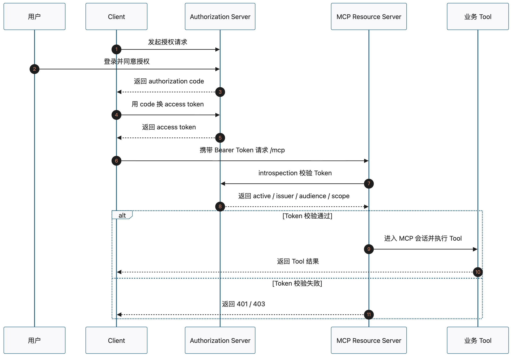

# 13 | MCP 远程授权：Token 从哪里来，又在哪里被验证

远程 MCP Server 一旦通过 HTTP 暴露出来，就会多一个问题：

> Client 连上了 `/mcp`，是否就应该允许它调用 Tool？

显然不应该。

远程访问只解决“怎么找到 Server”。远程授权解决的是“谁有资格进入 Server”。

如果一个订单查询、退款、内部数据读取类 Tool，只要知道 URL 就能调用，那它不是能力入口，而是业务后门。

所以，远程 MCP 的授权边界不应该藏在某个 Tool 函数里，而应该发生在请求进入 MCP 会话之前。

## 一、先分清三个角色

远程授权里最容易乱的地方，是把登录、发 Token、验证 Token、执行 Tool 都混在一个 Server 里想。

更清楚的分工是三类角色：

```text
Client
想访问远程 MCP Server，并调用某个 Tool。

Authorization Server
确认用户是否同意，确认 Client 是否可信，然后签发 access token。

Resource Server
也就是远程 MCP Server。它验证 access token，通过后才允许请求进入 MCP 会话。
```

这三个角色解决的是不同问题。

Authorization Server 不处理 MCP Tool。Resource Server 不负责用户登录。Client 也不能因为自己知道 URL，就默认拥有调用权限。

这就是远程授权的第一层直觉：发凭据和用凭据访问资源，是两件事。



## 二、Token 从哪里来

access token 不是 Client 自己编出来的，也不应该写死在代码里。

它应该来自 Authorization Server。

一个授权码流程可以简化理解成：

```text
Client 发起授权请求
→ 用户登录并同意某个权限范围
→ Authorization Server 生成 authorization code
→ Client 用 code 换 access token
```

这里有两个词很容易混。

`authorization code` 是一次性换票凭证。

它只说明“用户刚刚同意过这次授权请求”。它通常有效期很短，只能用一次，不能直接拿去访问 MCP Server。

`access token` 才是访问凭据。

Client 最终访问远程 MCP Server 时，带的是它：

```text
Authorization: Bearer <access_token>
```

为什么要先 code 再 token？

因为这能把“用户同意”和“签发访问凭据”分开。即使 authorization code 出现在回调地址里，它也不是最终访问凭据；真正换 token 时，Client 还要证明自己的身份，并提交前面绑定过的回调信息。

一句话：

```text
authorization code 用来换 Token
access token 用来访问资源
```

## 三、Token 在哪里被验证

access token 不应该作为 Tool 参数传进去。

它应该在 HTTP 层被带上：

```text
Authorization: Bearer <access_token>
```

这意味着 Token 校验发生在 MCP 入口处，而不是业务 Tool 里面。

请求进入远程 MCP Server 时，合理顺序应该是：

```text
读取 Bearer Token
→ 验证 Token 是否可信
→ 检查权限范围是否满足
→ 通过后进入 MCP initialize / tools-call
→ 最后才执行具体 Tool
```

如果 Token 不可信，请求应该停在入口层。它不应该进入 MCP 初始化，也不应该跑到 Tool 函数里再失败。

这是一条很重要的边界：

```text
认证层判断：谁能进入 MCP 会话
Tool 代码处理：已经进入会话后的业务逻辑
```

把这两层混在一起，后面权限会越写越乱。

## 四、Resource Server 要验证什么

带了 `Authorization` Header，不等于有权限。

Header 只是装 Token 的地方。Resource Server 真正要判断的是：这个 Token 是否可信，是否适合当前 Server，是否具备当前能力需要的权限。

至少要回答四个问题：

| 问题 | 含义 |
| --- | --- |
| 还有效吗？ | Token 是否 active，是否过期 |
| 谁签发的？ | issuer 是否可信 |
| 给谁用的？ | audience 是否是当前 MCP Server |
| 能做什么？ | scope 是否包含当前 Tool 需要的权限 |

其中 `audience` 特别容易被忽略。

一个发给 A 服务的 Token，不应该被 B 服务接受。否则 Token 就会在服务之间乱窜，Resource Server 的边界也就失效了。

如果 Token 是 opaque token，Resource Server 自己看不出里面内容，就需要向 Authorization Server 做 introspection：把 Token 发回去问，它是否有效、属于谁、给谁用、有什么 scope。

## 五、401 只说明被挡住

远程 MCP Server 返回 `401`，只说明一件事：

> 当前请求没有通过入口认证。

它不等于 Client 已经自动完成 OAuth。

这两条链路要分开看：

```text
无 Token 请求
→ 401

取得 access token
→ 携带 Token 请求
→ 进入 MCP 会话
```

第一条链路证明 Server 有门槛。

第二条链路证明正确凭据能通过门槛。

真实系统里，Client 如何发现 Authorization Server，如何打开授权页，如何保存和刷新 Token，仍然需要单独设计。不能看到 401，就以为后面的授权流程会自动发生。

## 六、最后记住这句话

远程访问让 Client 找到 MCP Server。

远程授权决定 Client 能不能进入 MCP Server。

一个合理的远程 MCP 调用，不应该是：

```text
知道 URL
→ 直接调用 Tool
```

而应该是：

```text
知道 URL
→ 取得可信 access token
→ Resource Server 在入口层验证 Token
→ 验证通过后进入 MCP 会话
→ 再执行 Tool
```

所以这篇最核心的问题其实就是两个：

```text
Token 从哪里来？
Authorization Server 签发。

Token 在哪里被验证？
Resource Server 的 MCP 入口层验证。
```

把这两个位置分清，后面再讨论 scope、audience、token passthrough 和下游业务权限，才不会乱。

---

查看完整实现、运行步骤和实验输出：

```text
GitHub 仓库：
https://github.com/yauld/ai-forge

完整实验文章：
labs/mcp/foundations/13 | MCP 远程授权：从 401 到第一次受保护调用.md

```
