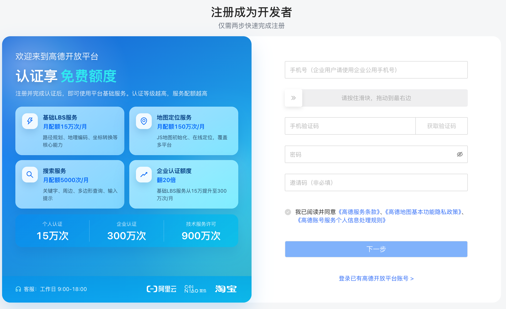
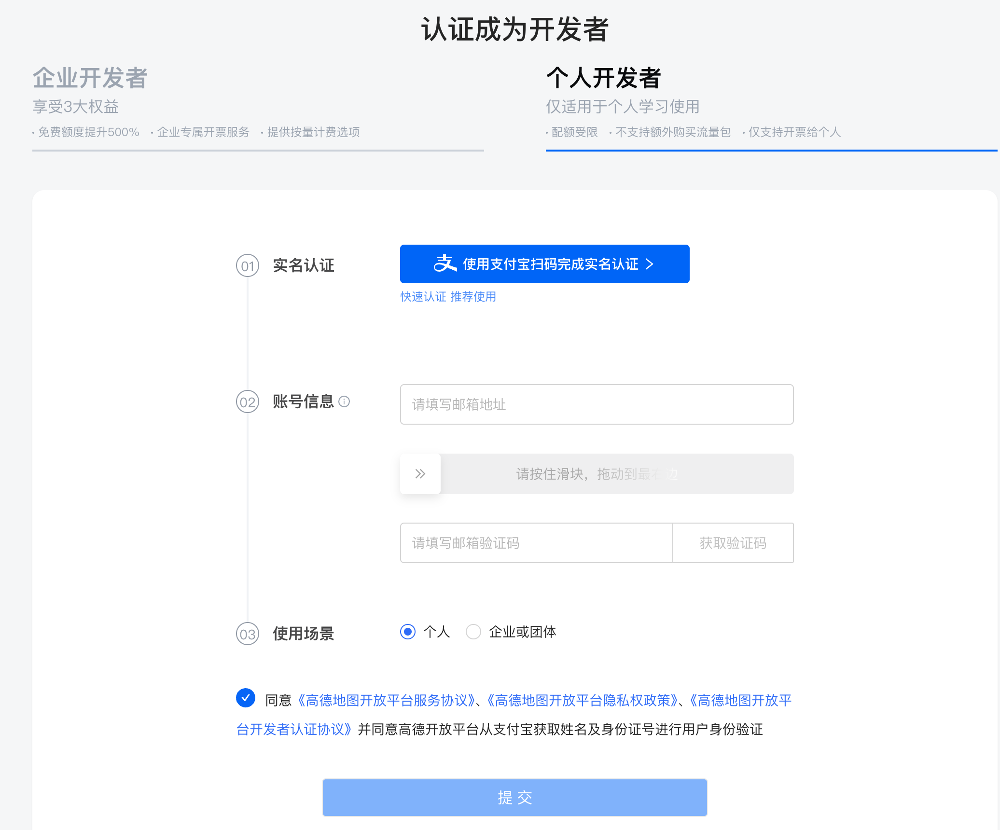
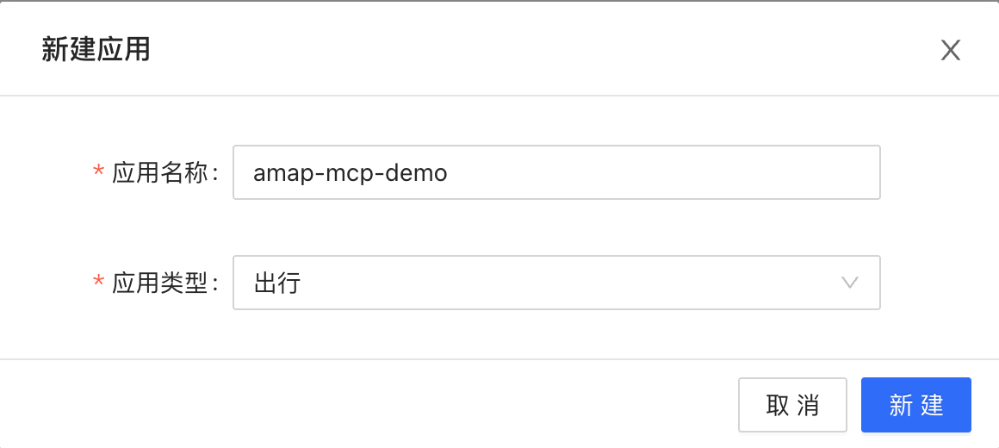
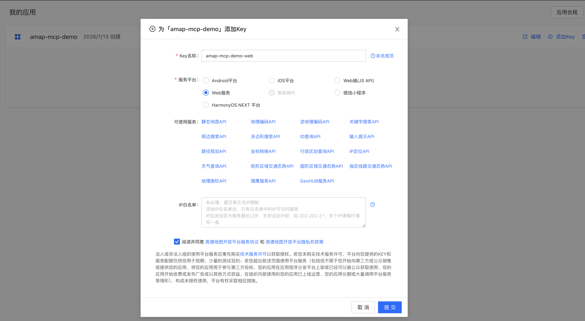

# 手写的AI应用如何调用真实的高德MCP天气工具？

当用户问“明天去杭州西湖适合出门吗”，

我希望本地模型能自动选择高德MCP里的天气工具，查到天气后再给出出行建议。

今天想要摸清的就是实现这个事的链路。

---

先了解一下高德MCP Server，官网地址是https://lbs.amap.com/api/mcp-server/summary

看它的概述，高德会通过MCP协议向大模型开放位置搜索、路线规划、天气查询等实时出行能力，解决大模型在出行场景中数据时效性和工具能力不足的问题。就用他的天气查询能力来体验一番。

但是我们不是在cursor或claude或codex里来使用，而是手写一个mcp client demo。

# 第一步，先注册成为开发者

https://console.amap.com/dev/id/phone





这里很基础，细节不展开。

# 第二步，注册应用并创建key


进入开放平台，https://console.amap.com/dev/index

应用管理-我的应用，然后点击页面右上角**创建新应用**，填写表单即可创建新的应用。



然后创建Key，在我的应用中选择需要创建Key的应用，点击【添加Key】，表单中的服务平台选择【Web服务】



- 服务平台：因为我们要连的是类似https://mcp.amap.com/mcp?key=你的Key，
所以这里选择选默认的Web服务。
- 可使用服务：基本可以理解为，用生成的这个Key可以调用它下面列出的这些API能力，比如天气查询、地理编码、逆地理编码、关键词搜索、路径规划等等等。

提交后会拿到mcp client中需要的key，保管好。

以上，准备工作都差不多了，开始着手mcp client。

# 第三步，把Key放进.env

先在你项目根目录里放一个.env：

```dotenv
AMAP_MCP_KEY=你的高德Key
```

后面的演示代码里会读取Key，再拼出完整的高德MCP地址，类似这种：

```text
https://mcp.amap.com/mcp?key=...
```

# 第四步，用Streamable HTTP连接高德MCP Server

高德MCP Server是远程的，这意味着我们不需要自己启动一个本地MCP Server，也不需要npx拉起一个子进程。我们的Client只需要连接这个地址就可以：

```text
https://mcp.amap.com/mcp?key=你的Key
```

然后，client demo里用MCP SDK的Streamable HTTP Client可以类似下面这样定义：

```python
async with streamable_http_client(mcp_url) as (read, write, _):
    async with ClientSession(read, write) as session:
        await session.initialize()
        tools_result = await session.list_tools()
```

这里的两个核心动作：

```text
initialize  #建立MCP会话。
tools/list  #问高德MCP Server：你现在到底暴露了哪些工具？
```

实际跑了一下，高德返回了15个MCP Tool，其中最后一个就是我们打算用的maps_weather
```
1. maps_direction_bicycling
   描述：骑行路径规划用于规划骑行通勤方案，规划时会考虑天桥、单行线、封路等情况。最大支持 500km 的骑行路线规划

2. maps_direction_driving
   描述：驾车路径规划 API 可以根据用户起终点经纬度坐标规划以小客车、轿车通勤出行的方案，并且返回通勤方案的数据。

...

14. maps_schema_take_taxi
   描述：根据用户输入的起点和终点信息，返回一个拼装好的客户端唤醒URI，直接唤起高德地图进行打车。直接展示生成的链接，不需要总结

15. maps_weather
   描述：根据城市名称或者标准adcode查询指定城市的天气
```

# 第五步，确认天气Tool怎么传参数

继续看maps_weather的参数Schema，可以看到它只需要一个字段：

```json
{
  "city": "杭州"
}
```

city可以是城市名，也可以是标准adcode，所以如果问题是:明天去杭州西湖适合出门吗？

模型只要从问题里识别出“杭州”，就可以提出这样的工具调用：

```json
{
  "name": "maps_weather",
  "args": {
    "city": "杭州"
  }
}
```

# 第六步，把MCP工具定义交给本地模型

我们的Python Host会把tools/list里拿到的MCP Tool转成模型可理解的工具定义，主要包括三部分：

```text
工具名
工具描述
参数Schema
```

然后通过langchain-ollama里的ChatOllama.bind_tools交给本地模型：

```python
model = ChatOllama(
    model="qwen3-coder:30b",
    temperature=0,
).bind_tools(model_tools)
```

到这里，模型拿到的是高德MCP Server中有关天气工具的说明书，大概像这样：

```text
maps_weather:
根据城市名称或者标准adcode查询指定城市的天气。
参数：city，字符串，必填。
```

于是模型看到用户问题后，会判断：

```text
这个问题需要天气。
可用工具里有maps_weather。
参数需要city。
用户提到了杭州。
所以调用maps_weather(city=杭州)。
```

# 第七步，Host校验模型提出的Tool Call

模型提出Tool Call后，Host不应该直接无脑执行，它至少要检查两件事：

```text
1.这个tool name是否真的来自tools/list
2.参数是否是合法的JSON object
```

防的是，如果模型幻觉出一个不存在的工具：get_weather，那么本地Host应该拒绝。

另外就是，如果模型给的参数不是结构化对象，也应该拒绝。

在这个demo里，模型第一次返回的是：

```json
{
  "name": "maps_weather",
  "args": {
    "city": "杭州"
  }
}
```

检查通过后，Host才调用MCP：

```python
result = await session.call_tool("maps_weather", {"city": "杭州"})
```

这一步才是真正访问高德MCP Server。

# 第八步，高德返回天气结果

高德返回的结果里包含城市和未来几天预报。

实际运行时，返回类似这样：

```json
{
  "city": "杭州市",
  "forecasts": [
    {
      "date": "2026-07-16",
      "dayweather": "多云",
      "nightweather": "多云",
      "daytemp": "37",
      "nighttemp": "29",
      "daywind": "东南",
      "daypower": "1-3"
    }
  ]
}
```

这份数据它来自：

```text
高德MCP Server -> maps_weather -> Tool Result
```

到这里，Host已经拿到了真实工具结果，还差最后一步：把结果交回模型，让模型组织成用户能读懂的话。

# 第九步，把Tool结果交回模型

工具结果会被包装成ToolMessage，追加回对话上下文。

第二次调用模型时，模型看到的不只是用户问题了，而是完整上下文：

```text
System：你是地图与出行助手，需要外部信息时使用MCP工具
Human：明天去杭州西湖适合出门吗？请结合天气给出建议
AI：我要调用maps_weather(city=杭州)
Tool：高德返回的杭州天气预报的结果
```

这时模型就不需要再调用工具了，它会根据天气数据组织最终回答：

```text
明天杭州多云，白天温度较高，适合出门，但建议做好防晒和补水，
尽量避开中午高温时段。
```

# 理一下链路

如果你在做自己的AI应用，真正有价值的是理解这条链路：

```text
.env读取Key
  -> Streamable HTTP连接高德MCP
  -> tools/list发现工具
  -> 把工具定义交给本地模型
  -> 模型提出maps_weather调用
  -> Host校验并执行tools/call
  -> 工具结果回到模型
  -> 模型生成最终回答
```

这里是拆成了很多步骤，但真正串起来，其实就是下面这条主干。

```python
mcp_url = load_amap_mcp_url()

async with streamable_http_client(mcp_url) as (read, write, _):
    async with ClientSession(read, write) as session:
        await session.initialize()
        tools_result = await session.list_tools()

        model_tools = build_model_tools(tools_result.tools)
        allowed_tools = {tool["name"] for tool in model_tools}

        model = ChatOllama(
            model="qwen3-coder:30b",
            temperature=0,
        ).bind_tools(model_tools)

        messages = [
            SystemMessage(content="需要外部信息时使用MCP工具。"),
            HumanMessage(content="明天去杭州西湖适合出门吗？请结合天气给出建议。"),
        ]

        response = await model.ainvoke(messages)
        messages.append(response)

        tool_call = response.tool_calls[0]
        tool_name = tool_call["name"]
        arguments = tool_call["args"]

        if tool_name not in allowed_tools:
            raise RuntimeError("模型请求了未发现的工具")

        tool_result = await session.call_tool(tool_name, arguments)

        messages.append(
            ToolMessage(
                content=json.dumps(tool_result.content, ensure_ascii=False),
                tool_call_id=tool_call["id"],
            )
        )

        final_response = await model.ainvoke(messages)
        print(final_response.content)
```

完整实验代码和更详细的实验说明在仓库里。

```text
GitHub仓库：
https://github.com/yauld/ai-forge

完整实验文章：
labs/mcp/foundations/15 | MCP Client实战：用高德天气Tool跑通真实远程服务.md

实验代码：
labs/mcp/foundations/examples/amap_mcp_tools_probe.py
labs/mcp/foundations/examples/amap_mcp_agent_demo.py
```