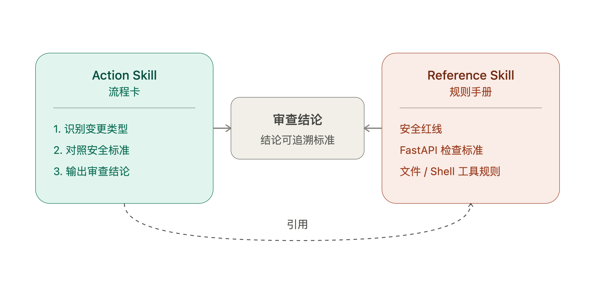

# 03 | Skill 的两种常见设计形态：Action 与 Reference

写 Skill 时，一个常见问题是：只写“怎么做”，却没写“按什么标准判断”。

比如一个本地个人 Agent，原本只负责回答问题。现在你想让它支持三件事：

```text
1. FastAPI 改成监听 0.0.0.0，方便手机访问。
2. 新增文件读取工具，让模型读取本机文件。
3. 新增 shell 执行工具，让模型运行命令。
```

为了方便称呼，下面把这个本地 Agent 叫作 RedBean。

如果 Skill 里只写“识别变更类型、检查安全风险、输出结论”，Agent 可能知道要检查 FastAPI、文件工具和 Shell 工具，却不知道该按什么标准判断：

- 没有鉴权时，FastAPI 能不能监听 `0.0.0.0`？
- 文件工具能不能读取任意本机路径？
- Shell 命令能不能让模型直接执行？

这些问题不是流程步骤，而是判断规则。

先说明清楚：Action 和 Reference 不是 Skill 规范里的固定字段，也不是必须写进 frontmatter 的官方类型。最小 `SKILL.md` 仍然只需要 `name` 和 `description`。这里说的 Action / Reference，只是两种常见的 Skill 设计形态：一个偏流程，一个偏标准。

## 一、Reference 是规则手册

Reference Skill 不直接指挥 Agent 完成任务，它提供背景知识、规范和判断标准。

比如这个本地 Agent 的安全规则，可以写成一个 Reference Skill：

````markdown
---
name: redbean-security-policy
description: 当任务需要理解这个本地 Agent 的安全边界、FastAPI 暴露限制、文件工具或 Shell 工具规则时，使用这个 Skill。
---

# 本地 Agent 安全规则摘要

## 安全红线

- 除非先实现 API 鉴权，否则保持 FastAPI 监听 `127.0.0.1`。
- 不添加无限制文件读写。
- 不添加无限制 shell 执行。
- 不允许模型自行决定任意本机路径。

## 文件工具规则

- 新增文件工具前必须定义唯一 workspace 根目录。
- 拒绝 workspace 外路径。
- 拒绝符号链接逃逸。
- 增加读写大小限制。
````

这类 Skill 像一本手册：它回答"标准是什么、边界在哪里、哪些情况允许或不允许"。

## 二、Action 是流程卡

Action Skill 负责告诉 Agent 怎么做。它更像一张流程卡：先看什么，再判断什么，最后按什么结构输出。

对应地，新能力安全审查流程可以写成一个 Action Skill：

````markdown
---
name: reviewing-redbean-change
description: 当用户要求审查这个本地 Agent 的新能力、配置变更、入口暴露、文件工具或 Shell 工具设计是否安全时，使用这个 Skill。
---

# 本地 Agent 新能力安全审查流程

执行判断时，需要参考 `redbean-security-policy` 中的安全标准。

## 工作流

1. 识别变更涉及的入口和能力类型。
2. 检查是否触碰 `redbean-security-policy` 的「安全红线」。
3. 检查 FastAPI 暴露范围、文件读写能力和 Shell 执行能力。
4. 输出审查结论、阻塞项、补充设计和对应安全标准。
````

真正有用的 Action，不是泛泛地说"检查风险"，而是在关键步骤里明确引用 Reference 的对应标准——就像第 2 步那样，直接点名要对照哪一份规则、哪一个章节。

Action 负责推进流程，Reference 负责提供依据。



## 三、为什么要分开

如果把规则和流程都塞进同一个 Skill，短期看很省事，长期会有两个问题。

### 1. 规则难复用

今天有一个"新能力安全审查流程"，明天可能还有"上线前安全检查流程""代码评审安全检查流程"。这些流程都可能需要同一套安全规则。如果规则只藏在某个 Action 里，其他流程就很难复用。

### 2. 判断容易变成感觉

只写 Action、不引用 Reference 时，Agent 知道自己"要检查"，但没有明确标准可依据，输出往往是这样的：

```text
审查结论：需要注意

这次改动涉及网络暴露和执行权限，建议谨慎评估相关风险，
确认是否存在安全隐患后再上线。
```

这段话听起来没错，但没有一条能落地的标准——"谨慎评估"是评估什么？"安全隐患"具体指什么？读的人还是要自己去猜。

加上 Reference 后，同一次审查的输出会变成：

```text
审查结论：阻塞

阻塞项：
- 无鉴权时 FastAPI 不应监听 0.0.0.0。
- 文件工具不能允许任意本机路径。
- Shell 工具不能让模型直接执行任意命令。

对应安全标准：
- 安全红线
- FastAPI 检查标准
- 文件工具规则
- Shell 工具规则
```

两相对比就能看出差别：前者是"表态"，后者是"判决"——每一条阻塞项都能追溯到具体规则，而不是停留在"这样不太好"的模糊感觉上。

这就是 Reference 的价值：它让 Action 的判断不靠感觉，而是落到具体标准。

## 四、遇到"半流程半规则"怎么办

实际写的时候，还会遇到一种中间状态：一份 Skill 里，流程和规则的占比差不多各一半，很难说它主要是"讲怎么做"还是"讲判断标准"。

这种情况不用纠结去凑一个精确比例，可以换一个问题来判断：

> 这份内容里，哪一部分换个场景还能直接用，哪一部分只能用在这一个流程里？

能被别的流程复用的部分（安全红线、命名规范、分类标准……），拆出去做 Reference；只在这一个流程里才有意义的部分（第几步做什么、输出成什么格式），留在 Action 里。

拆分之后两者不会失联——Action 正文里明确写出"参考 XX Skill 的 YY 标准"，这条引用关系本身就是两者的连接点。换句话说，"是否可复用"是拆分的判断标准，"显式引用"是拆分之后维持联系的方式。

## 五、一个简单判断法

写 Skill 时，可以先问三件事：

```text
1. 这份 Skill 主要是在告诉 Agent 怎么做，还是告诉它按什么标准判断？
2. 这些判断标准会不会被多个流程复用？
3. 当前流程里的关键判断点，能不能对应到一份明确的规则手册？
```

如果主要是步骤、流程、输出格式，写成 Action。

如果主要是规范、原则、分类、边界和判断依据，写成 Reference。

如果两者都需要，让 Action 在正文里明确引用 Reference 的具体章节。

最后再强调一次：`name` 和 `description` 是最小发现入口；Action / Reference 是我们对 Skill 职责的设计方法，不是必须写进 frontmatter 的规范字段。

---

文中的 RedBean 示例来自一份配套实验样本，正文里把它当作一个本地个人 Agent 的代称即可。如果想直接跑一遍这套审查流程，可以看这里：

```text
GitHub 仓库：
https://github.com/yauld/ai-forge

配套实验样本：
labs/skills/foundations/examples/stage3-skill-types/
```
