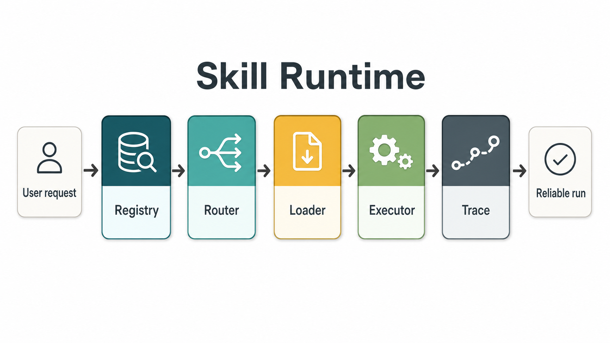

# 05 | Agent 能力要跑起来，Skill Runtime 应至少得有这五层

第一次做 Agent，脑子里想的是：

```text
用户提问 -> 大模型回答
```

再往前走一步，会加工具：

```text
用户提问 -> 大模型判断 -> 调用工具 -> 回答
```

也能跑，但当你开始沉淀一批可复用能力时，问题就来了。

比如，一个 AI 助理既能整理周报，也能改 commit message，还能审查学习路线图。用户只说：

```text
请审查这份学习路线图，看看阶段顺序、边界和产出物是否合理。
```

系统应该怎么知道这是“路线图审查”能力？选中以后，应该读取哪些流程说明？如果这个能力需要统计输入文本长度，谁来调用工具？最后出了问题，又该从哪里看它到底选了什么、读了什么、调用了什么？

这些问题不是“模型聪不聪明”能单独解决的。

它们属于 Agent 的运行结构。

## 一、只写 Skill 还不够

Skill 可以理解成一份可复用的工作方法：什么任务应该触发它，按什么步骤处理，需要什么工具，最后怎么检查结果。

但 Skill 本身只是一份说明。它不会自己跳出来工作。

真正让它运转起来的，是外面那层 runtime，也就是 Agent 的宿主环境。这个环境至少要回答五个问题：

```text
1. 系统里有哪些 Skill？
2. 当前用户请求应该用哪个 Skill？
3. 命中后要加载哪份说明？
4. 需要调用哪些工具？
5. 整个过程如何记录？
```

如果这五件事都混在一段超长 prompt 或一个大脚本里，短期看很快，长期一定难维护。

因为你分不清问题出在哪里：是 Skill 没被发现？是路由选错了？是正文没加载？是工具没调用？还是调用了但没有记录？

## 二、一个清晰的 Agent runtime，至少分五层

更稳的做法，是把 Agent runtime 拆成五个角色。



### 1. Registry：先知道有哪些能力

Registry 像一个能力目录。

它不负责执行任务，只负责扫描系统中有哪些 Skill，并读取每个 Skill 的基本信息：

```text
name：这份能力叫什么
description：什么情况下应该使用它
tools：这份能力可能用到哪些工具
```

这一步的价值是把“散落在文件里的能力说明”变成一份结构化索引。

如果没有 Registry，后面的选择、加载和记录都没有稳定基础。

### 2. Router：根据请求选择能力

Router 负责判断：

```text
这个用户请求，应该交给哪个 Skill？
```

它通常不应该一开始就读取所有 Skill 正文。发现阶段只看 `name` 和 `description` 就够了。

比如用户说：

```text
请审查这份学习路线图，看看阶段顺序、边界和产出物是否合理。
```

Router 看到某个 Skill 的 description 写着：

```text
当用户要求审查、改进或校验学习路线图、研究计划、内容路线图或分阶段技术学习计划时，使用这个 Skill。
```

它就可以选择这个路线图审查 Skill。选择的方式可以通过简单的内容规则匹配，也可以依靠模型来辅助选择。

这里的关键是：Router 负责“选”，不负责“做”。

### 3. Loader：选中以后再加载正文

Router 选中 Skill 后，Loader 才读取完整说明。

这一步看似简单，但边界很重要。

因为 Skill 正文里通常会有执行步骤、输出结构、约束条件，甚至引用资料。如果系统一开始就把所有正文都塞给模型，上下文会越来越重，也更容易混淆。

所以更好的顺序是：

```text
先用 metadata 选中 Skill
再读取命中的 Skill 正文
```

这就是很多 Agent 能力系统里“按需加载”的基本思想。

### 4. Executor：工具调用不应该藏在正文里

Skill 可以声明自己需要哪些工具，但真正调用工具的应该是 Executor。

比如路线图审查 Skill 里写：

```text
调用 text_stats 观察路线图文本规模，辅助判断内容是否过长或过碎。
```

这句话只是在说明流程。真正执行时，Executor 需要调用一个文本统计工具，得到类似结果：

```json
{
  "characters": 185,
  "non_empty_lines": 5,
  "paragraphs": 2
}
```

这一步把 Skill 和 Tool 的边界分开了：

```text
Skill 规定方法
Tool 提供动作
Executor 负责调用
```

这比“让模型看到一堆工具，自己想怎么用就怎么用”更容易控制。

### 5. Trace：没有记录，就很难调试

Agent 系统最怕的一种状态是：它看起来完成了任务，但你不知道中间发生了什么。

所以 runtime 应该记录一次请求的关键路径：

```json
{
  "registry_skills": [
    "formatting-commit-message",
    "reviewing-roadmap",
    "writing-weekly-report"
  ],
  "selected_skill": "reviewing-roadmap",
  "loaded_files": [
    "skills/reviewing-roadmap/SKILL.md"
  ],
  "tool_calls": [
    {
      "name": "text_stats",
      "result": {
        "characters": 185,
        "non_empty_lines": 5,
        "paragraphs": 2
      }
    }
  ],
  "status": "completed"
}
```

这份记录不只是日志。

它能帮你判断：

- 系统发现了哪些 Skill；
- Router 为什么选中某个 Skill；
- Loader 实际读取了哪份说明；
- Executor 调用了哪些工具；
- 工具返回了什么结果。

有了 Trace，Agent 不再是一个“黑盒回答器”，而是一个可以观察、调试和评测的运行系统。

## 三、一个简单检查清单

如果你正在设计自己的 Agent 能力系统，可以先问五个问题：

```text
1. 系统是否有 Registry，能列出当前所有可用能力？
2. Router 是否只负责选择，而不是顺手执行任务？
3. Loader 是否只在命中后加载完整说明？
4. Executor 是否统一负责工具调用，而不是让工具散落在各处？
5. Trace 是否记录了命中、加载、工具调用和结果？
```

如果答案都是“是”，这个 Agent 就已经从“会回答问题”往“能稳定运行能力”迈了一步。

最后收束成一句话：

> Skill 让 Agent 有可复用的方法；runtime 让这些方法能被发现、被加载、被执行、被追踪。

没有 runtime，Skill 只是文档。

有了 runtime，Skill 才开始变成系统能力。

---

完整实验和代码入口：

```text
GitHub 仓库：
https://github.com/yauld/ai-forge

完整实验文章：
labs/skills/foundations/05 | 教学用 Skills runtime：扫描、路由、加载、执行如何分工.md

实验代码：
labs/skills/foundations/examples/stage5-runtime-architecture/
```
