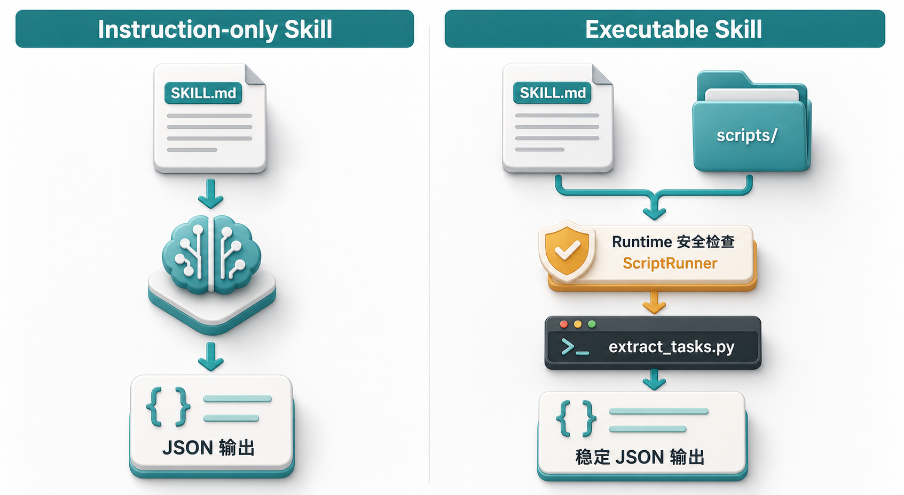

# 06 | Instruction-only Skill 与 Executable Skill

Instruction-only是Skill的一种类型，如字面意思，它代表的是这个Skill一般只含说明、流程、规则等描述。

还有一种是Executable Skill类型，可以把它理解成是一种在Instruction-only的基础上，额外还能支持脚本，或者API调用，或者MCP tool，或者workflow等等的Skill类型。



用同一个提取会议纪要的SKILL需求背景，输出对应的两种类型的Skill，

看一下区别点在哪里

## 1、Instruction-only

它的目录结构类似这样
```
meeting-task-extractor-basic/
└── SKILL.md
```

SKILL.md内容如下：
```
---
name: meeting-task-extractor-basic
description: 当用户要求从会议纪要、例会记录或 Markdown 记录中提取待办事项、负责人和截止时间时，使用这个 Skill。
---

# Meeting Task Extractor Basic

1. 阅读用户提供的会议纪要或 Markdown 记录。
2. 识别明确出现的待办事项、负责人和截止时间。
3. 不要猜测没有出现的信息。
4. 如果负责人或截止时间缺失，使用 `null`。
5. 用 JSON 返回结果。

输出格式：

{
  "tasks": [
    {
      "owner": "张三",
      "task": "整理竞品清单",
      "deadline": "下周三"
    }
  ],
  "task_count": 1
}
```


上面的这个SKILL.md的描述很直白，并没有任何脚本执行等描述，只是一般的说明。所以后面对会议内容的提取其实主要是靠模型能力来提取了，至于提取的形式是不是你想要的，那要看模型是如何理解。


## 2、Executable Skill
Executable类型SKILL在这个场景下，从目录结构上也能看得出来，它里面有一个scripts的目录，这是第一眼看到的不同。

```
meeting-task-extractor-script/
├── SKILL.md
└── scripts/
    └── extract_tasks.py
```

然后，SKILL.md里面的描述也与instruction-only的有不一样的地方

```
---
name: meeting-task-extractor-script
description: 当用户要求从会议纪要、例会记录或 Markdown 记录中提取待办事项、负责人和截止时间时，使用这个 Skill。
---

# Meeting Task Extractor Script

1. 阅读用户提供的会议纪要或 Markdown 记录。
2. 如果 runtime 支持脚本执行，调用 `scripts/extract_tasks.py` 提取待办事项。
3. 不要猜测没有出现的信息。
4. 使用脚本返回的结构化结果作为事实来源。
5. 如果脚本无法执行，再按普通文本规则提取，并说明结果来自模型分析。
```

看重点：**如果 runtime 支持脚本执行，调用scripts/extract_tasks.py提取待办事项。**

# 3、对比
所以，相同的会议内容，比如：

```
本周例会

1、张三负责整理竞品清单，下周三前完成
2、李四需要更新项目排期
3、已讨论预算问题，暂不处理
```

instruction-only类型就是纯靠模型的理解和能力来输出，它不敢保证每次输出都符合格式要求，质量上也不敢保证。

而execuable类型的skill是你用脚本等能力约定死的，提供确定性的执行逻辑，至少格式上可以固定，输出的质量上就看你写的脚本是否可靠了。