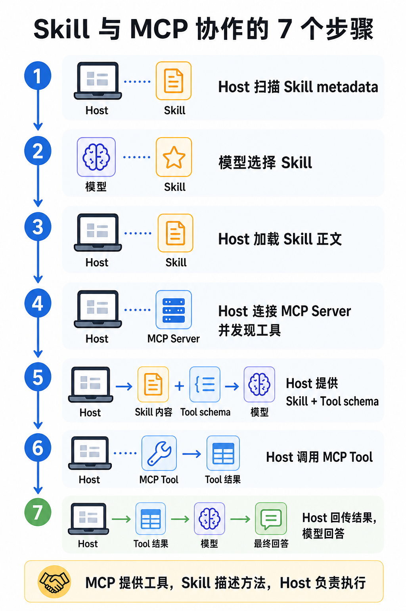

# 10 | Skill与MCP放在一起是咋协作的

你问：

```text
帮我查一下订单O-1001的状态、商品和金额，并用一句话告诉我结果。
```

如果你的agent即用了skill，又用了mcp，回答你的这个问题的时候大概经过了这些链路：



## 1. Host先扫描Skill metadata

这句请求进来以后，Host不应该一开始就把所有Skill正文都塞给模型。

更合理的做法是先扫描每个Skill的基本信息，就是frontmater信息，比如

```text
name：这个Skill叫什么
description：什么任务适合使用它
```

比如系统里有一个订单查询Skill：

```yaml
name: order-query
description: 当用户需要查询订单状态、订单金额、商品名称或订单摘要时，使用这个Skill。
```

Host需要先知道“系统里有哪些Skill”，所以这一步的扫描只是在建立所有skills的能力目录。

## 2. 模型根据用户任务选择Skill

接下来，Host把这句用户请求和Skill metadata交给模型，让模型选择最匹配的Skill。

用户请求是：

```text
帮我查一下订单O-1001的状态、商品和金额，并用一句话告诉我结果。
```

模型看到order-query的description，就可以判断：

```text
这个请求要查订单状态、商品和金额，应该使用order-query。
```

注意，这一步依然，依然，依然还没有读取完整Skill正文。

它只是在做路由：这句查订单的请求，应该进入哪一套任务方法，这一步的边界很重要。

## 3. Host再加载完整Skill正文

选中要使用哪个Skill后，Host才读取完整的SKILL.md，轻量就体现在这。

Skill正文里通常会写：

```text
这个任务适合什么场景；
需要按什么步骤做；
要使用哪些MCP Server和Tool；
参数从哪里来；
工具结果应该怎么处理；
最终输出有什么要求。
```

围绕这句请求，订单查询Skill.md可以写：

```markdown
当用户询问订单状态、商品或金额时：

1. 从用户请求中提取订单号。
2. 调用order-service MCP Server中的get_order工具。
3. 使用工具返回结果生成一句简短回答。
4. 不要编造工具结果里没有出现的信息。
```

至此，完整的skill.md的全部内容才被host获取，这一步之后，Skill才真正进入模型上下文。

换句话说，到此时模型才知道：O-1001要从用户请求里提取，查询动作要交给get_order，最后还要按“一句话”的要求回答。

## 4. Host连接MCP Server，并发现工具

Skill告诉系统“这个订单查询任务应该用get_order”，但工具本身来自MCP Server。

所以Host还需要连接MCP Server，询问它当前暴露了哪些工具。

一个MCP Server可能返回类似这样的工具定义：

```text
tool name: get_order
description: 根据订单号查询订单状态、金额和商品名称
input schema: { order_id: string }
```

这一步解决的是：

```text
Host知道外部系统真实提供了哪些能力。
```

这里也要注意边界：MCP Server并不知道当前命中了哪个Skill。

它只负责暴露工具。

至于为什么这句请求要用get_order，是Skill和Host的事情。

## 5. Host把Skill正文和MCP Tool schema交给模型

现在Host手里有两类信息：

```text
Skill正文：这类任务应该怎么做（注意，是即将要用的，完整的SKILL.md的内容）
MCP Tool schema：当前有哪些工具可以调用
```

Host会把它们一起交给模型。

但模型拿到的不是MCP连接，也不是工具函数本身，模型拿到的是工具说明：

```text
工具名是什么；
工具能做什么；
参数schema是什么。
```

然后模型根据Skill正文和这句用户请求，提出一个Tool Call。

比如：

```json
{
  "name": "get_order",
  "args": {
    "order_id": "O-1001"
  }
}
```

这一步是“模型提出调用意图”：为了回答这句请求，需要查O-1001。

不是模型真的执行工具。

## 6. Host按Tool Call调用MCP Server

模型提出Tool Call以后，真正执行的人是Host。

Host会拿到：

```text
tool_name = get_order
arguments = {"order_id": "O-1001"}
```

然后通过MCP Client调用MCP Server。

MCP Server返回真实结果：

```json
{
  "order_id": "O-1001",
  "status": "paid",
  "product": "耳机",
  "amount": 199
}
```

这一步是整个链路里真正发生外部动作的地方：系统确实拿着O-1001去查订单了。

不是Skill执行了工具，也不是模型执行了工具。

是Host根据模型提出的调用意图，向MCP Server发起真实调用。

## 7. Host把工具结果交回模型，生成最终回答

到这已经是收尾的活了，工具调用完成后，Host还要把结果交回模型。

如果不把工具结果交回模型，模型就只能停留在“我想调用工具”的阶段。

只有拿到工具结果后，模型才能把结构化数据变成用户要的“一句话回答”。

比如工具结果是：

```json
{
  "order_id": "O-1001",
  "status": "paid",
  "product": "耳机",
  "amount": 199
}
```

最终回答可以是：

```text
订单O-1001当前状态是paid，商品是耳机，金额为199元。
```

这个回答里的事实来自MCP Tool。

但“要调用这个工具、订单号从请求里取、最后用一句话回答”这件事，来自Skill。

## 把7步连起来看

完整链路可以总结成这样：

```text
1. Host扫描Skill metadata
2. 模型根据用户任务选择Skill
3. Host加载完整Skill正文
4. Host连接MCP Server，并发现工具
5. Host把Skill正文和Tool schema交给模型
6. Host按模型提出的Tool Call调用MCP Server
7. Host把工具结果交回模型，生成最终回答
```

这7步背后，其实是在划分四个角色：

```text
Skill：描述一类任务的方法
MCP Server：暴露外部工具
Model：理解任务，并提出工具调用意图
Host：负责发现、加载、绑定、调用和回传结果
```

而，Skill与MCP的关系不是谁替代谁，准确地说应该是：

> MCP提供工具，Skill告诉Agent如何把工具用进任务流程，Host负责真正执行。

如果只接MCP，没有Skill，系统知道“能做什么”，但不一定知道“这类任务应该怎么做”。

如果只有Skill，没有MCP，系统知道“应该怎么做”，但缺少连接外部系统的工具能力。

两者配合起来，Agent才能从“知道工具存在”，走到“按稳定方法使用工具完成任务”。

---

完整实验和代码入口：

```text
GitHub仓库：
https://github.com/yauld/ai-forge

完整实验文章：
labs/skills/foundations/10 | Skills + MCP：如何让 Skill 指导 MCP 工具调用.md

实验代码：
labs/skills/foundations/examples/stage10-mcp-skill/
```