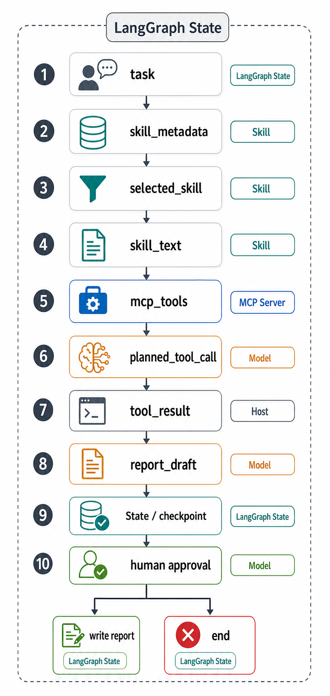

# 11 | 从10个节点看Skill、MCP和LangGraph是咋协作的

用Skill、MCP、LangGraph做了一个小demo，主要看他们三个混在一起是如何协作的。

用户问题：

```text
帮我查询订单O-1001，生成一份简短订单报告，确认后写入本地文件。
```

对应的大致的graph结构



这个图里，订单任务被拆成了10个LangGraph节点。

下面就按图里的10个节点走一遍。


## 1. task：接收用户任务

先把用户请求放进LangGraph State，此时State里只有原始任务：

```text
帮我查询订单O-1001，生成一份简短订单报告，确认后写入本地文件。
```

这一步的意义是：后面所有节点都围绕同一个任务继续推进，而不是各自重新理解一遍。

## 2. skill_metadata：读取Skill目录

这个节点读取系统里已有的Skill基本信息。

需要注意的是，这里读的不是完整Skill正文，而是metadata，通常包括：

```text
name：Skill叫什么
description：什么任务适合使用它
```

比如系统里可能有两个Skill：

```text
order-report：生成订单报告
shipping-policy：查询配送政策
```

那这一步只是在建立候选列表，因为它还没有决定用哪个Skill。

## 3. selected_skill：选择当前任务要用的Skill

这个节点让模型根据用户任务和Skill metadata做选择，用户要查订单并生成报告，所以模型应该选中：

```text
order-report
```

这一步解决的是这个任务应该进入哪套处理方法，说白了就是我该用哪个skill

## 4. skill_text：加载完整Skill正文

上一个节点知道我要用哪个Skill，之后，第四个节点才读取完整的SKILL.md。

Skill正文会告诉模型这类任务应该怎么做，例如：

```text
1. 从用户请求中提取订单号；
2. 查询订单信息；
3. 生成简短订单报告；
4. 写文件前必须等待用户确认。
```

这一步开始，模型才真正拿到任务方法。

Skill在这里像操作手册，它告诉Agent流程和约束，但它自己不连接订单系统。

## 5. mcp_tools：发现当前可用工具

这个节点的任务是连接MCP Server，读取当前暴露的工具都有哪些，

比如MCP Server返回：

```text
get_order(order_id)：查询订单
get_shipping_policy(region)：查询配送政策
```

这一步解决的是：当前外部系统能提供哪些能力？

Skill告诉系统：订单报告要查订单。
MCP告诉系统：现在mcp server里有哪些工具，我都拿过来了。

## 6. planned_tool_call：模型生成工具调用计划

第六个节点让模型结合三类信息做判断：

```text
用户任务是啥
Skill正文是啥
MCP工具列表
```

于是模型生成计划，决定它要用mcp server里具体哪一个tool，模型判断后大致会得到类似下面的调用意向

```text
调用 get_order
参数：order_id = O-1001
```

注意，这里只是计划，还没有真正执行。

模型负责判断“应该调用哪个工具、传什么参数”。真正执行要交给下一个节点。

## 7. tool_result：Host执行工具调用

第七个节点由Host执行工具调用，因为模型在上一步已经提出：

```text
调用get_order，查询O-1001
```

Host负责检查并发送请求：

```text
这个工具能不能调用？
参数是否合法？
是否符合权限和安全规则？
```

检查通过后，Host通过MCP调用工具，拿到订单结果。

这一步的边界很重要：模型只提出计划，Host才真正执行动作。

## 8. report_draft：生成报告草稿

第八个节点根据工具结果生成报告草稿。

比如订单工具返回了状态、金额、商品名称，模型就可以整理成一段简短报告。

这一步还不会写文件。

原因很简单：写文件是副作用。用户原始任务里说的是“确认后写入”，所以系统必须先生成草稿，再等用户确认。

## 9. State / checkpoint：保存现场并暂停

第九个节点是LangGraph很关键的地方。

系统会把当前现场保存下来：

```text
原始任务
选中的Skill
Skill正文
已发现的MCP工具
工具调用计划
订单查询结果
报告草稿
```

保存checkpoint之后，流程可以暂停。

这意味着用户过一会儿再确认，系统也知道刚才执行到哪里，不需要从头重新查订单。

## 10. human approval：等待用户确认

第十个节点等待用户选择。

如果用户批准：

```text
继续执行write report
```

系统把报告写入本地文件。

如果用户拒绝：

```text
进入end
```

流程结束，不产生写文件这个副作用。

这个节点体现的是人工确认，也就是Human-in-the-loop。它不是装饰，而是控制真实副作用的一道门。

## 这10个节点串起来看

整条链路可以压缩成一句话：

```text
LangGraph保存流程，Skill提供方法，MCP提供工具，模型做选择，Host执行动作，用户确认副作用。
```

再对应到10个节点：

```text
task：接收任务
skill_metadata：读取Skill候选
selected_skill：选择Skill
skill_text：加载Skill方法
mcp_tools：发现MCP工具
planned_tool_call：生成工具调用计划
tool_result：执行工具并拿到结果
report_draft：生成报告草稿
State / checkpoint：保存现场并暂停
human approval：确认后写入或结束
```

所以，Skill、MCP和LangGraph在这条流程里的角色扮演情况类似：

```text
Skill管任务方法。
MCP管外部能力。
LangGraph管执行过程。
```

模型在中间做判断，Host把判断变成受控动作。

这样拆开以后，任务每一步为什么发生、由谁负责、结果保存在哪里，就清楚了。

## 完整实验入口

```text
GitHub 仓库：
https://github.com/yauld/ai-forge

完整实验文章：
labs/skills/foundations/11 | Skills + LangGraph：如何把路由、执行和人工确认放进状态图.md

实验代码：
labs/skills/foundations/examples/stage11-langgraph-skills/
```
