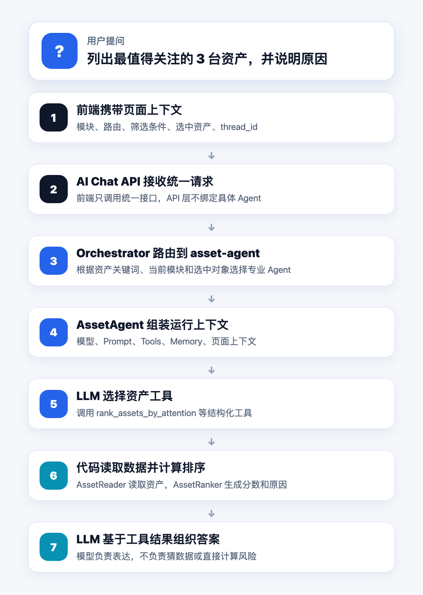
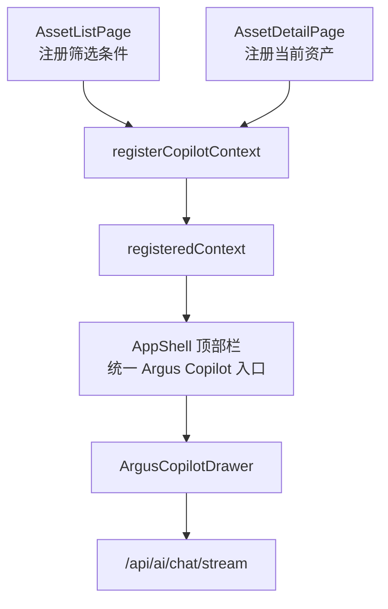
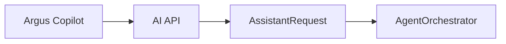
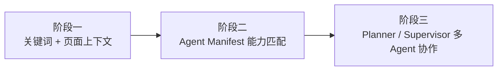
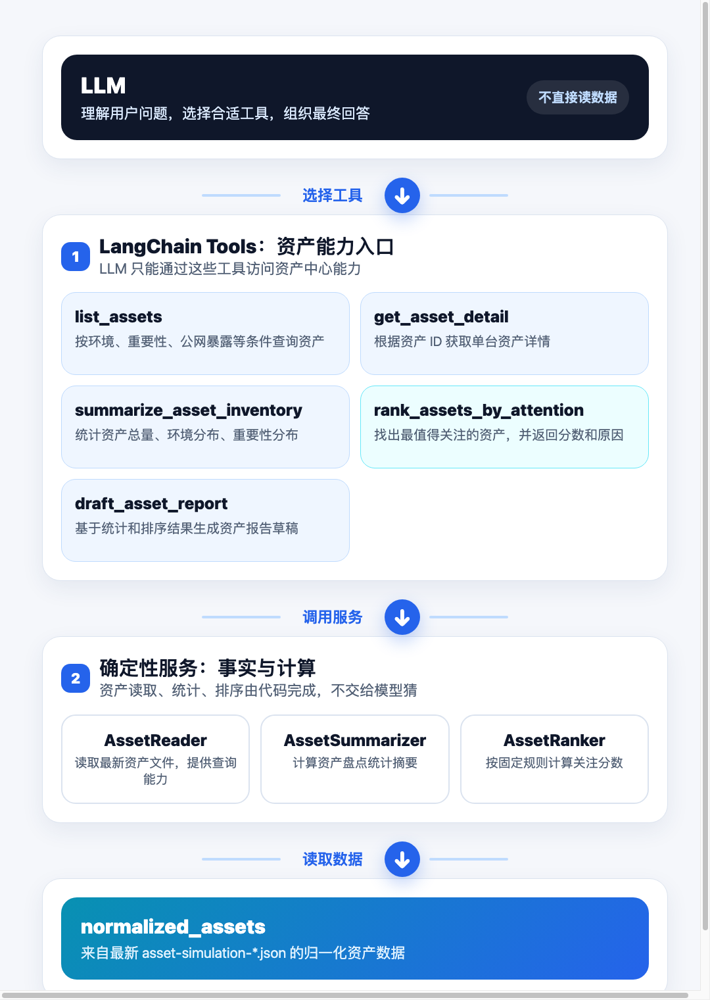
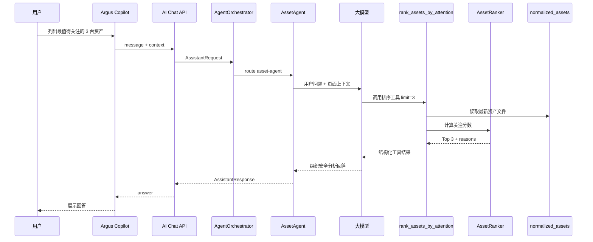
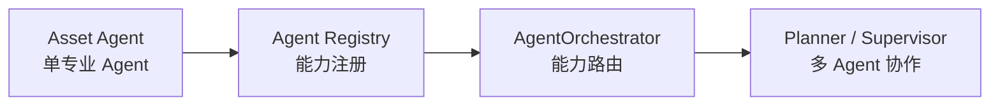

# 把资产中心接入大模型：一次资产运营提问背后的 Agent 闭环

## 一、从一个真实问题开始

安全资产中心通常解决的是“看见资产”的问题：

1. 当前有哪些资产？
2. 属于哪个业务和部门？
3. 是否存在公网暴露？
4. 运行了哪些端口、进程和软件包？
5. HIDS Agent 是否在线？

但安全工程师真正关心的，往往不是单纯“看见”，而是进一步判断：

```text
当前最值得关注的 3 台资产是哪几台？为什么？
```

如果只依赖传统页面，工程师通常需要筛选、排序、查看详情、对比字段，再自己总结原因。

这次 Asset Agent 的目标，就是让用户可以在资产中心直接向 **Argus Copilot** 提问：

```text
列出最值得关注的 3 台资产，并说明原因
```

然后系统自动完成：

1. 识别用户当前所在页面。
2. 路由到资产中心专业 Agent。
3. 调用资产排序工具。
4. 读取真实资产数据。
5. 使用确定性规则计算关注优先级。
6. 由大模型组织成安全工程师可读的答案。

这篇文章不按模块罗列实现，而是沿着这一次提问，拆解一个安全 Agent 最小闭环是如何工作的。

## 二、ASCC 资产中心是什么

### 2.1 ASCC 的定位

ASCC 可以理解为一个安全指挥中心系统。它不是单点工具，而是把资产、漏洞、情报、事件等安全模块组织在一起，为安全运营提供统一入口。

其中，资产中心是整个系统的事实底座。

原因很简单：无论做漏洞治理、情报关联、攻击面分析还是风险评分，都必须先知道资产是什么、在哪里、归属谁、暴露了什么。

### 2.2 当前资产中心已有能力

当前资产中心已经具备基础页面能力：

1. 查看资产列表。
2. 按环境、子公司、状态、公网暴露、HIDS 状态筛选资产。
3. 查看单台资产详情。
4. 展示云资源信息、网络端口、软件包、进程和原始数据引用。
5. 从资产模拟引擎生成的 JSON 文件加载归一化资产。

后续文章中可以在这里插入资产列表页和资产详情页截图。

```text
建议截图位置：
- 资产列表页截图
- 资产详情页截图
- Argus Copilot Drawer 截图
```

当前数据源暂时不是数据库，而是本地生成的归一化资产文件：

```text
data/generated/assets/asset-simulation-*.json
```

第一版 Asset Agent 只读最新资产文件，不写入数据，不修改资产状态。

## 三、一句话请求的完整链路

### 3.1 请求从哪里开始

用户在资产中心页面点击右上角的 **Argus Copilot**，输入：

```text
列出最值得关注的 3 台资产，并说明原因
```

这句话表面上只是一个自然语言问题，但系统背后至少要解决六件事：

1. 前端要知道用户在哪个页面。
2. 后端要知道这个问题应该交给哪个 Agent。
3. Asset Agent 要知道自己有哪些工具可用。
4. 工具要能读取真实资产数据。
5. 关注排序必须由代码确定性计算。
6. 大模型只能基于工具结果组织答案。

完整链路如下：


这条链路里最关键的原则是：

**LLM 不直接读资产文件，不直接计算资产分数，只负责理解问题、选择工具和组织表达。**

## 四、第一步：前端把页面上下文带给 Agent

### 4.1 Argus Copilot 不是孤立聊天框

如果只是做一个普通聊天框，用户每次都要解释：

```text
我现在在资产中心页面，筛选了生产环境资产，请帮我分析一下。
```

这很低效，也不符合安全系统的使用方式。

所以 Argus Copilot 的设计不是“孤立聊天框”，而是“带页面上下文的业务 Copilot”。

前端会自动携带：

1. 当前模块。
2. 当前路由。
3. 当前筛选条件。
4. 当前选中对象。
5. 当前会话 thread_id。

### 4.2 前端上下文架构



真实实现中，页面上下文由 `copilot-context.ts` 维护：

```ts
const registeredContext = shallowRef<CopilotContext | null>(null)

export function useCopilotContext() {
  const route = useRoute()

  return computed(
    () =>
      registeredContext.value ?? {
        current_module: String(route.meta.module ?? 'unknown'),
        current_route: route.fullPath,
        selected_objects: [],
        visible_filters: {},
        permission_scope: { thread_id: `route-${String(route.name ?? route.path)}` },
      },
  )
}
```

资产列表页注册筛选条件：

```ts
const copilotContext = computed(() => ({
  current_module: 'asset_center',
  current_route: '/assets-center',
  selected_objects: [],
  visible_filters: {
    dataset: selectedDataset.value,
    keyword: filters.keyword || undefined,
    environment: filters.environment,
    subsidiary: filters.subsidiary,
    assetStatus: filters.assetStatus,
    publicExposure: filters.publicExposure,
    agentStatus: filters.agentStatus,
  },
  permission_scope: { thread_id: copilotThreadId },
}))
```

资产详情页注册当前资产：

```ts
const copilotContext = computed(() => ({
  current_module: 'asset_center',
  current_route: `/assets-center/${assetId.value}`,
  selected_objects: asset.value ? [{ type: 'asset', id: asset.value.id }] : [],
  visible_filters: { dataset: dataset.value },
  permission_scope: { thread_id: copilotThreadId.value },
}))
```

这一步解决的是 Agent 应用里的第一个关键问题：

**用户不需要告诉 Agent 自己在哪里，系统应该知道。**

## 五、第二步：API 接收统一对话请求

### 5.1 统一入口

前端不会直接调用 `asset-agent`，而是调用统一 AI API。

这样做的好处是：前端只感知一个 AI 入口，后端可以根据上下文路由到不同专业 Agent。

真实 API 代码如下：

```python
@router.post("/chat", response_model=ChatResponse)
def chat(payload: ChatRequest) -> ChatResponse:
    return chat_with_assistant(payload)


@router.post("/chat/stream")
def chat_stream(payload: ChatRequest) -> StreamingResponse:
    return StreamingResponse(_as_sse(stream_with_assistant(payload)), media_type="text/event-stream")
```

流式接口使用 SSE：

```python
def _as_sse(chunks: Iterator[str]) -> Iterator[str]:
    for chunk in chunks:
        data = json.dumps({"content": chunk}, ensure_ascii=False)
        yield f"event: delta\ndata: {data}\n\n"
    yield "event: done\ndata: {}\n\n"
```

### 5.2 API 层不做业务判断

API 层只负责协议转换，把请求转成 Agent 层的 `AssistantRequest`。

具体由哪个 Agent 回答，不应该写死在 API 层，而是交给 Orchestrator。



这一步解决的是第二个关键问题：

**AI 入口要统一，但专业能力不能耦合在 API 层。**

## 六、第三步：Orchestrator 判断交给 asset-agent

### 6.1 为什么需要 Orchestrator

当前系统已经有 `asset-agent`，未来还会有情报、漏洞、风险等专业 Agent。

如果前端直接选择 Agent，后续会很难维护。更合理的方式是：

```text
前端只提交问题和上下文，后端统一决定由哪个 Agent 处理。
```

### 6.2 第一版规则路由

当前 Orchestrator 采用第一阶段规则路由。

真实代码核心逻辑如下：

```python
def _route(self, request: AssistantRequest) -> str:
    message = request.message.lower()

    if any(keyword in message for keyword in vuln_keywords):
        return "vuln-agent"

    if request.context.current_module == "vulnerability_governance":
        return "vuln-agent"

    if any(keyword in message for keyword in asset_keywords):
        return "asset-agent"

    if request.context.current_module == "asset_center":
        return "asset-agent"

    if any(item.type == "asset" for item in request.context.selected_objects):
        return "asset-agent"

    return "vuln-agent"
```

对于这次问题：

```text
列出最值得关注的 3 台资产，并说明原因
```

它会命中“资产”关键词，或者命中当前模块 `asset_center`，因此路由到 `asset-agent`。

### 6.3 路由演进方向

第一版规则路由不是最终形态。

后续可以演进为：



这一步解决的是第三个关键问题：

**用户只面对一个 Copilot，但系统内部可以逐步演进成多 Agent。**

## 七、第四步：AssetAgent 组装模型、工具和记忆

### 7.1 AssetAgent 的职责

AssetAgent 是资产中心专业 Agent。

它不负责具体资产计算，而是负责组装：

1. 模型。
2. Prompt。
3. Tools。
4. 短期记忆。
5. 页面上下文。

核心代码如下：

```python
agent = create_agent(
    model=self._build_model(settings),
    tools=ASSET_TOOLS,
    system_prompt=ASSET_AGENT_SYSTEM_PROMPT,
    checkpointer=self.checkpointer,
)
```

### 7.2 模型接入

模型通过 `init_chat_model()` 接入 OpenAI 兼容端点：

```python
return init_chat_model(
    model=settings.model,
    model_provider="openai",
    base_url=settings.base_url,
    api_key=settings.api_key,
    temperature=settings.temperature,
)
```

配置来自环境变量：

```python
model=os.getenv("ASCC_AI_MODEL") or "qwen3.5-plus"
api_key=os.getenv("ASCC_AI_API_KEY") or os.getenv("DASHSCOPE_API_KEY")
base_url=os.getenv("ASCC_AI_BASE_URL") or os.getenv("DASHSCOPE_BASE_URL")
temperature=float(os.getenv("ASCC_AI_TEMPERATURE") or "0.2")
```

这使系统可以接入阿里云百炼等 OpenAI 兼容模型服务。

### 7.3 页面上下文进入模型输入

AssetAgent 会把用户问题和页面上下文合并成模型输入：

```python
def _build_user_message(self, request: AssistantRequest) -> str:
    context = {
        "current_module": request.context.current_module,
        "current_route": request.context.current_route,
        "selected_objects": [item.model_dump() for item in request.context.selected_objects],
        "visible_filters": request.context.visible_filters,
    }
    return "\n".join(
        [
            request.message,
            "",
            "ASCC 页面上下文：",
            json.dumps(context, ensure_ascii=False),
        ]
    )
```

这一步非常关键。

如果用户在资产详情页问：

```text
解释这台资产的安全画像
```

模型能从 `selected_objects` 中知道“这台资产”是谁。

这一步解决的是第四个关键问题：

**Agent 必须理解业务上下文，而不是只理解一句孤立文本。**

## 八、第五步：LLM 通过 Tool 调用资产能力

### 8.1 为什么要设计 Tools

大模型不能直接访问资产中心数据。

它必须通过工具调用进入系统边界。

Asset Agent 当前暴露 5 个工具：

1. `list_assets`
2. `get_asset_detail`
3. `summarize_asset_inventory`
4. `rank_assets_by_attention`
5. `draft_asset_report`

工具架构如下：


### 8.2 这个问题会调用哪个工具

对于问题：

```text
列出最值得关注的 3 台资产，并说明原因
```

最匹配的工具是：

```python
rank_assets_by_attention
```

真实实现如下：

```python
@tool(args_schema=LimitOnlyInput)
def rank_assets_by_attention(limit: int = 10) -> dict[str, Any]:
    """按关注优先级找出最值得关注的资产。"""

    assets = _reader().load_assets()
    return {"items": AssetRanker().rank(assets, limit=limit)}
```

这里的 `limit` 可以由模型从“3 台资产”中理解出来，然后传给工具。

这一步解决的是第五个关键问题：

**自然语言可以交给模型理解，但业务动作必须落到结构化工具调用。**

## 九、第六步：资产数据由确定性服务处理

### 9.1 数据读取边界

资产数据由 `AssetReader` 读取。

真实代码如下：

```python
class AssetReader:
    def __init__(self, asset_dir: Path | None = None) -> None:
        project_root = Path(__file__).resolve().parents[6]  # project/ascc
        self.asset_dir = asset_dir or project_root / "data" / "generated" / "assets"
```

读取最新文件：

```python
def latest_file(self) -> Path:
    files = sorted(self.asset_dir.glob("asset-simulation-*.json"))
    if not files:
        raise FileNotFoundError(f"未找到资产数据文件：{self.asset_dir}/asset-simulation-*.json")
    return files[-1]
```

只读取 `normalized_assets`：

```python
def load_assets(self) -> list[dict[str, Any]]:
    payload = json.loads(self.latest_file().read_text(encoding="utf-8"))
    assets = payload.get("normalized_assets") if isinstance(payload, dict) else None
    if not isinstance(assets, list):
        raise ValueError("资产数据文件缺少 normalized_assets 列表")
    return assets
```

### 9.2 关注排序不交给 LLM

最值得关注的资产，不应该让 LLM 凭感觉判断。

第一版使用固定规则计算分数：

```python
score += self._add(asset.get("environment") == "production", 30, "production", reasons)
score += self._add(self._has_public_ip(asset), 25, "public exposed", reasons)
score += self._add(asset.get("criticality") == "high", 25, "high criticality", reasons)
score += self._add(asset.get("criticality") == "medium", 10, "medium criticality", reasons)
score += self._add(asset.get("role") in KEY_ROLES, 15, f"key role: {asset.get('role')}", reasons)
score += self._add(self._agent_inactive(asset), 10, "agent inactive", reasons)
score += self._add(not asset.get("owner"), 10, "missing owner", reasons)
score += self._add(asset.get("environment") == "staging", 5, "staging", reasons)
```

返回结果中包含资产和原因：

```python
return {
    "asset_id": asset.get("id"),
    "name": asset.get("name"),
    "score": score,
    "reasons": reasons,
    "environment": asset.get("environment"),
    "criticality": asset.get("criticality"),
    "role": asset.get("role"),
    "has_public_ip": self._has_public_ip(asset),
}
```

这种设计有两个好处：

1. 排序结果可解释。
2. LLM 不会在风险判断上自由发挥。

这一步解决的是第六个关键问题：

**安全分析里的数字、排序和事实，必须由代码确定性生成。**

## 十、第七步：LLM 只负责把工具结果组织成答案

### 10.1 LLM 的合理边界

当工具返回排序结果后，LLM 的职责是把结构化结果变成可读回答。

例如工具返回：

```text
prod-gateway-21，score=95，原因=production, public exposed, high criticality, key role
```

LLM 可以组织成：

```text
prod-gateway-21 是当前最值得关注的资产。它位于生产环境，存在公网暴露，重要性为 high，并且承担网关角色，因此应优先检查访问控制、安全组和外部暴露面。
```

这里 LLM 没有决定资产分数，也没有编造数据。它只是把工具结果翻译成安全工程师更容易阅读的语言。

### 10.2 为什么这比“直接问模型”可靠

如果直接把问题丢给模型：

```text
哪些资产最值得关注？
```

模型可能会根据经验给出看似合理的答案，但无法保证：

1. 数据来自当前资产中心。
2. 数字是准确的。
3. 排序规则一致。
4. 原因可追溯。

Tool-based Agent 的价值就在这里：

```text
模型负责理解和表达，工具负责事实和计算。
```

## 十一、第八步：短期记忆支持连续追问

### 11.1 为什么需要记忆

用户通常不会只问一轮。

例如第一轮：

```text
列出最值得关注的 3 台资产
```

第二轮：

```text
解释第一台资产的安全画像
```

这里的“第一台资产”依赖上一轮回答。

### 11.2 当前实现

Asset Agent 使用 LangGraph 的 `InMemorySaver`：

```python
DEFAULT_ASSET_AGENT_CHECKPOINTER = InMemorySaver()
```

从请求上下文中提取 `thread_id`：

```python
def thread_id_from_request(request: AssistantRequest) -> str:
    scope = request.context.permission_scope
    return str(scope.get("thread_id") or scope.get("session_id") or "default")
```

调用 Agent 时传入配置：

```python
config: RunnableConfig = {"configurable": {"thread_id": thread_id_from_request(request)}}
result = agent.invoke(
    {"messages": [{"role": "user", "content": self._build_user_message(request)}]},
    config=config,
)
```

第一版使用内存型记忆，适合 MVP 和学习场景。后续如果要跨进程保存对话，可以切换到 SqliteSaver 或 PostgresSaver。

这一步解决的是第七个关键问题：

**安全 Copilot 必须支持连续分析，而不是每轮都从零开始。**

## 十二、一次请求的后端时序图

把上面的过程压缩成一张时序图：



这就是本次 Asset Agent 的最小闭环。

## 十三、当前已经完成的能力

第一版 Asset Agent 已经可以处理几类典型问题。

### 13.1 资产整体情况

```text
帮我总结当前资产中心整体情况
```

对应工具：

```text
summarize_asset_inventory
```

### 13.2 重点关注资产

```text
列出最值得关注的 3 台资产
```

对应工具：

```text
rank_assets_by_attention
```

### 13.3 当前资产安全画像

```text
解释这台资产的安全画像
```

对应工具：

```text
get_asset_detail
```

### 13.4 简单资产报告

```text
生成一份简单资产报告
```

对应工具：

```text
draft_asset_report
```

## 十四、当前边界

第一版明确不追求“大而全”。

当前边界包括：

1. 只读最新资产模拟 JSON 文件。
2. 不写入资产数据。
3. 不做跨模块资产与情报关联。
4. 路由仍是规则路由。
5. 流式输出接口已打通，但前端真实流式体验仍需继续排查。
6. 对上下文不足时的指代问题，还需要更强的工程约束。

这些边界不是问题，而是刻意控制范围。

Agent 系统最容易失败的方式，就是第一版就试图解决所有问题。

## 十五、为什么这是一个可演进的闭环

### 15.1 单 Agent 到多 Agent

当前只实现资产中心专业 Agent。

后续可以增加：

1. Intelligence Agent：处理情报中心问题。
2. Vulnerability Agent：处理漏洞治理问题。
3. Risk Agent：处理风险评分和优先级分析。
4. Report Agent：处理报告生成。

演进路线如下：



### 15.2 本地 JSON 到真实资产服务

当前数据来自本地 JSON，是为了优先验证 Agent 链路。

后续可以替换为：

1. 资产数据库。
2. 资产中心内部 API。
3. 带权限控制的资产检索服务。
4. 带引用来源的证据链返回。

### 15.3 从自然语言回答到证据链回答

安全系统里的 Agent 不能只给结论。

后续更合理的回答应该包含：

1. 使用了哪个工具。
2. 查询了哪些资产。
3. 命中了哪些字段。
4. 判断依据是什么。
5. 数据来源和时间是什么。

这样才能从“AI 回答”升级为“可审计的安全分析”。

## 十六、总结

这次 Asset Agent 的核心价值，不是给 ASCC 加了一个聊天框，而是验证了一个安全 Agent 应用的最小闭环。

围绕一句问题：

```text
列出最值得关注的 3 台资产，并说明原因
```

系统完成了完整链路：

1. 前端采集页面上下文。
2. API 接收统一对话请求。
3. Orchestrator 路由到资产专业 Agent。
4. AssetAgent 组装模型、Prompt、Tools 和 Memory。
5. LLM 选择资产工具。
6. Tool 读取真实资产数据。
7. 代码确定性计算排序和原因。
8. LLM 基于工具结果生成回答。

这条链路背后的核心原则是：

```text
上下文由前端提供。
路由由 Orchestrator 负责。
事实由工具获取。
计算由代码完成。
表达由模型生成。
记忆由 LangGraph 维护。
```

对于安全系统来说，这比单纯做一个聊天框重要得多。

因为安全 Agent 的关键不在于“能不能聊天”，而在于：

1. 是否知道自己处在哪个业务场景。
2. 是否能通过受控工具访问真实数据。
3. 是否能把确定性逻辑留在代码里。
4. 是否能支持连续追问。
5. 是否能为多 Agent 演进保留空间。

先把一个专业 Agent 做稳，再谈多 Agent 协作。

这是本次 Asset Agent 实战最重要的工程结论。
