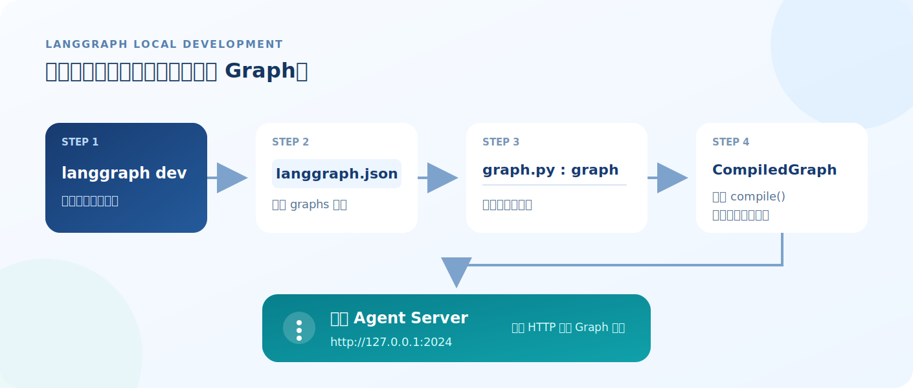

# 02 | LangGraph 启动原理：CLI 如何找到并加载 Graph

> 本文是 LangGraph 基础学习系列第 02 篇。建议先阅读第 01 篇《LangGraph 入门第一步：从开发环境搭建到可视化跑通》。

第 01 篇中，我们通过一条命令启动了本地服务：

```bash
uv run langgraph dev
```

但项目中有那么多文件，CLI 怎么知道应该加载哪张 Graph？

答案藏在下面这条启动链路中：

```text
uv run langgraph dev
 -> 读取 langgraph.json
 -> 定位 graph.py:graph
 -> 加载编译后的 Graph
 -> 启动本地 Agent Server
 -> Studio 显示 Graph
```



## 一、启动命令做了什么

```bash
uv run langgraph dev
```

这条命令由两部分组成：

```text
uv run
 -> 使用当前项目的 Python 环境和锁定依赖

langgraph dev
 -> 启动 LangGraph 本地开发服务
```

使用 `uv run` 可以避免误用全局 CLI。

CLI 启动后，会先在项目根目录寻找：

```text
langgraph.json
```

## 二、`langgraph.json` 如何定位 Graph

当前项目的配置如下：

```json
{
  "$schema": "https://langgra.ph/schema.json",
  "dependencies": ["."],
  "graphs": {
    "agent": "./src/agent/graph.py:graph"
  },
  "env": ".env",
  "image_distro": "wolfi"
}
```

定位 Graph 的关键配置是：

```json
"agent": "./src/agent/graph.py:graph"
```

它可以拆成三部分：

| 配置 | 含义 |
| --- | --- |
| `agent` | Graph 在 Agent Server 中的注册名称 |
| `./src/agent/graph.py` | Python 文件路径 |
| `graph` | graph.py文件中需要加载的变量名 |

冒号左边是文件，右边是变量：

```text
./src/agent/graph.py : graph
        文件路径       变量名称
```

CLI 会导入 `src/agent/graph.py`，然后读取其中的 `graph` 变量。

如果变量改名，配置也必须同步修改。例如：

```python
order_graph = ...
```

对应配置应改为：

```json
"agent": "./src/agent/graph.py:order_graph"
```

文件路径或变量名不一致，CLI 就无法加载 Graph。

## 三、为什么必须调用 `compile()`

当前项目最终导出的 `graph` 大致如下：

```python
graph = (
    StateGraph(MessagesState)
    .add_node("assistant", assistant)
    .add_node("tools", ToolNode(TOOLS))
    .add_edge(START, "assistant")
    .add_conditional_edges(
        "assistant",
        tools_condition,
        {"tools": "tools", "__end__": END},
    )
    .add_edge("tools", "assistant")
    # 将图结构编译为可运行的 Graph
    .compile(name="Order Calculator")
)
```

这里展示的是本系列后续将完成的订单金额计算 Graph，不是官方模板的默认业务代码。第 04 篇会给出完整改造步骤；这一篇暂时不用理解节点和条件边，只需要关注：

```python
.compile(name="Order Calculator")
```

`StateGraph` 用来描述状态、节点和连接关系；`compile()` 将这些定义转换成可运行的 Graph。

```text
StateGraph
 -> 图的定义

compile()
 -> 可执行的 Graph
```

`langgraph.json` 指向的，就是这个编译后的 `graph` 对象。

还要区分两个容易混淆的名称：

```text
agent
 -> Graph 在 Agent Server 中的注册名称

Order Calculator
 -> compile() 设置的 Graph 显示名称
```

它们指向同一个 Graph，但用途不同，因此名称不必相同。

## 四、为什么要启动 Agent Server

加载 Graph 后，`langgraph dev` 会在本地启动 Agent Server：

```text
http://127.0.0.1:2024
```

当前版本使用 **Starlette** 创建 ASGI 应用，并由 **Uvicorn** 启动。相关实现由 `langgraph-api` 提供，不在项目的业务代码中。

核心代码可以简化为：

```python
from starlette.applications import Starlette
import uvicorn

app = Starlette(...)
uvicorn.run("langgraph_api.server:app", host="127.0.0.1", port=2024)
```

Graph 本身可以在 Python 中直接运行：

```python
result = graph.invoke(input_data)
```

但浏览器中的 Studio 无法直接调用本地 Python 对象，因此需要 Agent Server 提供 HTTP 接口：

```text
Studio
 -> 请求本地 Agent Server
 -> Agent Server 调用 Graph
 -> 返回图结构、运行结果和流式事件
```

简单来说，Agent Server 是 Studio、SDK 与本地 Graph 之间的桥梁。停止服务后，Studio 仍能打开，但无法继续运行 Graph。

## 五、langgraph.json中其他配置分别做什么

### `1、dependencies`

```json
"dependencies": ["."]
```

`.` 表示当前项目。Agent Server 会使用项目中声明的依赖，例如：

```toml
dependencies = [
    "langchain>=1.0.0",
    "langchain-openai>=1.0.0",
    "langgraph>=1.0.0",
]
```

代码导入的第三方库没有加入项目依赖时，通常会出现 `ModuleNotFoundError`。

### `2、env`

```json
"env": ".env"
```

表示启动服务时加载项目根目录的 `.env`：

```dotenv
LANGSMITH_API_KEY=你的_LangSmith_API_Key
LANGSMITH_TRACING=false
```

这是第 01～03 篇保留官方模板时需要的配置。第 04 篇接入订单金额计算助手后，再增加模型服务的地址和 API Key。

修改 `.env` 后，需要重新启动服务。

### `3、image_distro`

```json
"image_distro": "wolfi"
```

它用于配置部署镜像，与本地查找 Graph 的过程无关。

## 六、启动失败时检查什么

按启动顺序排查即可：

```text
1. uv run langgraph dev 能否执行
2. 项目根目录是否存在 langgraph.json
3. graphs 中的文件路径是否正确
4. 冒号后的变量名是否存在
5. graph 是否已经调用 compile()
6. pyproject.toml 是否声明了所需依赖
7. .env 是否包含节点运行需要的配置
```

几个常见错误：

| 错误 | 优先检查 |
| --- | --- |
| `command not found: langgraph` | CLI 是否安装，是否使用 `uv run` |
| 找不到 Graph | 文件路径和变量名 |
| `ModuleNotFoundError` | `pyproject.toml` 与 `uv sync` |
| 服务启动但节点运行失败 | `.env`、API Key 和节点代码 |

## 小结

整个启动过程可以浓缩为：

```text
langgraph.json 告诉 CLI：
去哪个 Python 文件，加载哪个编译后的 Graph。

Agent Server 再把这个 Graph：
通过 HTTP 提供给 Studio 和其他客户端调用。
```

其中最关键的配置格式是：

```text
Python 文件路径 : Graph 变量名
```

第 03 篇继续分析 Studio、本地 Agent Server 与外部模型之间的数据流。

## 参考资料

- [LangGraph CLI](https://docs.langchain.com/langsmith/cli)
- [Application structure](https://docs.langchain.com/langsmith/application-structure)
