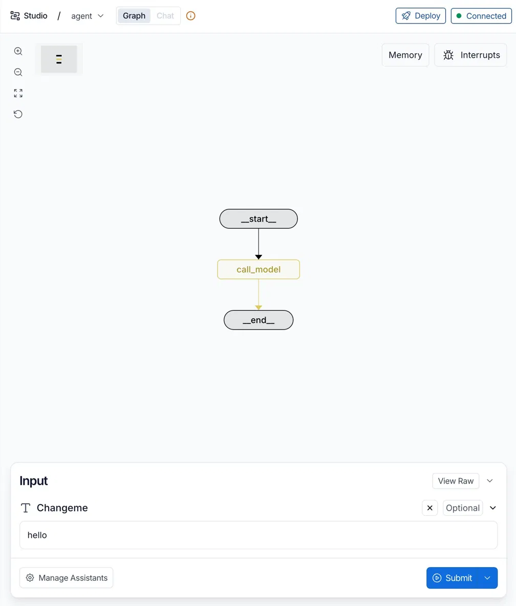
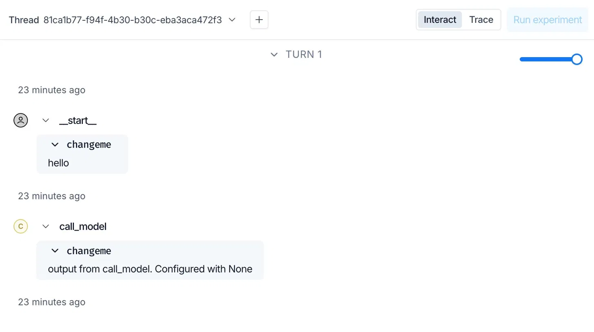

# 03 | LangGraph Studio 数据流：云端界面如何连接本地 Graph

> 本文是 LangGraph 基础学习系列第 03 篇。建议先阅读：
>
> 《01 | LangGraph 入门第一步：从开发环境搭建到可视化跑通》
>
> 《02 | LangGraph 启动原理：CLI 如何找到并加载 Graph》

------

经过前两篇，我们完成了一件事：

```text
uv run langgraph dev
 -> 读取 langgraph.json，定位 graph.py
 -> 加载 compile() 后的 Graph 对象
 -> 启动本地 Agent Server（默认 http://127.0.0.1:2024）
 -> 自动在浏览器打开 Studio
```

但此时你会注意到一件奇怪的事——终端里跑的是本地服务，浏览器地址栏显示的却是：

```text
https://smith.langchain.com/studio/?baseUrl=http://127.0.0.1:2024
```

**界面在云端(https://smith.langchain.com/studio/)，Graph 在本地(?baseUrl=http://127.0.0.1:2024)，**

**点击 Submit 后，请求到底去了哪里？**

这篇文章专门回答这个问题。

先给结论：

> Studio 页面来自云端，但 Graph 的执行全部在本地。

------

## 一、搞清楚四个参与者

一次本地调试，涉及四个角色：

| 参与者           | 在哪里跑                      | 负责什么                             |
| ---------------- | ----------------------------- | ------------------------------------ |
| LangSmith Studio | `smith.langchain.com`（云端） | 提供可视化调试界面                   |
| 浏览器           | 本机                          | 加载 Studio 页面，向本地端口发送请求 |
| Agent Server     | 本机 `127.0.0.1:2024`         | 提供 Graph API，接收并调度运行请求   |
| Graph            | 本地 Python 进程              | 按节点和边执行，处理状态更新         |

看起来有点绕，但抓住一条主线就清楚了：

```text
smith.langchain.com 只负责提供界面，
真正的请求由浏览器发给 127.0.0.1:2024，
Graph 始终跑在本地。
```

Studio 不会读取你的 `graph.py` 源码，也不会在网页里执行 Python。它只是一个"可视化遥控器"，通过 HTTP 调用本地 Agent Server 的接口，把返回数据渲染出来。

关于账号的问题也顺带说一下：首次打开 Studio，浏览器可能要求登录 LangSmith。

**这只是访问界面的入口认证，和你的本地 Graph 没有任何关系**，不代表代码被上传或部署到了云端。

------

## 二、`baseUrl` 是连接的关键

再看一次 CLI 自动打开的 URL：

```text
https://smith.langchain.com/studio/?baseUrl=http://127.0.0.1:2024
```

重点在这个参数：

```text
baseUrl=http://127.0.0.1:2024
```

`baseUrl` 告诉 Studio：**这次调试连接的是本机上的 Agent Server，不是某个云端服务**。

虽然页面托管在公网域名下，但页面里运行的 JavaScript 仍然在你的本地浏览器中执行，因此它完全可以向 `127.0.0.1` 发起请求——这是浏览器的正常行为，不存在"跨越云端访问本地"的魔法。

如果你修改了服务端口：

```bash
uv run langgraph dev --port 3030
```

CLI 打开的 URL 也会随之变成：

```text
https://smith.langchain.com/studio/?baseUrl=http://127.0.0.1:3030
```

端口不匹配，Studio 就无法连接——右上角的状态会从 `Connected` 变成断开。

------

## 三、Studio 是怎么画出 Graph 的

这是很多初学者会困惑的地方：**Studio 里的那张节点图，是从哪来的？**

答案是：Agent Server 返回的，不是 Studio 扫描源码生成的。

当 Studio 连接成功后，会向 Agent Server 请求当前加载的 Graph 信息，拿到：

- 所有节点和它们之间的边；
- Graph 接受什么格式的输入；
- 运行过程中产生的事件流。

Studio 拿到这些数据之后，才在界面上完成可视化：

```text
节点 + 边  →  绘制 Graph 结构图
输入格式   →  生成底部 Input 区域
运行事件   →  按顺序展示执行过程
```

用官方模板创建新项目后，默认 Graph 非常简单，只有一个节点：



这张图里有三个值得注意的信号：

1. **右上角 `Connected`**：浏览器已成功连接到 `baseUrl` 指向的本地 Agent Server；
2. **中间的节点图**：来自 Agent Server 返回的 Graph 结构，不是手工画的；
3. **底部 Input 区域**：字段名和类型由 Graph 的输入 Schema 决定，不同的 Graph 这里会不一样。

------

## 四、点击 Submit 后，请求走了哪条路

在底部输入框填入内容，点击 Submit，一次完整的请求大概经过这几步：

```text
1. 浏览器中的 Studio 将输入数据 POST 到 baseUrl（本地 127.0.0.1:2024）
2. 本地 Agent Server 接收请求
3. Agent Server 调用已加载的 Graph，按节点和边依次执行
4. 每执行完一个节点，Agent Server 向 Studio 推送一条事件
5. Studio 收到事件后实时更新界面，展示执行进度和中间状态
6. 全部节点执行完毕，Studio 展示最终结果
```

用官方模板跑一次之后，右侧面板会展示类似这样的结果：



从上往下读这张图，你能看到：

```text
用户输入（__start__）
 → call_model 节点执行
 → 返回输出结果
```

Studio 之所以能按顺序展示每一步，是因为 Agent Server 返回的是**事件流**，不只是最终答案。每个节点执行完，就推送一条事件；Studio 收到一条，就渲染一条。

Graph 内部如何决定执行哪个节点、下一步去哪里，这是 Node 和 Edge 的逻辑，第 04 篇会通过一个完整例子展开讲。

------

## 五、哪些数据会离开本机

这个问题值得单独说清楚，因为容易混淆：

登录 LangSmith、配置 API Key、上传 Trace，是三件相互独立的事：

- **登录 LangSmith**：只是访问 Studio 界面的入口，和本地 Graph 运行无关；
- **`LANGSMITH_API_KEY`**：用于认证 LangSmith 服务，不配置则无法打开 Studio页面；
- **`LANGSMITH_TRACING`**：控制是否把运行轨迹上传到云端，默认可以关闭。

当前项目中关闭了 Tracing：

```dotenv
LANGSMITH_TRACING=false
```

关闭之后，Studio 仍然能实时展示本地运行事件——只是运行记录不会被上传到 LangSmith 云端存储。

| 数据流向                                  | 是否离开本机             |
| ----------------------------------------- | ------------------------ |
| Studio 与本地 Agent Server 之间的调试请求 | **不离开**               |
| LangSmith Trace 记录                      | 仅在启用 Tracing 时上传  |
| 调用云端模型（如 OpenAI、DashScope 等）   | **会发送给对应模型服务** |

最后一条要注意：**"Graph 在本地跑"不等于"整个应用离线"**。如果 Graph 内部调用了云端 AI 模型，那部分请求依然会发到外部服务。

------

## 六、如果无法访问 Studio，Graph 还能用吗？

可以。Studio 只是一个可视化调试工具，不是运行 Graph 的必要条件。

如果当前网络无法打开 `smith.langchain.com`，Graph 照样可以跑，有两种方式：

**方式一：直接在 Python 中调用**

```python
# 同步调用
result = graph.invoke({"messages": [{"role": "user", "content": "你好"}]})

# 异步调用
result = await graph.ainvoke({"messages": [{"role": "user", "content": "你好"}]})
```

**方式二：通过 Agent Server 的 HTTP API 调用**

Agent Server 启动后暴露了标准 REST API，可以用任何 HTTP 工具直接调用，无需 Studio 界面。

------

## 小结

这篇把 Studio 和本地 Graph 之间的连接关系说清楚了：

```text
smith.langchain.com  →  提供 Studio 界面
浏览器（本机）       →  根据 baseUrl 向本地发请求
127.0.0.1:2024      →  Agent Server 接收并调度
本地 Python 进程     →  Graph 按节点和边执行
```

**一个验证小实验**：保持 Studio 页面打开，在终端按 `Ctrl+C` 停掉 `langgraph dev`，再回到 Studio 提交一次输入——页面还在，但请求会失败。这正说明 Studio 只是界面，Graph 跑在本地进程里。

------

第 04 篇开始进入 Graph 内部：用一个带工具调用的完整例子，把 State、Node、Edge 和工具循环一次讲清楚。

------

## 参考资料

- [LangSmith Studio](https://docs.langchain.com/langsmith/studio)
- [Local development & testing](https://docs.langchain.com/langsmith/local-dev-testing)
- [Tracing quickstart](https://docs.langchain.com/langsmith/observability-quickstart)