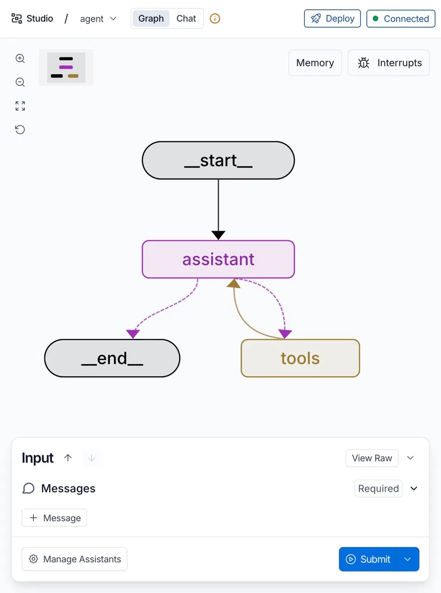
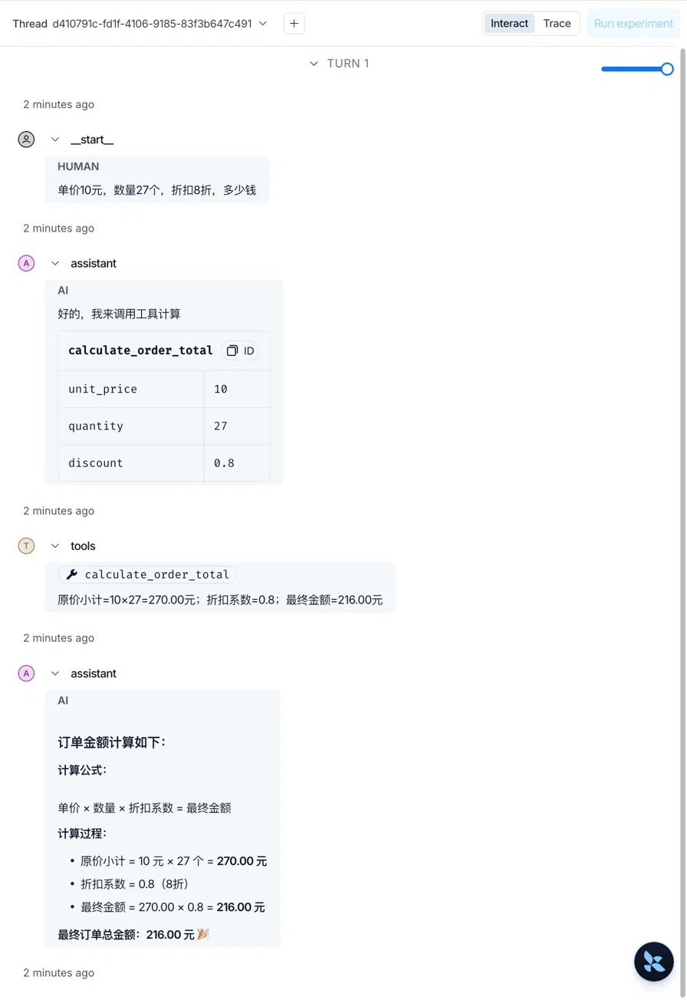

# 04 | LangGraph 核心三件套：用一个订单计算器看清Node、State、Edge

> 本文是 LangGraph 基础学习系列第 04 篇。前三篇已经完成了环境搭建、启动原理和 Studio 连接原理的铺垫，这篇直接进入 Graph 内部，用一个完整例子把核心概念一次讲透。

------

前三篇解决的是"怎么把 Graph 跑起来"的问题。现在环境已经就绪，是时候打开 `graph.py`，搞清楚 Graph 内部到底在做什么了。

我们用一个**订单金额计算助手**作为贯穿全文的例子。先给一个感性认识——这是最终要实现的效果：

> 用户输入：`单价10元，数量27个，折扣8折，多少钱`
>
> Graph 执行后返回：原价小计 10×27=270.00元，折扣系数 0.8，最终金额 216.00元

听起来简单，但背后的执行过程比想象中有趣得多。

------

## 一、先看完整代码，建立全局感

在拆解概念之前，先把完整的 `graph.py` 放在这里，让你对整体结构有个印象。后面每个章节都会回到这段代码的某个具体部分来讲解。

```python
"""使用 LangGraph 实现带工具循环的订单金额计算助手."""

from __future__ import annotations

import os
from functools import lru_cache
from typing import Any

from langchain.chat_models import init_chat_model
from langchain_core.language_models.chat_models import BaseChatModel
from langchain_core.messages import SystemMessage
from langchain_core.tools import tool
from langgraph.graph import END, START, StateGraph
from langgraph.graph.message import MessagesState
from langgraph.prebuilt import ToolNode, tools_condition

# 强制调用工具，让金额计算可验证，也便于在 Studio 中观察完整循环。
SYSTEM_PROMPT = """你是一个订单金额计算助手。
涉及单价、数量和折扣的计算时，必须调用 calculate_order_total 工具，不要心算。
拿到工具结果后，用中文说明计算公式和最终金额。"""


@tool
def calculate_order_total(
    unit_price: float,
    quantity: int,
    discount: float = 1.0,
) -> str:
    """计算订单折扣后的总金额.

    Args:
        unit_price: 单件商品价格。
        quantity: 商品数量。
        discount: 折扣系数，例如九折传入 0.9；不打折传入 1.0。
    """
    subtotal = round(unit_price * quantity, 2)
    total = round(subtotal * discount, 2)

    return (
        f"原价小计={unit_price:g}×{quantity}={subtotal:.2f}元；"
        f"折扣系数={discount}；最终金额={total:.2f}元"
    )


# 模型绑定和 ToolNode 共用同一份工具列表。
TOOLS = [calculate_order_total]


@lru_cache(maxsize=1)
def get_model() -> BaseChatModel:
    """首次调用时创建模型，之后复用实例."""
    base_url = os.environ.get("DASHSCOPE_BASE_URL")
    api_key = os.environ.get("DASHSCOPE_API_KEY")
    if not base_url or not api_key:
        raise RuntimeError(
            "请在项目 .env 中配置 DASHSCOPE_BASE_URL 和 DASHSCOPE_API_KEY"
        )

    return init_chat_model(
        model="deepseek-v4-flash",
        model_provider="openai",
        base_url=base_url,
        api_key=api_key,
        temperature=0,
    ).bind_tools(TOOLS)


async def assistant(state: MessagesState) -> dict[str, Any]:
    """调用模型并返回消息状态更新."""
    response = await get_model().ainvoke(
        [SystemMessage(content=SYSTEM_PROMPT), *state["messages"]]
    )

    return {"messages": [response]}


graph = (
    StateGraph(MessagesState)
    .add_node("assistant", assistant)
    .add_node("tools", ToolNode(TOOLS))
    .add_edge(START, "assistant")
    # 有工具请求时进入 tools，否则结束。
    .add_conditional_edges(
        "assistant",
        tools_condition,
        {"tools": "tools", "__end__": END},
    )
    # 工具结果返回模型，由模型组织最终回答。
    .add_edge("tools", "assistant")
    .compile(name="Order Calculator")
)
```

把这段代码放进 LangGraph Studio，得到的可视化结构如下：



这张图和代码是完全对应的：**代码里写了什么，Studio 就画出什么**。接下来我们就沿着这段代码，把三个核心概念逐一拆开。

------

## 二、Node：节点是做事的单元

整段代码里，对应"节点"的内容有两处。

**节点一：`assistant`（AI 决策节点）**

```python
async def assistant(state: MessagesState) -> dict[str, Any]:
    """调用模型并返回消息状态更新."""
    response = await get_model().ainvoke(
        [SystemMessage(content=SYSTEM_PROMPT), *state["messages"]]
    )
    return {"messages": [response]}
```

这个函数就是 `assistant` 节点的全部逻辑：从 `state` 里取出历史消息，加上系统提示词，发给 LLM，把回复写回 `state`。

系统提示词的约束是关键：

```python
SYSTEM_PROMPT = """你是一个订单金额计算助手。
涉及单价、数量和折扣的计算时，必须调用 calculate_order_total 工具，不要心算。
拿到工具结果后，用中文说明计算公式和最终金额。"""
```

它明确告诉 LLM：**遇到计算，必须调用工具，不能自己推算**。这是让 AI 行为可预期、结果可验证的重要手段。

**节点二：`tools`（工具执行节点）**

工具本身是用 `@tool` 装饰器定义的普通 Python 函数：

```python
@tool
def calculate_order_total(
    unit_price: float,
    quantity: int,
    discount: float = 1.0,
) -> str:
    """计算订单折扣后的总金额."""
    subtotal = round(unit_price * quantity, 2)
    total = round(subtotal * discount, 2)
    return (
        f"原价小计={unit_price:g}×{quantity}={subtotal:.2f}元；"
        f"折扣系数={discount}；最终金额={total:.2f}元"
    )

# 模型绑定和 ToolNode 共用同一份工具列表。
TOOLS = [calculate_order_total]
```

在组装 Graph 时，`ToolNode(TOOLS)` 被直接传入 `add_node`：

```python
.add_node("tools", ToolNode(TOOLS))
```

`ToolNode` 是 LangGraph 的内置节点，它负责解析 LLM 发出的工具调用请求、执行对应的 Python 函数、把结果写回 `state`。你不需要自己写这个节点的函数体，传入工具列表就够了。

同样值得注意的是 `get_model()` 里的 `.bind_tools(TOOLS)`：

```python
return init_chat_model(...).bind_tools(TOOLS)
```

这一步让 LLM 知道当前有哪些工具可以调用，以及每个工具接收什么参数。`TOOLS` 列表在两处共用，确保模型绑定的工具和 `ToolNode` 执行的工具完全一致。

> **理解节点的关键：** 每个节点都是一个函数（或封装好的对象），接收当前 `state`，返回对 `state` 的更新。节点本身不关心上下文从哪里来、结果送到哪里去——这些由 Edge 决定。

------

## 三、State：状态是节点之间的信使

你可能注意到，`assistant` 函数的参数是 `state: MessagesState`，返回值是 `{"messages": [response]}`。这个 `state` 是什么，为什么每个节点都要读写它？

**State 是整个 Graph 的共享数据容器，在所有节点之间流转。**

`MessagesState` 是 LangGraph 内置的状态类型，本质是一个消息列表。随着 Graph 执行，`state["messages"]` 不断累积：

```text
初始：
  [HumanMessage("单价10元，数量27个，折扣8折，多少钱")]

assistant 节点执行后：
  [HumanMessage(...), AIMessage("好的，我来调用工具计算 + 工具调用请求")]

tools 节点执行后：
  [HumanMessage(...), AIMessage(...), ToolMessage("原价小计=10×27=270.00元；...")]

assistant 节点再次执行后：
  [HumanMessage(...), AIMessage(...), ToolMessage(...), AIMessage("最终订单总金额：216.00元")]
```

每个节点执行完，把自己的输出追加到 `state["messages"]`，下一个节点读取完整历史再继续。**这就是 Graph 拥有"上下文记忆"的原因**——不是模型自己记住了，而是 State 帮它传递着。

> **理解 State 的关键：** 节点不直接互相通信，它们只读写 State。State 就是节点之间的信使。

------

## 四、Edge：边决定流程走向

有了节点和状态，还差最后一块：节点执行完之后，下一步去哪？这由 **Edge（边）** 决定。

看 Graph 组装部分的代码：

```python
graph = (
    StateGraph(MessagesState)
    .add_node("assistant", assistant)
    .add_node("tools", ToolNode(TOOLS))
    .add_edge(START, "assistant")
    # 有工具请求时进入 tools，否则结束。
    .add_conditional_edges(
        "assistant",
        tools_condition,
        {"tools": "tools", "__end__": END},
    )
    # 工具结果返回模型，由模型组织最终回答。
    .add_edge("tools", "assistant")
    .compile(name="Order Calculator")
)
```

这里有两种边：

**固定边（`add_edge`）**：无条件跳转，A 执行完必然去 B。

```python
.add_edge(START, "assistant")   # 起点 → assistant
.add_edge("tools", "assistant") # tools 执行完 → 回到 assistant
```

**条件边（`add_conditional_edges`）**：执行完 A 之后，由判断函数决定去 B 还是 C。

```python
.add_conditional_edges(
    "assistant",
    tools_condition,                      # 判断函数
    {"tools": "tools", "__end__": END},   # 有工具调用 → tools；否则 → 结束
)
```

`tools_condition` 是 LangGraph 内置的判断函数，逻辑简单直接：

```text
LLM 的输出里包含工具调用请求？
  是 → 去 "tools" 节点
  否 → 结束（__end__）
```

把所有边拼在一起，Graph 的执行路径就清晰了：

```text
START
 → assistant（LLM 决策）
   → 有工具调用？
     是 → tools（Python 执行）→ assistant（LLM 整理）→ 继续判断…
     否 → END
```

**这个循环可以执行任意次**——只要 LLM 还有工具要调用，就继续循环；直到 LLM 整理好最终回复，流程才结束。这正是 Studio 截图中那两条弯曲箭头所表达的含义。

------

## 五、一次完整运行，逐步拆解

现在把三个概念合起来，对照 Studio 的实际运行截图，看一次真实执行的全过程。

在 Studio 底部的 Messages 输入框里填入：

```
单价10元，数量27个，折扣8折，多少钱
```

点击 Submit，右侧面板按时间顺序展示每一步的执行结果：



对照截图，逐步拆解：

**第 1 步：`__start__` 接收输入，写入 State**

```text
state["messages"] = [HumanMessage("单价10元，数量27个，折扣8折，多少钱")]
```

**第 2 步：`assistant` 节点执行——LLM 决策**

LLM 读取 State 中的消息，按系统提示词的约束，决定调用工具，输出工具调用请求：

```text
AI：好的，我来调用工具计算
→ calculate_order_total
    unit_price: 10
    quantity:   27
    discount:   0.8   ← LLM 自动把"八折"翻译成了 0.8
```

**注意这里：LLM 做的是"理解意图、抽取参数"的工作**，把自然语言"八折"映射成结构化参数 `0.8`。这正是 LLM 擅长的部分，也是让它和精确计算工具搭档的价值所在。

**第 3 步：`tools_condition` 判断——走条件边**

检测到 LLM 输出中有工具调用请求，沿条件边跳转到 `tools` 节点。

**第 4 步：`tools` 节点执行——Python 精确计算**

执行 `calculate_order_total(unit_price=10, quantity=27, discount=0.8)`：

```text
工具返回：原价小计=10×27=270.00元；折扣系数=0.8；最终金额=216.00元
```

这一步是真正的 Python 代码执行，数字 100% 精确。

**第 5 步：固定边——回到 `assistant`**

工具结果被写入 State，Graph 沿 `.add_edge("tools", "assistant")` 返回 `assistant` 节点。

**第 6 步：`assistant` 节点再次执行——LLM 整理答案**

LLM 读取完整 State（包含工具返回结果），用自然语言组织最终回复：

```text
订单金额计算如下：
计算公式：单价 × 数量 × 折扣系数 = 最终金额

计算过程：
• 原价小计 = 10元 × 27个 = 270.00元
• 折扣系数 = 0.8（8折）
• 最终金额 = 270.00 × 0.8 = 216.00元

最终订单总金额：216.00元 🎉
```

**第 7 步：`tools_condition` 再次判断——流程结束**

LLM 这次没有发出工具调用请求，条件边判断结果为 `__end__`，Graph 执行完毕。

------

## 六、用一张表总结三个核心概念

| 概念      | 一句话定义                         | 在本例中的体现                                            |
| --------- | ---------------------------------- | --------------------------------------------------------- |
| **State** | Graph 的共享数据容器，在节点间流转 | `MessagesState`，保存完整的对话历史                       |
| **Node**  | 做一件具体事情的函数单元           | `assistant`（LLM 决策）、`ToolNode(TOOLS)`（Python 计算） |
| **Edge**  | 决定节点执行完后下一步去哪         | 固定边 + 条件边，构成可循环的执行路径                     |

三者的关系可以这样理解：**State 是流水线上的货物，Node 是各个工位，Edge 是工位之间的传送带。**

LangGraph 的价值在于：它让你把"LLM 擅长的事"（理解意图、整理语言）和"代码擅长的事"（精确计算、访问外部系统）组合在一起，由图的结构统一调度。

------

## 小结

这篇通过订单计算器，完整走过了一次 LangGraph Agent 的执行路径：

```text
用户输入 → State（存储）
State → assistant（LLM 理解意图，生成工具调用参数）
条件边判断 → tools（Python 执行，精确计算）
tools 结果写回 State → assistant（LLM 整理，输出最终答案）
条件边判断 → END
```

Node、Edge、State 不是三个孤立的概念，它们是同一个执行流程的三个角度：**State 记录了什么，Node 做了什么，Edge 决定了走向哪里。**
