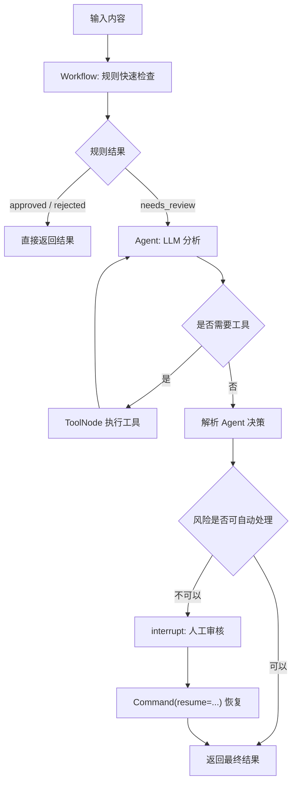

# 16 | LangGraph 内容安全混合方案：Workflow 与 Agent 的 MVP 实现

前面那份 `Workflow vs Agent` 示例已经把两种思路讲清楚了：

- `Workflow` 适合稳定、便宜、可解释的规则判断；
- `Agent` 适合处理语义、上下文、边界情况。

但如果直接把内容安全交给一个 LLM 节点，工程上还不够完整。一个可落地的内容安全 MVP 至少要补上三件事：

- 工具列表：让模型可以查询规则、扫描模式、读取上下文，而不是只凭一次提示词判断；
- 工具循环：模型可以先分析、调工具、再根据工具结果继续判断；
- 人工审核：高风险或低置信度内容不能硬判，要能暂停并等待人工决策。

所以这一篇不再做“Workflow 和 Agent 二选一”，而是实现一个混合架构：

```text
用户内容
  -> Workflow 快速规则层
      -> 明确通过 / 明确拒绝：直接结束
      -> 边界内容：进入 Agent
          -> LLM 制定检查思路
          -> 调用工具补证据
          -> 继续推理
          -> 高风险或低置信度：人工审核
          -> 否则输出最终审核结果
```

## 一、MVP 的边界

这套 MVP 只解决一个问题：

```text
输入一段用户生成内容，输出 approved / rejected / needs_review，以及原因和证据。
```

先不做复杂后台，也不做多租户策略中心。MVP 的目标是验证架构是否可用：

- 规则层能快速拦截明显违规；
- Agent 层能处理规则层说不清的边界内容；
- Agent 不是单次 LLM 调用，而是有工具、有循环、有证据；
- 人工审核不是普通函数占位，而是用 `interrupt()` 真正暂停图；
- checkpoint 能保存暂停前状态，方便之后恢复。

## 二、整体架构



这里有两个关键点。

第一，`Workflow` 不负责解决所有问题。它只负责便宜、稳定、确定的判断。

第二，`Agent` 不是“再问一次 LLM”。它要拿到工具，能形成“分析 -> 调工具 -> 再分析”的循环。

## 三、状态设计

内容安全场景里，不要只保存最终结论。后续排查和人工复核都需要证据，所以 State 里要保留规则命中、工具证据、Agent 分析和人工意见。

```python
from typing import Annotated, Literal, TypedDict

from langchain_core.messages import AnyMessage
from langgraph.graph.message import add_messages


Decision = Literal["approved", "rejected", "needs_review"]


class ModerationState(TypedDict, total=False):
    content: str

    # Workflow 层结果
    workflow_decision: Decision
    workflow_reason: str
    rule_hits: list[str]

    # Agent 层上下文
    messages: Annotated[list[AnyMessage], add_messages]
    agent_decision: Decision
    agent_reason: str
    confidence: float
    evidence: list[str]

    # 人工审核
    human_decision: Decision
    human_reason: str

    # 最终输出
    final_decision: Decision
    final_reason: str
```

这个 State 里有三组结论：

- `workflow_decision`：规则层判断；
- `agent_decision`：Agent 判断；
- `final_decision`：对外返回的最终判断。

这样设计的好处是，后面你可以清楚知道一次审核到底是被规则拒绝、被 Agent 拒绝，还是被人工改判。

## 四、第一层：Workflow 快速过滤

Workflow 层只做确定性规则，不调用模型。

```python
import re


PROFANITY = ["脏话1", "脏话2", "敏感词"]
SENSITIVE_TOPICS = ["政治", "暴力", "色情"]


def workflow_screen(state: ModerationState) -> dict:
    content = state["content"]
    lowered = content.lower()

    rule_hits: list[str] = []

    if any(word in lowered for word in PROFANITY):
        rule_hits.append("profanity_keyword")

    if re.search(r"(.)\1{5,}", content):
        rule_hits.append("repeat_character_spam")

    if content.count("http") > 3:
        rule_hits.append("too_many_links")

    if content.isupper() and len(content) > 20:
        rule_hits.append("all_caps_spam")

    if any(topic in lowered for topic in SENSITIVE_TOPICS):
        rule_hits.append("sensitive_topic")

    if "profanity_keyword" in rule_hits:
        return {
            "workflow_decision": "rejected",
            "workflow_reason": "命中明确不当语言规则",
            "rule_hits": rule_hits,
        }

    if any(hit in rule_hits for hit in ["repeat_character_spam", "too_many_links", "all_caps_spam"]):
        return {
            "workflow_decision": "rejected",
            "workflow_reason": "命中明确垃圾内容规则",
            "rule_hits": rule_hits,
        }

    if "sensitive_topic" in rule_hits:
        return {
            "workflow_decision": "needs_review",
            "workflow_reason": "命中敏感话题，需要 Agent 深度分析",
            "rule_hits": rule_hits,
        }

    return {
        "workflow_decision": "approved",
        "workflow_reason": "未命中明显违规规则",
        "rule_hits": rule_hits,
    }
```

这里故意把敏感话题路由到 `needs_review`，而不是直接拒绝。因为“提到政治、暴力、色情”不等于违规，可能是新闻讨论、教育内容、反诈提示或安全科普。

## 五、Workflow 到 Agent 的路由

混合方案的关键是路由策略。

```python
def route_after_workflow(state: ModerationState) -> Literal["finalize_workflow", "agent"]:
    if state["workflow_decision"] in ["approved", "rejected"]:
        return "finalize_workflow"
    return "agent"


def finalize_workflow(state: ModerationState) -> dict:
    return {
        "final_decision": state["workflow_decision"],
        "final_reason": state["workflow_reason"],
    }
```

MVP 阶段可以用这个简单策略：

- 明确违规：规则层直接拒绝；
- 明确正常：规则层直接通过；
- 敏感或边界内容：交给 Agent。

生产环境里可以再加灰度策略，比如抽样把一部分 `approved` 内容送 Agent 复核，用来评估规则漏判。

## 六、第二层：给 Agent 准备工具

这一步是和原 Notebook 最大的区别。

原来的方案二只是让 LLM 输出分析结果，本质上是 `LLM-powered graph`。这里要把它升级成真正有工具循环的 Agent。

```python
from langchain_core.tools import tool


POLICY_TEXT = {
    "self_harm": "自伤内容：鼓励、指导或美化自伤行为时拒绝；求助或康复讨论应转人工或提供安全回应。",
    "violence": "暴力内容：具体伤害指导、威胁、煽动暴力时拒绝；新闻、教育、反暴力讨论可通过或转人工。",
    "sexual": "色情内容：露骨性内容、未成年人相关性内容应拒绝；健康教育语境需谨慎判断。",
    "spam": "垃圾内容：批量广告、诱导点击、刷屏、欺诈链接应拒绝。",
}


@tool
def lookup_policy(category: str) -> str:
    """查询某个内容安全类别的审核政策。category 可取 self_harm、violence、sexual、spam。"""
    return POLICY_TEXT.get(category, "未找到该类别政策，请转人工审核。")


@tool
def scan_spam_signals(content: str) -> str:
    """扫描内容中的垃圾信息信号，返回命中的模式。"""
    signals = []
    if len(re.findall(r"https?://", content)) > 3:
        signals.append("链接过多")
    if re.search(r"(.)\1{5,}", content):
        signals.append("重复字符刷屏")
    if re.search(r"(加微信|免费提现|限时返利|点击领取)", content):
        signals.append("疑似广告或欺诈话术")
    return "、".join(signals) if signals else "未发现明显垃圾信息信号"


@tool
def collect_context(content: str) -> str:
    """提取内容中的上下文线索，帮助判断是违规、讨论、求助还是教育场景。"""
    hints = []
    if any(word in content for word in ["如何", "教程", "步骤", "具体做法"]):
        hints.append("可能包含操作性指导")
    if any(word in content for word in ["新闻", "讨论", "研究", "历史", "科普"]):
        hints.append("可能是讨论或教育语境")
    if any(word in content for word in ["救命", "求助", "怎么办", "我想伤害自己"]):
        hints.append("可能是求助语境")
    return "、".join(hints) if hints else "未发现明确上下文线索"


TOOLS = [lookup_policy, scan_spam_signals, collect_context]
```

这三个工具分别承担不同职责：

- `lookup_policy`：把审核政策显式交给模型；
- `scan_spam_signals`：让模型不要自己猜垃圾信号；
- `collect_context`：把语境线索结构化出来。

工具不一定要复杂。MVP 里，工具的价值是让 Agent 的判断有外部依据。

## 七、Agent 节点：LLM 绑定工具

```python
import json

from langchain_core.messages import AIMessage, HumanMessage, SystemMessage
from langchain_ollama import ChatOllama
from langgraph.prebuilt import ToolNode, tools_condition


llm = ChatOllama(
    model="qwen3-coder:30b",
    temperature=0,
)

llm_with_tools = llm.bind_tools(TOOLS)


AGENT_SYSTEM_PROMPT = """你是内容安全审核 Agent。

你必须按以下方式工作：
1. 先判断内容可能涉及哪些安全类别。
2. 如果需要政策、垃圾信号或上下文线索，调用工具。
3. 工具结果不足时，可以继续调用工具。
4. 当证据足够时，输出最终 JSON，不要输出多余解释。

最终 JSON 格式：
{
  "decision": "approved/rejected/needs_review",
  "reason": "简短原因",
  "confidence": 0.0,
  "evidence": ["证据1", "证据2"]
}

决策要求：
- 明显违规且证据充分：rejected
- 正常讨论、教育、新闻或低风险内容：approved
- 高风险、语义不确定、政策冲突、置信度低于 0.75：needs_review
"""


def enter_agent(state: ModerationState) -> dict:
    content = state["content"]
    rule_hits = ", ".join(state.get("rule_hits", [])) or "无"
    workflow_reason = state.get("workflow_reason", "无")

    return {
        "messages": [
            SystemMessage(content=AGENT_SYSTEM_PROMPT),
            HumanMessage(
                content=(
                    f"请审核以下内容：\n{content}\n\n"
                    f"Workflow 初筛原因：{workflow_reason}\n"
                    f"规则命中：{rule_hits}"
                )
            ),
        ]
    }


def agent_assistant(state: ModerationState) -> dict:
    response = llm_with_tools.invoke(state["messages"])
    return {"messages": [response]}
```

`agent_assistant` 不是最终决策函数。它只是 Agent 循环中的模型节点。

如果模型返回 `tool_calls`，图会进入 `ToolNode`；如果没有工具调用，说明模型认为可以输出最终 JSON。

## 八、解析 Agent 输出

Agent 的最后一条消息应该是 JSON。MVP 里可以先做保守解析：解析失败就转人工。

```python
def parse_agent_decision(state: ModerationState) -> dict:
    last_message = state["messages"][-1]
    raw = last_message.content if isinstance(last_message.content, str) else str(last_message.content)

    try:
        data = json.loads(raw)
    except json.JSONDecodeError:
        return {
            "agent_decision": "needs_review",
            "agent_reason": "Agent 输出不是合法 JSON，需要人工审核",
            "confidence": 0.0,
            "evidence": [raw[:500]],
        }

    decision = data.get("decision", "needs_review")
    if decision not in ["approved", "rejected", "needs_review"]:
        decision = "needs_review"

    confidence = float(data.get("confidence", 0.0))
    evidence = data.get("evidence", [])
    if not isinstance(evidence, list):
        evidence = [str(evidence)]

    return {
        "agent_decision": decision,
        "agent_reason": str(data.get("reason", "无原因")),
        "confidence": confidence,
        "evidence": [str(item) for item in evidence],
    }
```

生产环境建议换成结构化输出或 JSON schema 校验。MVP 先用这个版本可以跑通主流程。

## 九、低置信度和高风险转人工

人工审核不是一个普通节点返回固定值，而是让图暂停。

```python
from langgraph.types import Command, interrupt


def route_after_agent(state: ModerationState) -> Literal["human_review", "finalize_agent"]:
    if state.get("agent_decision") == "needs_review":
        return "human_review"
    if state.get("confidence", 0.0) < 0.75:
        return "human_review"
    return "finalize_agent"


def human_review(state: ModerationState) -> dict:
    human_result = interrupt(
        {
            "question": "请人工审核该内容，并给出 approved / rejected / needs_review。",
            "content": state["content"],
            "agent_decision": state.get("agent_decision"),
            "agent_reason": state.get("agent_reason"),
            "confidence": state.get("confidence"),
            "evidence": state.get("evidence", []),
        }
    )

    if isinstance(human_result, str):
        return {
            "human_decision": "needs_review",
            "human_reason": human_result,
        }

    return {
        "human_decision": human_result.get("decision", "needs_review"),
        "human_reason": human_result.get("reason", "人工审核未提供原因"),
    }


def finalize_agent(state: ModerationState) -> dict:
    return {
        "final_decision": state["agent_decision"],
        "final_reason": state["agent_reason"],
    }


def finalize_human(state: ModerationState) -> dict:
    return {
        "final_decision": state["human_decision"],
        "final_reason": state["human_reason"],
    }
```

这一步让内容安全系统有了真实的 Human-in-the-loop 能力。

图执行到 `interrupt()` 时会停住。恢复时用：

```python
graph.invoke(
    Command(resume={"decision": "approved", "reason": "人工判断为新闻讨论语境"}),
    config=config,
)
```

## 十、组装完整 Graph

```python
from langgraph.checkpoint.memory import InMemorySaver
from langgraph.graph import END, START, StateGraph


builder = StateGraph(ModerationState)

# Workflow 层
builder.add_node("workflow_screen", workflow_screen)
builder.add_node("finalize_workflow", finalize_workflow)

# Agent 层
builder.add_node("enter_agent", enter_agent)
builder.add_node("agent_assistant", agent_assistant)
builder.add_node("tools", ToolNode(TOOLS))
builder.add_node("parse_agent_decision", parse_agent_decision)
builder.add_node("human_review", human_review)
builder.add_node("finalize_agent", finalize_agent)
builder.add_node("finalize_human", finalize_human)

builder.add_edge(START, "workflow_screen")

builder.add_conditional_edges(
    "workflow_screen",
    route_after_workflow,
    {
        "finalize_workflow": "finalize_workflow",
        "agent": "enter_agent",
    },
)

builder.add_edge("finalize_workflow", END)

builder.add_edge("enter_agent", "agent_assistant")

# ReAct 风格工具循环：
# assistant -> tools -> assistant -> ... -> parse
builder.add_conditional_edges(
    "agent_assistant",
    tools_condition,
    {
        "tools": "tools",
        "__end__": "parse_agent_decision",
    },
)
builder.add_edge("tools", "agent_assistant")

builder.add_conditional_edges(
    "parse_agent_decision",
    route_after_agent,
    {
        "human_review": "human_review",
        "finalize_agent": "finalize_agent",
    },
)

builder.add_edge("human_review", "finalize_human")
builder.add_edge("finalize_agent", END)
builder.add_edge("finalize_human", END)

checkpointer = InMemorySaver()
graph = builder.compile(checkpointer=checkpointer)
```

这段图里已经有真正的 Agent 结构：

```text
agent_assistant -> tools -> agent_assistant
```

这就是工具循环。模型可以先调用 `lookup_policy`，看到政策后再调用 `collect_context`，最后再输出 JSON。

## 十一、运行示例

明确正常内容会在 Workflow 层结束：

```python
config = {"configurable": {"thread_id": "moderation-demo-001"}}

result = graph.invoke(
    {"content": "这是一条正常的产品体验评论。"},
    config=config,
)

print(result["final_decision"])
print(result["final_reason"])
```

明显垃圾内容也会在 Workflow 层结束：

```python
result = graph.invoke(
    {"content": "AAAAAAAAAAAAAAAAAAA 点击领取 http://a http://b http://c http://d"},
    config={"configurable": {"thread_id": "moderation-demo-002"}},
)

print(result["final_decision"])
print(result["final_reason"])
```

边界内容会进入 Agent：

```python
result = graph.invoke(
    {"content": "这篇文章在讨论暴力事件的新闻报道方式是否合适。"},
    config={"configurable": {"thread_id": "moderation-demo-003"}},
)

print(result.get("final_decision"))
print(result.get("final_reason"))
print(result.get("__interrupt__"))
```

如果触发人工审核，结果中会出现 `__interrupt__`。之后用同一个 `thread_id` 恢复：

```python
resume_result = graph.invoke(
    Command(resume={"decision": "approved", "reason": "人工判断为新闻讨论语境，可以通过"}),
    config={"configurable": {"thread_id": "moderation-demo-003"}},
)

print(resume_result["final_decision"])
print(resume_result["final_reason"])
```

## 十二、这套方案比原 Notebook 强在哪里

原 Notebook 的方案一是固定 Workflow，方案二是 LLM 分析节点。它们适合教学，但直接做内容安全 MVP 还缺几个工程能力。

这篇的混合方案补上了这些能力：

| 能力 | 原 Workflow | 原 Agent | 本篇混合 MVP |
|---|---:|---:|---:|
| 固定规则快速过滤 | 有 | 无 | 有 |
| LLM 语义判断 | 无 | 有 | 有 |
| 工具列表 | 无 | 无 | 有 |
| 工具执行节点 | 无 | 无 | `ToolNode` |
| ReAct 风格循环 | 无 | 无 | `assistant -> tools -> assistant` |
| 多步证据收集 | 无 | 弱 | 有 |
| 低置信度兜底 | 规则兜底 | 简单分支 | 人工审核 |
| 真正暂停等待人工 | 无 | 无 | `interrupt()` |
| 可恢复执行 | 无 | 无 | checkpointer + `Command(resume=...)` |

最重要的变化是：Agent 不再只是“LLM 判断器”，而是变成一个能使用工具、积累证据、必要时交给人的审核执行单元。

## 十三、MVP 到生产还要补什么

这套代码适合验证主链路，但生产化还需要补几个部分：

- 策略中心：把 `POLICY_TEXT` 换成数据库、配置中心或版本化策略文件；
- 结构化输出：用 JSON schema 或 Pydantic 校验 Agent 输出；
- 审计日志：记录规则命中、工具调用、模型响应、人工结论；
- 持久化 checkpoint：把 `InMemorySaver` 换成 SQLite 或 Postgres；
- 评测集：准备正常、违规、边界、对抗样本，持续评估漏判和误判；
- 成本控制：只让边界内容进入 Agent，明确内容走 Workflow；
- 安全防护：工具参数要校验，模型输出不能直接作为系统动作执行。

如果只做一个 MVP，优先顺序是：

```text
Workflow 规则层
 -> Agent 工具循环
 -> interrupt 人工审核
 -> checkpoint 持久化
 -> 审计日志和评测集
```

## 十四、小结

内容安全不适合完全交给规则，也不适合完全交给 LLM。

更稳的做法是：

- 用 Workflow 处理确定性问题；
- 用 Agent 处理语义和边界问题；
- 用工具给 Agent 提供证据；
- 用循环让 Agent 能多步检查；
- 用人工审核承接高风险和低置信度情况。

这就是一个内容安全 MVP 的基本骨架。

