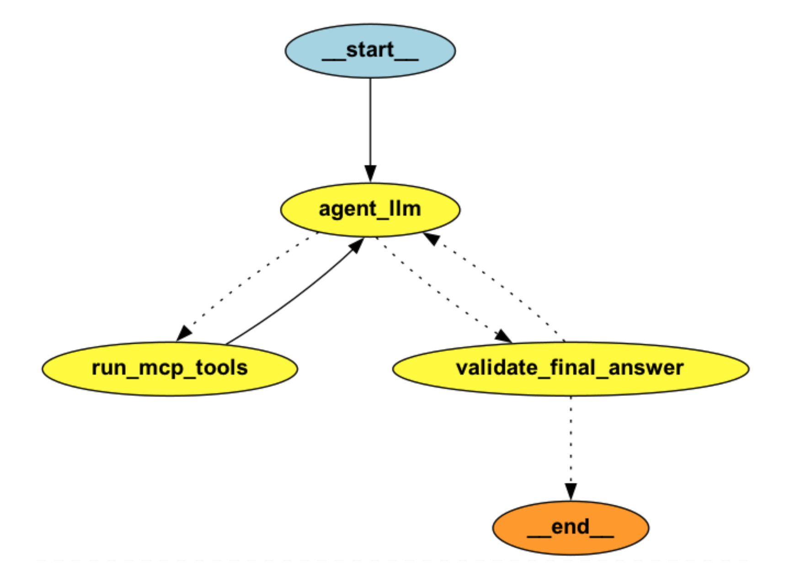
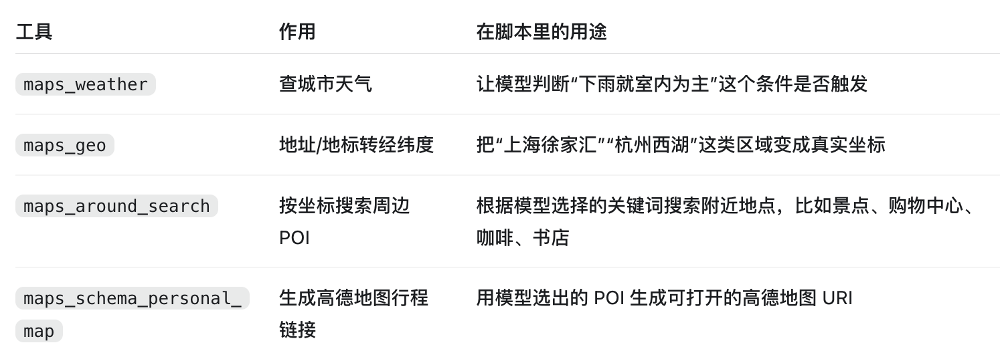
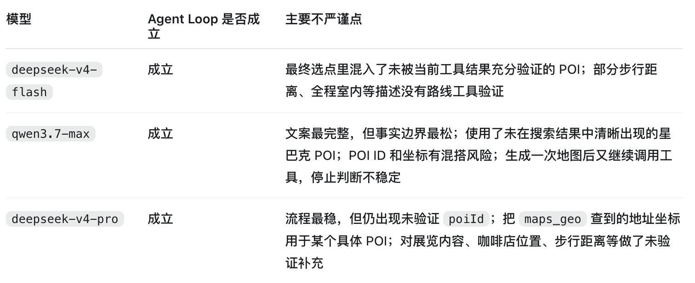

# 19 | 用模型驱动tool loop实现一个CityWalk Agent

## 想要做的事儿
问：“明天下午想在杭州西湖附近玩 3 小时，尽量少走路，最好有咖啡、展览或书店；如果下雨就安排室内为主，最后给我一个能打开高德地图的路线。”

实现：不用workflow，而是完全由模型驱动tool-calling loop，LangGraph只负责【agent_llm -> run_mcp_tools -> agent_llm】的回路，基于4个高德mcp tools返回真实的处理答案。

## 图结构：
```
agent_llm
  ├─ 有 tool call -> run_mcp_tools -> agent_llm
  └─ 无 tool call -> validate_final_answer
        ├─ 未满足要求 -> agent_llm
        └─ 已满足要求 -> END
```


## 用到的4个高德MCP tools


## 部分主干代码
```
from typing import Annotated, Literal, TypedDict

from langchain_core.messages import AnyMessage, ToolMessage
from langgraph.graph import END, START, StateGraph
from langgraph.graph.message import add_messages


class AgentState(TypedDict):
    # messages 是 Agent 的上下文：用户问题、模型回复、工具结果都放这里
    messages: Annotated[list[AnyMessage], add_messages]

    # Host 侧只记录业务阶段，不记录一串抽象工具历史
    has_target_location: bool
    has_searched_pois: bool
    has_map_link: bool

    # 是否允许结束
    final_ready: bool


async def agent_llm(state: AgentState):
    """模型观察上下文，自己决定是否调用工具。"""
    response = await bound_model.ainvoke(state["messages"])

    return {
        "messages": [response],
    }


async def run_mcp_tools(state: AgentState):
    """Host 执行模型选择的工具，并把结果写回 messages。"""
    last_message = state["messages"][-1]
    tool_messages = []
    has_target_location = state["has_target_location"]
    has_searched_pois = state["has_searched_pois"]
    has_map_link = state["has_map_link"]

    for tool_call in last_message.tool_calls:
        tool_name = tool_call["name"]
        arguments = tool_call["args"]

        # Host 只做校验，不替模型决定下一步
        if tool_name not in allowed_tools:
            raise RuntimeError(f"未放行的工具：{tool_name}")

        if tool_name == "maps_around_search" and not has_target_location:
            tool_messages.append(
                ToolMessage(
                    content="请先用 maps_geo 获取用户目标区域的真实经纬度。",
                    tool_call_id=tool_call["id"],
                )
            )
            continue

        if tool_name == "maps_schema_personal_map" and not has_searched_pois:
            tool_messages.append(
                ToolMessage(
                    content="请先用 maps_around_search 获取真实 POI 和 poiId。",
                    tool_call_id=tool_call["id"],
                )
            )
            continue

        result = await call_mcp_tool(tool_name, arguments)

        if tool_name == "maps_geo" and not has_searched_pois:
            has_target_location = True
        if tool_name == "maps_around_search":
            has_searched_pois = True
        if tool_name == "maps_schema_personal_map":
            has_map_link = True

        tool_messages.append(
            ToolMessage(
                content=json.dumps(result, ensure_ascii=False),
                tool_call_id=tool_call["id"],
            )
        )

    return {
        "messages": tool_messages,
        "has_target_location": has_target_location,
        "has_searched_pois": has_searched_pois,
        "has_map_link": has_map_link,
    }


async def validate_final_answer(state: AgentState):
    """模型想结束时，Host 检查是否满足业务边界。"""
    if state["has_map_link"]:
        return {"final_ready": True}

    return {
        "messages": [
            HumanMessage(
                content=(
                    "你还不能最终回答。用户要求地图路线，"
                    "但你还没有调用 maps_schema_personal_map 获取真实地图链接。"
                )
            )
        ],
        "final_ready": False,
    }


def route_after_agent(state: AgentState) -> Literal["run_mcp_tools", "validate_final_answer"]:
    """模型有 tool call 就执行工具；没有 tool call 就进入最终校验。"""
    last_message = state["messages"][-1]
    return "run_mcp_tools" if last_message.tool_calls else "validate_final_answer"


def route_after_validation(state: AgentState) -> Literal["agent_llm", "__end__"]:
    """最终校验不过，就把提醒消息交回模型继续观察。"""
    return "__end__" if state["final_ready"] else "agent_llm"


builder = StateGraph(AgentState)

builder.add_node("agent_llm", agent_llm)
builder.add_node("run_mcp_tools", run_mcp_tools)
builder.add_node("validate_final_answer", validate_final_answer)

builder.add_edge(START, "agent_llm")

builder.add_conditional_edges(
    "agent_llm",
    route_after_agent,
    {
        "run_mcp_tools": "run_mcp_tools",
        "validate_final_answer": "validate_final_answer",
    },
)

builder.add_edge("run_mcp_tools", "agent_llm")

builder.add_conditional_edges(
    "validate_final_answer",
    route_after_validation,
    {
        "agent_llm": "agent_llm",
        "__end__": END,
    },
)

graph = builder.compile()
```


---
# 坑

## 1、maps_schema_personal_map返回的是高德App唤端链接
类似amapuri://workInAmap/createWithToken?polymericId=...&from=MCP

这是用于唤起高德地图App的链接，不是普通网页 URL，部分浏览器、桌面环境或聊天 App 内可能无法直接打开。
实际业务需要进一步的处理才能渲染，这里不展开。

## 2、模型肆意补全
最终给的方案本来应该来自，用关键字搜索出来的结果中的数据，一开始以为本地模型太弱鸡，但连续测试几个不同的模型，都没有使用最终搜索结果里内容，都是在最后一个环节自己幻想补全出一组假的信息...，举个例子类似：模型拿“浙江图书馆”的坐标，最后说成“瑞幸咖啡（浙江图书馆店）”，或者凭空塞一个没从周边搜索返回过的poiId。

不同模型出现的问题：


解决机制：
- maps_around_search返回后，Host会提取 id/name/address/typecode，记录成verified_pois白名单。
- 模型调用 maps_schema_personal_map 前，Host 会逐个检查 pointInfoList：poiId 必须来自白名单；
    - name 必须和搜索结果里的 POI 名称完全一致；
    - 否则拒绝执行，并把可用 POI 摘要作为 ToolMessage 返回给模型，让模型重试。
- 系统提示也收紧了：禁止把 A 地点的坐标包装成 B 地点，最终回答不要写未经工具证明的展览内容、楼层、步行距离、品牌背景、氛围评价等。
