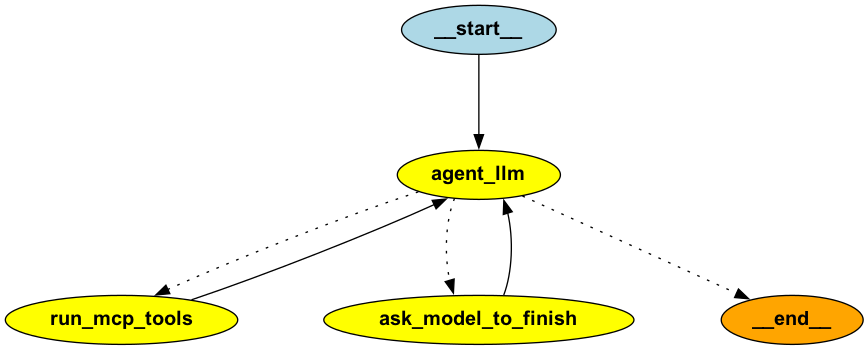

# 19 | 用模型驱动tool loop实现一个最小CityWalk Agent

## 想要做的事儿

问：“我想在杭州西湖附近 citywalk 3 小时，想找咖啡、书店或展览，请推荐一个轻量路线。”

实现：不用workflow提前写死“先查什么、再查什么、最后怎么拼答案”，而是让模型自己驱动tool-calling loop。

LangGraph只负责这个回路：

```text
agent_llm -> run_mcp_tools -> agent_llm
```

模型用本地 Ollama，高德地图能力来自高德 MCP。Host只做两件事：

- 执行模型发起的 MCP工具调用；
- 把工具结果包装成 ToolMessage 写回 messages。

这个实验刻意不做复杂可靠性工程：不查天气，不生成高德地图链接，不做 POI白名单，不做坐标审计，也不兜底改写最终回答。

它只想说明一个点：

> 一个 CityWalk Agent 可以不是一条写死的工作流，而是一个由模型自己决定下一步的工具循环。

## 图结构：

```text
START
  ↓
agent_llm
  ├─ 有 tool call -> run_mcp_tools -> agent_llm
  ├─ tool call 轮数过多 -> ask_model_to_finish -> agent_llm
  └─ 无 tool call -> END
```

这里的 ask_model_to_finish 不是业务校验，只是实验安全阀：防止模型一直调用工具不结束。



## 用到的2个高德MCP tools

这次只暴露两个工具给模型：

- maps_geo：把“杭州西湖”这样的目标区域解析成经纬度。
- maps_around_search：基于经纬度搜索附近 POI，比如咖啡、书店、展览。

不使用：

- maps_weather：天气会把主线带到“天气策略”上。
- maps_schema_personal_map：生成地图链接需要 POI、坐标、路线参数校验，很容易把实验带回复杂版本。

这个取舍很重要。

如果目标是讲清楚模型驱动 tool loop，工具越少，读者越容易看到循环本身。

## 实验目录

新实验放在：

```text
labs/langgraph/foundations/experiments/19_amap_citywalk_tool_loop/
```

核心文件：

```text
agent.py      # LangGraph State、模型节点、工具节点和条件边
adapters.py   # Ollama 与高德 MCP 的最小适配
cli.py        # 命令行入口、MCP 连接、trace 打印
README.md     # 实验说明
```

## 部分主干代码

先看 State。

这次 State 只保留三件事：

```python
class CityWalkToolLoopState(TypedDict):
    """LangGraph 在模型节点与工具节点之间传递的最小状态。"""

    messages: Annotated[list[AnyMessage], add_messages]
    trace: list[str]
    tool_rounds: int
```

messages 是 Agent 的上下文，里面会依次放入：

- SystemMessage：告诉模型它是 CityWalk 助手，以及有哪些工具；
- HumanMessage：用户问题；
- AIMessage：模型每一轮的回复，可能带 tool call；
- ToolMessage：Host执行 MCP工具后的结果。

trace 只是为了终端观察，不参与模型推理。

tool_rounds 只用来防止无限工具循环。

系统提示词也尽量短：

```python
def build_system_prompt(model_tools: list[dict[str, Any]]) -> str:
    """构造系统提示词：让模型自己决定何时调用工具、何时回答。"""
    return (
        "你是一个 CityWalk 助手。\n"
        "需要地图事实时，请自己调用工具；不需要时直接回答。\n"
        "建议先用 maps_geo 获取目标区域坐标，再用 maps_around_search 搜附近 POI。\n"
        "最终回答给出 3 个左右地点和一个简短行程建议；地点名称和地址只使用工具观察中出现过的信息，"
        "不要补充未搜索到的地点，不需要生成地图链接。\n\n"
        "当前可用工具：\n"
        f"{summarize_tools(model_tools)}"
    )
```

注意这里没有告诉模型“必须先查咖啡，再查书店，再查展览”。

只给了工具使用建议，具体要不要调用、调用几次、什么时候停止，由模型自己判断。

模型节点很薄：

```python
def make_agent_llm(model: Any):
    """创建模型节点。"""

    async def agent_llm(state: CityWalkToolLoopState) -> dict[str, Any]:
        """模型观察当前 messages，并自己决定调用工具或最终回答。"""
        response = await model.ainvoke(state["messages"])
        trace_items = [
            f"[模型观察 {state['tool_rounds'] + 1}] {compact_text(response.content)}",
        ]

        tool_calls = getattr(response, "tool_calls", None) or []
        if tool_calls:
            trace_items.append(
                "[模型决策] Tool Calls："
                + json.dumps(tool_calls, ensure_ascii=False, default=str)
            )
        else:
            trace_items.append("[模型决策] 没有 tool call，模型认为可以回答。")

        return {"messages": [response], "trace": append_trace(state, *trace_items)}

    return agent_llm
```

这个节点只做一件事：把当前 messages 交给模型。

模型如果返回 tool_calls，后面就进入工具节点；模型如果不返回 tool_calls，就结束。

工具节点也很薄：

```python
def make_run_mcp_tools(mcp_session: ClientSession, allowed_tools: set[str]):
    """创建工具执行节点。"""

    async def run_mcp_tools(state: CityWalkToolLoopState) -> dict[str, Any]:
        """Host 执行模型刚刚选择的 MCP 工具，并把结果写回 ToolMessage。"""
        last_message = state["messages"][-1]
        if not isinstance(last_message, AIMessage):
            raise RuntimeError("run_mcp_tools 期望最后一条消息是 AIMessage。")

        tool_messages: list[ToolMessage] = []
        trace_items: list[str] = []
        for tool_call in last_message.tool_calls:
            tool_name = tool_call["name"]
            arguments = tool_call["args"]
            trace_items.append(
                f"[Host行动] 执行 {tool_name}({json.dumps(arguments, ensure_ascii=False)})"
            )
            tool_result = await call_mcp_tool(
                mcp_session,
                allowed_tools,
                tool_name,
                arguments,
            )
            trace_items.append(f"[工具观察] {compact_json(tool_result)}")
            tool_messages.append(
                ToolMessage(
                    content=json.dumps(tool_result, ensure_ascii=False),
                    tool_call_id=tool_call["id"],
                )
            )

        return {
            "messages": tool_messages,
            "tool_rounds": state["tool_rounds"] + 1,
            "trace": append_trace(state, *trace_items),
        }

    return run_mcp_tools
```

Host不替模型规划下一步。

它只检查工具是不是被放行，然后执行：

```python
async def call_mcp_tool(
    session: ClientSession,
    allowed_tools: set[str],
    tool_name: str,
    arguments: dict[str, Any],
) -> dict[str, Any]:
    """Host 侧执行模型请求的 MCP 工具。"""
    if tool_name not in allowed_tools:
        raise RuntimeError(f"模型请求了未放行的工具：{tool_name}")
    if not isinstance(arguments, dict):
        raise RuntimeError(f"工具参数必须是 JSON object：{arguments!r}")

    result = await session.call_tool(tool_name, arguments)
    return extract_tool_payload(result)
```

最后是条件边：

```python
def route_after_agent(
    state: CityWalkToolLoopState,
) -> Literal["run_mcp_tools", "ask_model_to_finish", "__end__"]:
    """根据模型是否发起 tool call 决定继续工具循环还是结束。"""
    last_message = state["messages"][-1]
    tool_calls = getattr(last_message, "tool_calls", None) or []
    if not tool_calls:
        return "__end__"
    if state["tool_rounds"] >= MAX_TOOL_ROUNDS:
        return "ask_model_to_finish"
    return "run_mcp_tools"
```

这里就是模型驱动 tool loop 的核心：

- 有 tool call：执行工具；
- 没有 tool call：结束；
- 工具轮数太多：提醒模型收束。

完整 Graph：

```python
builder = StateGraph(CityWalkToolLoopState)
builder.add_node("agent_llm", make_agent_llm(model))
builder.add_node("run_mcp_tools", make_run_mcp_tools(mcp_session, allowed_tools))
builder.add_node("ask_model_to_finish", ask_model_to_finish)

builder.add_edge(START, "agent_llm")
builder.add_conditional_edges(
    "agent_llm",
    route_after_agent,
    {
        "run_mcp_tools": "run_mcp_tools",
        "ask_model_to_finish": "ask_model_to_finish",
        "__end__": END,
    },
)
builder.add_edge("run_mcp_tools", "agent_llm")
builder.add_edge("ask_model_to_finish", "agent_llm")

graph = builder.compile(name="Amap CityWalk Tool Loop")
```

## 运行

先准备两个条件：

- 项目根目录 `.env` 中配置 AMAP_MCP_KEY；
- 本地 Ollama 已启动，并且已经拉取 `qwen3-coder:30b`。

从仓库根目录运行：

```bash
uv run --no-sync \
  python -m labs.langgraph.foundations.experiments.amap_citywalk_tool_loop
```

也可以换一个问题：

```bash
uv run --no-sync \
  python -m labs.langgraph.foundations.experiments.amap_citywalk_tool_loop \
  --question "我想在上海衡山路附近散步 2 小时，找咖啡和书店"
```

如果只想导出 LangGraph 结构图，不连接高德 MCP，也不调用 Ollama：

```bash
uv run --no-sync \
  python -m labs.langgraph.foundations.experiments.amap_citywalk_tool_loop \
  --graphviz
```

不传路径时，默认输出到：

```text
labs/langgraph/foundations/assets/amap_citywalk_tool_loop_graph.png
```

## 一次实际运行

实验启动后，先连接高德 MCP，并把工具列表绑定给 Ollama 模型：

```text
连接地址：https://mcp.amap.com/mcp?key=***
模型提供方：ollama
模型：qwen3-coder:30b
用户问题：我想在杭州西湖附近 citywalk 3 小时，想找咖啡、书店或展览，请推荐一个轻量路线。

协议版本：2025-03-26
模型可见工具：["maps_around_search", "maps_geo"]
```

第一轮，模型没有直接回答，而是决定调用 maps_geo：

```text
[模型观察 1] 本轮未输出文本，只给出 tool call。
[模型决策] Tool Calls：[{"name": "maps_geo", "args": {"address": "杭州西湖"}, ...}]
[Host行动] 执行 maps_geo({"address": "杭州西湖"})
[工具观察] {"results": [{"country": "中国", "province": "浙江省", "city": "杭州市", ... "location": "120.130396,30.259242", "level": "区县"}, ...]}
```

第二轮，模型观察到坐标后，决定搜咖啡：

```text
[模型观察 2] 本轮未输出文本，只给出 tool call。
[模型决策] Tool Calls：[{"name": "maps_around_search", "args": {"keywords": "咖啡", "location": "120.130396,30.259242", "radius": "1000"}, ...}]
[Host行动] 执行 maps_around_search({"keywords": "咖啡", "location": "120.130396,30.259242", "radius": "1000"})
[工具观察] {"pois": [{"id": "B0J06ZG937", "name": "暇意西餐咖啡厅", "address": "曙光路156号(西湖区社会治理中心旁边)", ...}, ...]}
```

后面模型继续搜书店和展览：

```text
[Host行动] 执行 maps_around_search({"keywords": "书店", "location": "120.130396,30.259242", "radius": "1000"})
[工具观察] {"pois": [{"id": "B0J01A1B07", "name": "西湖书房(曙光路店)", "address": "曙光新村东1门旁", ...}, {"id": "B0LA27N0OU", "name": "晓风书屋(阅见西湖店)", "address": "曙光路184号阅见西湖", ...}, ...]}

[Host行动] 执行 maps_around_search({"keywords": "展览", "location": "120.130396,30.259242", "radius": "1000"})
[工具观察] {"pois": [{"id": "B0LD3AHQ97", "name": "阅见西湖", "address": "曙光路184号", ...}, ...]}
```

最后一轮，模型没有再发 tool call，直接回答：

```text
[模型观察 5] 根据您的需求，为您规划了一条轻量级的西湖 CityWalk 路线，包含咖啡、书店和展览，适合 3 小时内完成：...
[模型决策] 没有 tool call，模型认为可以回答。
```

最终回答使用了工具观察中出现过的地点：

```text
1. 晓风书屋(阅见西湖店)
   - 地址：曙光路184号阅见西湖

2. 阅见西湖
   - 地址：曙光路184号

3. 暇意西餐咖啡厅
   - 地址：曙光路156号(西湖区社会治理中心旁边)
```

这个运行结果说明了实验想证明的事：

模型不是在执行一条固定 workflow，而是在每一轮根据 messages 里的新观察决定下一步。

## 坑

## 1、不要一上来就做完整业务闭环

旧版本里同时做了天气、POI搜索、坐标补全、高德地图链接生成、最终回答审查。

这当然更接近真实业务，但对于“模型驱动 tool loop”这个主题来说，噪声太多。

读者最后看到的是各种 Host校验、POI白名单、地图链接格式、坐标绑定问题，反而不容易看清最核心的循环：

```text
模型观察 -> 模型决定 tool call -> Host执行工具 -> ToolMessage 回到模型
```

所以这个版本把目标压到最小：只查坐标和周边 POI。

## 2、模型仍然可能补充未搜索到的地点

第一次端到端测试时，tool loop 本身是通的，但最终回答里混入了未在工具结果中出现的地点，例如“星巴克北山路店”“断桥残雪或苏堤”。

这不是 LangGraph 的问题，也不是 MCP 的问题。

模型拿到真实工具结果后，仍然可能凭常识把答案补得更“完整”。

这里没有重新引入复杂审计，只是在系统提示词里收紧一句：

```text
地点名称和地址只使用工具观察中出现过的信息，不要补充未搜索到的地点。
```

这不是生产级可靠性方案，但对这个最小实验够用了。

## 3、最小 Host 仍然需要工具白名单

虽然这个实验尽量轻，但 Host不能完全裸奔。

模型能看到的工具只有：

```text
maps_geo
maps_around_search
```

Host执行前仍会检查 tool_name 是否在 allowed_tools 里。

这个检查不是复杂业务审计，而是 MCP Host 的基本边界：模型可以提议调用工具，但最终是否执行，还是 Host说了算。

## 小结

这个实验最终保留下来的东西很少：

- 一个 messages State；
- 一个模型节点；
- 一个 MCP工具执行节点；
- 一条条件边；
- 两个高德 MCP工具；
- 一个很轻的工具轮数上限。

但这已经足够说明模型驱动 tool loop：

> LangGraph 不负责替模型规划路线；它负责把“模型观察、工具执行、结果回填、再次观察”组织成一个可运行、可观察的循环。

如果后续要做真实 CityWalk 产品，再逐步加天气、路线生成、POI校验、地图链接和最终回答审查。

但在学习这个概念时，先把循环看清楚，比一上来做完整业务闭环更重要。
