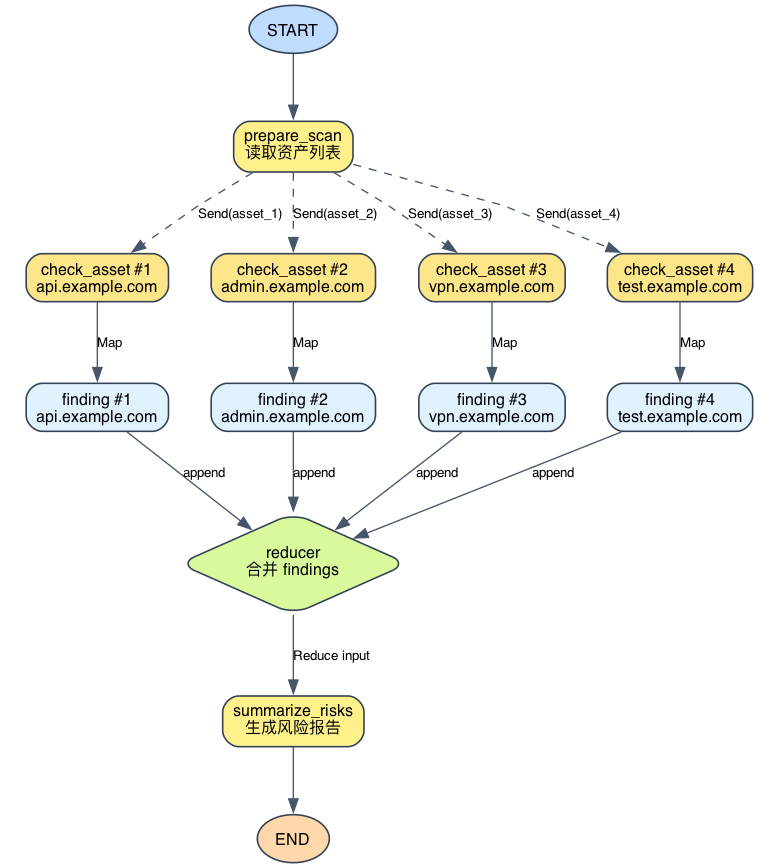
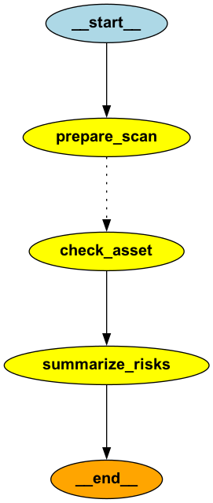

# LangGraph Send：并行分发与 Map-Reduce

前面我们已经看过普通边、条件边和 Reducer。它们解决的问题分别是：流程怎么走、状态怎么分支、多个状态更新怎么合并。

这一篇看一个更接近真实工作的场景：安全工程师拿到一批资产，需要分别检查每个资产的暴露风险，最后生成一份总报告。

这个问题很适合用 Map-Reduce 来理解：

- Map：每个资产独立检查，生成一条 finding。
- Reduce：把所有 finding 汇总成最终风险报告。

LangGraph 里的关键能力是 `Send`。它允许我们在运行时根据输入数量动态创建多个节点调用，而不是提前把 4 个、10 个或 100 个分支写死在图里。

本文配套实验代码位于：

```text
labs/langgraph/foundations/experiments/20_asset_risk_map_reduce
```

## 1. 实验目标

这次实验只回答一个问题：

> 如何用 LangGraph 的 `Send` 把一组资产动态分发给同一个 Map 节点，并在所有 Map 结果完成后统一 Reduce？

实验不做真实网络扫描，只使用模拟资产数据。原因很简单：本文关注的是 LangGraph 的工作流机制，不是资产扫描器本身。

实验输入是 4 个资产：

```text
api.example.com
admin.example.com
vpn.example.com
test.example.com
```

每个资产包含开放端口、是否启用 HTTPS、标签和暴露路径。Map 阶段会分别分析这些资产，Reduce 阶段会生成整体风险报告。

## 2. 目录结构

实验目录保持得比较小：

```text
20_asset_risk_map_reduce/
├── main.py
├── asset_schemas.py
├── risk_rules.py
├── graphviz_utils.py
├── asset_risk_map_reduce_graph.png
├── asset_risk_map_reduce_runtime_graph.png
└── README.md
```

各文件职责如下：

- `main.py`：实验主线，包含 Send 分发、Map 节点、Reduce 节点和运行入口。
- `asset_schemas.py`：State 类型、资产类型和样例资产。
- `risk_rules.py`：资产风险等级判定规则。
- `graphviz_utils.py`：静态结构图和运行时示意图导出。

这里刻意把风险规则和画图逻辑拆出去，是为了让 `main.py` 只保留最重要的脉络。

## 3. 整体流程

先看运行时逻辑图：



它表达的是：

```text
prepare_scan
  ├─ Send(asset_1) -> check_asset #1 -> finding #1
  ├─ Send(asset_2) -> check_asset #2 -> finding #2
  ├─ Send(asset_3) -> check_asset #3 -> finding #3
  └─ Send(asset_4) -> check_asset #4 -> finding #4
                         ↓
                      reducer
                         ↓
                   summarize_risks
```

对应到 LangGraph 代码，真正的图只有 3 个业务节点：

```python
builder.add_node("prepare_scan", prepare_scan)
builder.add_node("check_asset", check_asset)
builder.add_node("summarize_risks", summarize_risks)
```

静态结构图如下：



静态图里只有一个 `check_asset`，这不是画错了。原因是：LangGraph 里只定义了一个 Map 节点，多个 Map 分支是在运行时由 `Send` 动态创建出来的。

## 4. State：为什么 findings 要配置 Reducer

先看 `asset_schemas.py` 中的核心 State：

```python
class RiskScanState(TypedDict, total=False):
    assets: list[Asset]
    findings: Annotated[list[Finding], operator.add]
    final_report: str
    trace: Annotated[list[str], operator.add]
```

这里最重要的是：

```python
findings: Annotated[list[Finding], operator.add]
```

这表示：如果多个分支同时返回 `findings`，LangGraph 应该用 `operator.add` 合并它们。

每个 Map 分支返回的是单元素列表：

```python
{"findings": [finding]}
```

4 个资产就会产生 4 个这样的更新：

```text
[finding_api]
[finding_admin]
[finding_vpn]
[finding_test]
```

Reducer 合并后变成：

```text
[
  finding_api,
  finding_admin,
  finding_vpn,
  finding_test,
]
```

这一步是 Map-Reduce 能成立的关键。如果没有 reducer，多个并行分支同时写同一个 `findings` 字段，LangGraph 不知道应该覆盖、报错，还是合并。

## 5. Send：把资产列表动态分发出去

普通边只能表达“从 A 节点走到 B 节点”。但这里的问题是：资产数量不是固定的。

今天可能有 4 个资产：

```text
api.example.com
admin.example.com
vpn.example.com
test.example.com
```

明天可能有 40 个资产。我们不应该提前在图里画 40 个节点。

实验里用 `send_each_asset_to_checker` 生成 Send：

```python
def send_each_asset_to_checker(state: RiskScanState) -> list[Send]:
    """Send 分发函数：资产列表里有几项，就创建几个 Map 任务。"""
    send_tasks = []
    for asset in state.get("assets", []):
        send_tasks.append(Send("check_asset", {"asset": asset}))
    return send_tasks
```

这里的 `for` 只是创建 Send 指令，不是在 Python 里顺序执行 `check_asset`。

每个 Send 的含义是：

```python
Send("check_asset", {"asset": asset})
```

也就是：

```text
请 LangGraph 调用一次 check_asset 节点，
这次只传入当前这个 asset。
```

这组 Send 被接到 `prepare_scan` 后面：

```python
builder.add_conditional_edges(
    "prepare_scan",
    send_each_asset_to_checker,
    ["check_asset"],
)
```

虽然这里用的是 `add_conditional_edges`，但它不只是“条件分支”。当路由函数返回 `list[Send]` 时，它表达的是动态分发：返回几个 Send，就创建几个节点调用。

## 6. Map：一个资产生成一条 finding

Map 节点是 `check_asset`：

```python
async def check_asset(state: AssetTaskState) -> RiskScanState:
    """Map 节点：每次只检查一个资产，并返回一条 finding。"""
    asset = state["asset"]
    risk, rule_reason = assess_asset_by_rules(asset)
    response = await llm.ainvoke(build_asset_prompt(asset, risk, rule_reason))

    finding: Finding = {
        "host": asset["host"],
        "risk": risk,
        "rule_reason": rule_reason,
        "model_analysis": str(response.content).strip(),
    }
    return {
        "findings": [finding],
        "trace": [f"[Map] {asset['host']} 检查完成，风险等级：{risk}。"],
    }
```

它只关心一个资产，不关心完整资产列表。

这就是 Map 的核心：

```text
一个 asset -> 一个 finding
```

注意它返回的是：

```python
"findings": [finding]
```

不是：

```python
"finding": finding
```

原因是 `findings` 字段最终要收集多个分支的结果。每个分支都返回一个单元素列表，LangGraph 再用 reducer 拼成完整列表。

## 7. Reduce：所有 finding 生成一份总报告

Reduce 节点是 `summarize_risks`：

```python
async def summarize_risks(state: RiskScanState) -> RiskScanState:
    """Reduce 节点：把所有 Map 结果合成最终报告。"""
    findings = sort_findings(state.get("findings", []))
    response = await llm.ainvoke(build_reduce_prompt(findings))
    final_report = str(response.content).strip()

    return {
        "final_report": final_report,
        "trace": [f"[Reduce] 已汇总 {len(findings)} 条资产检查结果。"],
    }
```

运行到这里时，`findings` 已经不是单个资产结果，而是多个 Map 分支合并后的完整列表。

所以执行次数是：

```text
prepare_scan：1 次
check_asset：4 次
summarize_risks：1 次
```

Reduce 节点还有一个细节：它只返回 `final_report`，不再返回 `findings`。

如果 Reduce 节点再次返回 `findings`，会触发列表 reducer 再拼一次，导致结果重复。这个坑很隐蔽，写 Send + reducer 实验时尤其要注意。

## 8. 运行实验

运行前确认本地 Ollama 已有模型：

```bash
ollama list
```

如果没有，可以先拉取：

```bash
ollama pull qwen3-coder:30b
```

从仓库根目录运行实验：

```bash
uv run \
  python labs/langgraph/foundations/experiments/20_asset_risk_map_reduce/main.py
```

你会先看到 trace：

```text
========== LangGraph Trace ==========
[准备] 收到 4 个资产，下一步用 Send 动态分发检查任务。
[Map] api.example.com 检查完成，风险等级：低。
[Map] admin.example.com 检查完成，风险等级：中。
[Map] vpn.example.com 检查完成，风险等级：低。
[Map] test.example.com 检查完成，风险等级：高。
[Reduce] 已汇总 4 条资产检查结果。
```

这段输出能说明三件事：

- `prepare_scan` 只执行了一次。
- `check_asset` 按资产数量执行了 4 次。
- `summarize_risks` 只执行了一次。

随后会看到 Map 结果和最终报告。Map 结果类似：

```text
- test.example.com｜高｜公网暴露测试环境；开放 8080 这类常见测试或管理端口；未启用 HTTPS；暴露调试或运行时信息路径｜...
- admin.example.com｜中｜公网资产开放 SSH；公网暴露管理入口｜...
- api.example.com｜低｜只暴露必要服务，未命中本实验中的高危或中危规则｜...
- vpn.example.com｜低｜只暴露必要服务，未命中本实验中的高危或中危规则｜...
```

最终报告会汇总风险分布，并给出优先处置建议。

## 9. 导出两种图

导出 LangGraph 静态结构图：

```bash
uv run \
  python labs/langgraph/foundations/experiments/20_asset_risk_map_reduce/main.py \
  --graphviz
```

导出运行时 Map-Reduce 示意图：

```bash
uv run \
  python labs/langgraph/foundations/experiments/20_asset_risk_map_reduce/main.py \
  --runtime-graphviz
```

两张图的意义不同：

- 静态结构图来自 LangGraph，只展示图里定义了哪些节点。
- 运行时示意图是实验根据当前资产列表手动画出来的，专门用来解释这一次输入会展开成几个 Map 分支。

不要把运行时示意图误解成 LangGraph 自动记录的真实执行轨迹。它是说明图，不是 tracing 系统。

## 10. 小结

这个实验是一个标准的 Map-Reduce 工作流范式：

```text
输入集合：assets
Map：check_asset 分别检查每个资产
中间结果：finding
合并：findings reducer 把多条 finding 拼成列表
Reduce：summarize_risks 基于全部 findings 生成最终报告
输出：final_report
```

在 LangGraph 里，关键点有三个：

- `Send` 负责动态分发：输入有几个资产，就发出几个 Map 任务。
- Reducer 负责状态合并：多个分支返回的 `findings` 被拼成一个列表。
- Reduce 节点只执行一次：它读取完整结果，生成最终报告。

一句话记住：

> Send 解决“运行时有多少任务”的问题，Reducer 解决“并行结果怎么合并”的问题，Reduce 节点解决“合并后怎么形成最终结论”的问题。

