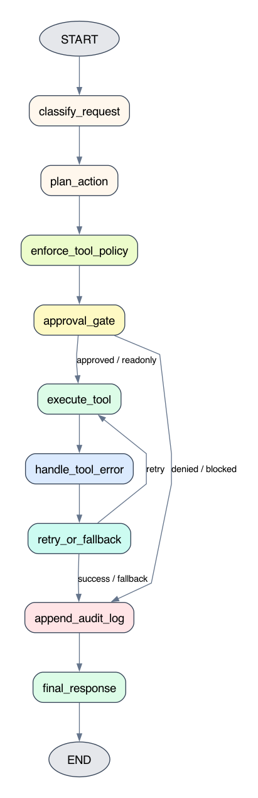

# LangGraph 工具调用治理：让工具执行可控、可恢复、可审计

这篇实验回答一个真实Agent工程里很关键的问题：

```text
真实业务里的工具调用，如何避免变成模型随意触发的黑箱动作？
```

前面我们已经学过工具节点、人工审批、checkpoint、Command、Runtime Context。它们分别解决了不同问题。但只会这些还不够。到了真实业务里，尤其是安全运维、财务、工单、权限管理这类场景，工具调用本身就可能产生副作用。

所以这篇不再只问“模型能不能调用工具”，而是换一个问题：

```text
工具调用之前，谁来决定它能不能执行？
工具调用失败之后，谁来兜底？
工具调用完成之后，谁来留下审计证据？
```

我们用一个安全运维工具执行台做实验。它不连接真实防火墙和资产系统，所有工具都是本地mock。实验重点不是安全业务本身，而是观察一张LangGraph图如何把工具执行管起来。

## 1. 实验目标

配套代码在：

```text
labs/langgraph/foundations/experiments/23_tool_governance_console/main.py
```

图结构图片由这个脚本生成：

```text
labs/langgraph/foundations/experiments/23_tool_governance_console/render_graphviz.py
```

当前项目实测使用：

```text
langgraph==1.2.0
langchain-ollama==1.1.0
```

模型固定使用本地Ollama的 `qwen3-coder:30b`。这里有一个刻意设计：模型只在最后的 `final_response` 节点中使用，用来根据最终State写一段中文回复。工具分类、工具规划、权限判断、工具执行、重试降级都使用确定性Python代码。

这样做是为了把实验主线收窄：

```text
我们要验证的是图结构如何治理工具调用，
不是验证模型是否每次都能稳定规划正确工具。
```

运行前确认Ollama已启动，并且已经拉取模型：

```bash
ollama list
ollama pull qwen3-coder:30b
```

从仓库根目录运行实验：

```bash
uv run labs/langgraph/foundations/experiments/23_tool_governance_console/main.py
```

如果只想重新生成图结构图片：

```bash
uv run labs/langgraph/foundations/experiments/23_tool_governance_console/render_graphviz.py
```

这篇实验要验证 5 件事：

1. 工具错误进入State，不让整张图直接崩掉。
2. 高风险写操作先 `interrupt()`，人工批准后才执行。
3. 每条路径都写入 `audit_log`。
4. 策略节点按动作类型限制可用工具集合。
5. 工具失败后重试一次，仍失败则创建人工处理工单。

## 2. 先看图结构

最终图结构刻意保持成一条治理流水线：

```text
classify_request
 -> plan_action
 -> enforce_tool_policy
 -> approval_gate
 -> execute_tool
 -> handle_tool_error
 -> retry_or_fallback
 -> append_audit_log
 -> final_response
```

对应图片如下：



这张图有两个很重要的设计取舍。

第一个取舍是，不再为每一种工具单独画一个节点。比如只读工具节点、写工具节点、重试工具节点、人工工单节点全部铺开后，图会变得很乱。更糟糕的是，读者会把注意力放在“图为什么这么绕”，而不是“治理动作发生在哪一层”。

第二个取舍是，把治理动作显式拆成几个稳定节点：

| 节点 | 职责 |
| --- | --- |
| `classify_request` | 判断用户请求属于只读、高风险写操作，还是未知请求。 |
| `plan_action` | 把请求规划成 `planned_tool` 和 `tool_args`。 |
| `enforce_tool_policy` | 检查规划出的工具是否属于当前动作类型允许的工具集合。 |
| `approval_gate` | 对高风险写操作执行人工审批；只读动作跳过审批但记录状态。 |
| `execute_tool` | 真正调用工具，并把成功或异常都写回State。 |
| `handle_tool_error` | 显式呈现错误已经进入State。 |
| `retry_or_fallback` | 失败后重试一次；仍失败则创建人工工单。 |
| `append_audit_log` | 汇总输入、审批、执行结果、错误和降级信息。 |
| `final_response` | 只根据最终State生成用户可读回复。 |

这就是这篇实验的核心：工具治理不是某一个节点的“魔法”，而是一组明确的执行前、执行中、执行后控制点。

## 3. State中保存什么

实验的State使用一个 `TypedDict`：

```python
class ToolGovernanceState(TypedDict, total=False):
    user_request: str
    action_type: ActionType
    planned_tool: str
    tool_args: dict[str, Any]

    approval: dict[str, Any]
    tool_result: dict[str, Any]
    tool_error: dict[str, Any]
    retry_count: int
    tool_status: ToolStatus
    manual_ticket: dict[str, Any]
    next_step: NextStep
    audit_log: Annotated[list[dict[str, Any]], operator.add]
    final_answer: str
```

这里的关键不是字段多，而是职责清楚。

`user_request`、`action_type`、`planned_tool`、`tool_args` 描述“用户想做什么，以及图准备怎么做”。

`approval` 描述人工审批结果。只读动作会写入 `{"decision": "skipped", "reason": "readonly_action"}`，表示没有人工审批，但这件事本身也被记录下来。

`tool_status`、`tool_result`、`tool_error` 描述工具执行状态。工具失败不会让整张图直接抛异常终止，而是被捕获到 `tool_error`。

`manual_ticket` 是降级结果。图在无法安全继续时，不会硬着头皮调用工具，而是创建人工处理工单。

`audit_log` 用 `operator.add` 做Reducer。每次进入审计节点时都会追加一条日志，记录这条路径的完整证据。

## 4. 执行前治理：先分类，再限制工具集合

实验把工具动作分成三类：

```python
ActionType = Literal["readonly", "high_risk_write", "unknown"]
```

只读工具和写操作工具分开维护：

```python
READONLY_TOOLS = {
    "lookup_asset": lookup_asset,
    "query_exposure": query_exposure,
    "check_ip_reputation": check_ip_reputation,
}

WRITE_TOOLS = {
    "block_ip": block_ip,
    "add_account_to_watchlist": add_account_to_watchlist,
}
```

策略节点只做一件事：检查规划出的工具是否属于当前动作类型允许的集合。

```python
def enforce_tool_policy(state: ToolGovernanceState) -> dict[str, Any]:
    action_type = state.get("action_type", "unknown")
    planned_tool = state.get("planned_tool", "")
    allowed_tools = ALLOWED_TOOLS_BY_ACTION_TYPE.get(action_type, {})

    if planned_tool in allowed_tools:
        return {"tool_status": "pending", "tool_error": {}}

    if action_type == "unknown":
        ticket = create_manual_ticket(state)
        return {
            "tool_status": "ticket_created",
            "manual_ticket": ticket,
            "tool_error": {
                "type": "unknown_action_type",
                "tool": planned_tool,
            },
        }

    return {
        "tool_status": "failed",
        "tool_error": {
            "type": "tool_not_allowed",
            "tool": planned_tool,
            "action_type": action_type,
            "allowed_tools": sorted(allowed_tools),
        },
    }
```

这个节点验证的是“按节点限制工具集合”。

注意，这里的策略限制不是写在工具函数里，也不是交给模型自觉遵守。它是图结构中的一个显式节点。只要 `action_type=readonly`，规划出的工具就必须来自只读工具集合；如果规划成 `block_ip`，图会在执行前拒绝。

这也是路径 5 的设计目的。

路径 5 的输入是：

```text
请查询错误示例
```

分类节点会把它判断为 `readonly`，因为它包含“查询”。但规划节点故意把它规划成写操作工具 `block_ip`：

```python
if "错误示例" in request:
    planned_tool = "block_ip"
    tool_args = {"ip": "203.0.113.77", "reason": "演示策略节点拒绝越权工具"}
```

这不是业务推荐写法，而是实验里的对抗性输入。它模拟的是planner出错、模型被诱导、或者上游规则误判时，图结构里的策略节点是否还能拦住越权工具。

运行时可以看到：

```text
[classify_request] action_type=readonly
[plan_action] planned_tool=block_ip args={'ip': '203.0.113.77', 'reason': '演示策略节点拒绝越权工具'}
[enforce_tool_policy] tool_not_allowed: block_ip
[approval_gate] skip because status=failed
```

判断标准很直接：没有出现 `[execute_tool] run block_ip(...)`，并且最终 `tool_error.type=tool_not_allowed`。这说明图是在执行前拒绝了越权工具，而不是执行失败后才补救。

## 5. 高风险写操作：用 interrupt() 暂停

安全运维里有些动作不能自动执行，例如封禁IP、把账号加入观察名单。它们不是“工具调用是否能跑通”的问题，而是“这个动作是否应该发生”的问题。

实验在 `approval_gate` 节点里处理这件事：

```python
approval_result = interrupt(
    {
        "question": "这个高风险工具动作是否允许执行？",
        "planned_tool": state.get("planned_tool", ""),
        "tool_args": state.get("tool_args", {}),
        "expected_resume_shape": {
            "decision": "approved 或 denied",
            "operator": "审批人",
            "reason": "审批原因",
        },
    }
)
```

`interrupt()` 会让图在这里暂停，并把审批问题返回给外部调用方。这里的 `expected_resume_shape` 只是告诉读者和调用方：恢复执行时应该传回什么形状的数据。它不是LangGraph的强校验机制。

命令行实验分两次调用图。

第一次调用：

```python
first_result = graph.invoke({"user_request": request}, config=config)
print("__interrupt__:", first_result.get("__interrupt__"))
```

关键输出类似这样：

```text
__interrupt__: [Interrupt(value={
  'question': '这个高风险工具动作是否允许执行？',
  'planned_tool': 'block_ip',
  'tool_args': {'ip': '192.0.2.10', 'reason': '用户请求封禁可疑来源'},
  'expected_resume_shape': {
    'decision': 'approved 或 denied',
    'operator': '审批人',
    'reason': '审批原因'
  }
}, id='...')]
```

这说明图已经运行到审批门，并且暂停了。

第二次调用用 `Command(resume=...)` 把审批结果传回去：

```python
approval = {
    "decision": "approved",
    "operator": "alice",
    "reason": "已确认恶意来源",
}

final_state = graph.invoke(Command(resume=approval), config=config)
```

恢复后，`interrupt()` 表达式会返回这份审批结果，也就是代码里的 `approval_result`。如果 `decision=approved`，图继续进入 `execute_tool`：

```text
[approval_gate] approval_result={'decision': 'approved', 'operator': 'alice', 'reason': '已确认恶意来源'}
[execute_tool] run block_ip({'ip': '192.0.2.10', 'reason': '用户请求封禁可疑来源'})
```

这条路径验证的是：高风险工具不是在用户请求后直接执行，而是在人工批准后才执行。

## 6. 人工拒绝：证明危险动作没有发生

批准路径只能证明“审批通过后能继续执行”。更重要的是拒绝路径。

路径 3 同样会先暂停：

```text
路径 3A：高风险写操作，先暂停等待审批
```

然后传入拒绝结果：

```python
approval = {
    "decision": "denied",
    "operator": "alice",
    "reason": "证据不足",
}

final_state = graph.invoke(Command(resume=approval), config=config)
```

`approval_gate` 收到拒绝结果后，会把状态改成 `denied`：

```python
return {
    "approval": approval_result,
    "tool_status": "denied",
    "tool_result": {},
    "tool_error": {},
}
```

随后条件边会把流程送到 `append_audit_log`，不会进入 `execute_tool`。

关键观察点是：

```text
[approval_gate] approval_result={'decision': 'denied', 'operator': 'alice', 'reason': '证据不足'}
[append_audit_log] status=denied
```

同时没有出现：

```text
[execute_tool] run add_account_to_watchlist(...)
```

这才是拒绝路径的验收标准：不是只看最终回复说“没有执行”，还要看执行日志中确实没有进入工具节点，并且最终审计日志记录了 `tool_status=denied`。

## 7. 执行中治理：工具错误不炸图

路径 4 的输入是：

```text
请查询 unstable.example.com 的暴露服务
```

这个请求属于只读动作，规划出的工具是 `query_exposure`。但工具函数里故意让这个域名抛出异常：

```python
def query_exposure(domain: str) -> dict[str, Any]:
    if domain == "unstable.example.com":
        raise RuntimeError("exposure scanner timeout")
```

如果工具异常不做处理，整张图会直接失败，后面的重试、降级、审计和最终回复都没有机会执行。

实验在 `execute_tool` 节点里捕获异常：

```python
try:
    result = ALL_TOOLS[planned_tool](**tool_args)
    return {
        "tool_status": "success",
        "tool_result": result,
        "tool_error": {},
    }
except Exception as exc:
    return {
        "tool_status": "failed",
        "tool_error": {
            "type": "tool_runtime_error",
            "tool": planned_tool,
            "message": str(exc),
        },
    }
```

运行时可以看到第一次失败：

```text
[execute_tool] tool_failed: exposure scanner timeout
[handle_tool_error] captured error: {'type': 'tool_runtime_error', 'tool': 'query_exposure', 'message': 'exposure scanner timeout'}
[retry_or_fallback] retry_count=1
```

图没有崩掉，而是进入 `retry_or_fallback`，决定重试一次。

## 8. 执行后治理：重试、降级和审计

本实验把最大重试次数设为 1：

```python
MAX_RETRIES = 1
```

第一次失败后，`retry_or_fallback` 会设置 `next_step=execute_tool`，让条件边回到工具执行节点。第二次仍然失败，就创建人工处理工单：

```text
[execute_tool] tool_failed: exposure scanner timeout
[handle_tool_error] captured error: {'type': 'tool_runtime_error', 'tool': 'query_exposure', 'message': 'exposure scanner timeout'}
[retry_or_fallback] fallback ticket_id=SEC-MANUAL-001
```

最终State摘要里可以看到：

```text
tool_status: ticket_created
planned_tool: query_exposure
tool_error: {'type': 'tool_runtime_error', 'tool': 'query_exposure', 'message': 'exposure scanner timeout'}
manual_ticket: {'ticket_id': 'SEC-MANUAL-001', ...}
```

这条路径验证的是“重试与降级路径”。

最后所有路径都会进入 `append_audit_log`。审计日志不是只记录成功路径，而是记录成功、拒绝、越权、失败降级：

```python
audit_item = {
    "request": state.get("user_request", ""),
    "action_type": state.get("action_type"),
    "planned_tool": state.get("planned_tool"),
    "tool_args": state.get("tool_args", {}),
    "approval": state.get("approval", {}),
    "tool_status": state.get("tool_status"),
    "tool_result": state.get("tool_result", {}),
    "tool_error": state.get("tool_error", {}),
    "manual_ticket": state.get("manual_ticket", {}),
    "retry_count": state.get("retry_count", 0),
}
```

这就是可审计的最低要求：事后不仅知道“结果是什么”，还能知道“为什么这么走”。

## 小结

这篇实验不是在讲“如何让模型学会调用更多工具”，而是在讲相反的事：

```text
当工具有真实副作用时，图结构必须负责约束工具调用。
```

五条路径分别验证了工具治理的五个关键点：

| 路径 | 输入 | 验证点 |
| --- | --- | --- |
| 1 | `请查询 example.com 的暴露服务` | 只读查询可直接执行，并写入审计日志。 |
| 2 | `请封禁这个 IP` + `decision=approved` | 高风险写操作先暂停，批准后才执行。 |
| 3 | `请把这个账号加入观察名单` + `decision=denied` | 人工拒绝后不执行写工具，但保留审计记录。 |
| 4 | `请查询 unstable.example.com 的暴露服务` | 工具异常进入State，重试后降级到人工工单。 |
| 5 | `请查询错误示例` | 只读请求被错误规划成写工具时，策略节点在执行前拦截。 |

读完这篇以后，可以把工具调用分成三层看：

```text
执行前：分类、规划、工具集合限制、危险动作审批
执行中：捕获工具异常，不让整张图直接崩掉
执行后：重试、降级、审计、最终回复
```

这也是生产级Agent和普通tool loop的差别：不是能调用工具就结束了，而是每一次工具调用都应该可控、可恢复、可审计。
