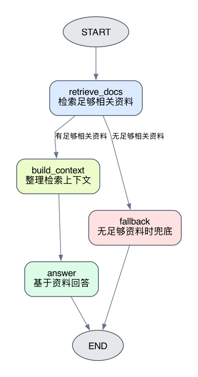

# LangGraph + RAG：把最小问答链路接入图

这篇实验回答一个很基础，但很容易写乱的问题：

```text
在 LangGraph 里，如何把一个最小 RAG 问答链路拆成节点，并用 State 串起来？
```

这里不研究复杂RAG优化，也不做重排、查询改写、多路召回。那些都很重要，但不是这篇的主线。

这篇只做一件事：把已经熟悉的最小RAG问答链路接入LangGraph。

```text
用户问题
 -> 检索相关资料
 -> 整理 Prompt 上下文
 -> 调用模型回答
```

如果检索不到足够相关的资料，就不调用模型回答，而是走一个简单fallback分支。

## 1. 实验目标

配套实验代码位于：

```text
labs/langgraph/foundations/experiments/24_minimal_rag_graph/main.py
```

图结构渲染脚本位于：

```text
labs/langgraph/foundations/experiments/24_minimal_rag_graph/render_graphviz.py
```

生成的图结构图片位于：

```text
labs/langgraph/foundations/experiments/24_minimal_rag_graph/minimal_rag_graph.png
```

本文实验使用已有RAG专题里的客服知识库：

```text
labs/rag/foundations/data/support_policy_retriever.txt
```

当前实验使用本地Ollama：

```text
Embedding 模型：qwen3-embedding:latest
回答模型：qwen3-coder:30b
```

运行前确认Ollama已启动，并且已经拉取模型：

```bash
ollama pull qwen3-embedding:latest
ollama pull qwen3-coder:30b
```

从仓库根目录运行：

```bash
uv run labs/langgraph/foundations/experiments/24_minimal_rag_graph/main.py
```

这篇实验要观察四件事：

1.如何把向量检索接成LangGraph节点。
2. `question`、`retrieved_docs`、`context`、`answer` 分别在State中承担什么职责。
3.知识库路径、模型名、检索参数和向量库为什么适合放进Runtime Context。
4.有足够相关资料和没有足够相关资料时，图如何走不同分支。

## 2. 先看图结构

最终图结构很小：

```text
START
 -> retrieve_docs
 -> 有足够相关资料：build_context
 -> answer
 -> END

retrieve_docs
 -> 无足够相关资料：fallback
 -> END
```

对应图片如下：



这张图表达的不是“RAG有多复杂”，而是“RAG每一步在LangGraph里放在哪里”。

| 节点 | 职责 |
| --- | --- |
| `retrieve_docs` | 根据用户问题查询向量库，把足够相关的资料写入State。 |
| `build_context` | 把结构化检索结果整理成模型可读的上下文文本。 |
| `answer` | 基于用户问题和检索上下文调用本地模型生成回答。 |
| `fallback` | 没有足够相关资料时，直接返回兜底回复。 |

这里最重要的是：模型并不是一上来就回答。图先检索，再根据检索结果决定要不要回答。

## 3. State保存问答过程

实验里的State定义如下：

```python
class RagState(TypedDict, total=False):
    question: str
    retrieved_docs: list[RagDocument]
    context: str
    route: Literal["answer", "fallback"]
    answer: str
```

这些字段都和“本次问答执行过程”有关。

`question` 是用户这次问的问题。

`retrieved_docs` 是检索节点拿到的相关资料。实验没有直接把LangChain的 `Document` 对象塞进State，而是整理成更稳定的字段：

```python
class RagDocument(TypedDict):
    source: str
    chunk_index: int
    start_index: int
    content: str
    similarity: float
```

这样最后打印参考资料时，可以清楚看到模型参考了哪个文件、哪个chunk、相似度是多少。

`context` 是给回答节点看的Prompt上下文。它来自 `retrieved_docs`，但两者不一样：

- `retrieved_docs` 更适合程序读取和结果展示。
- `context` 更适合模型阅读。

`route` 记录这次最终走的是 `answer` 还是 `fallback`。`answer` 保存最终回复。

## 4. Runtime Context保存运行配置

实验里的Runtime Context定义如下：

```python
class RagContext(TypedDict):
    knowledge_base_path: str
    top_k: int
    min_similarity: float
    embedding_model: str
    answer_model: str
    ollama_base_url: str
    vectorstore: InMemoryVectorStore
```

这些字段不是某一次问答的中间结果，而是这次运行依赖的配置和外部对象。

比如：

- 知识库文件在哪里；
- 使用哪个Embedding模型；
- 使用哪个回答模型；
- Ollama地址是什么；
- `top_k` 和 `min_similarity` 如何设置；
- 已经构建好的内存向量库是什么。

这些信息会影响节点怎么执行，但不应该变成用户问题的回答过程。

实验在 `main()` 启动阶段先构建向量库：

```python
vectorstore = build_vectorstore(
    knowledge_base_path=knowledge_base_path,
    embedding_model=embedding_model,
    ollama_base_url=ollama_base_url,
)
```

这一步会加载知识库、切分文本、调用Embedding模型，并把向量写入 `InMemoryVectorStore`。后面三个问题都复用这个向量库，不会每问一次就重新建索引。

然后把向量库和其他配置一起放进Runtime Context：

```python
runtime_context: RagContext = {
    "knowledge_base_path": knowledge_base_path,
    "top_k": 2,
    "min_similarity": 0.60,
    "embedding_model": embedding_model,
    "answer_model": answer_model,
    "ollama_base_url": ollama_base_url,
    "vectorstore": vectorstore,
}
```

这里的 `min_similarity=0.60` 只是当前示例知识库和 `qwen3-embedding:latest` 下的实验阈值，不是通用标准。换模型、换知识库、换切分策略后，都应该重新观察检索分数再调整。

## 5. 检索节点如何写State

`retrieve_docs` 是第一个业务节点。

它从State读取用户问题：

```python
question = get_question(state)
```

再从Runtime Context读取向量库和检索参数：

```python
results = context["vectorstore"].similarity_search_with_score(
    question,
    k=context["top_k"],
)
```

检索结果会带相似度分数。实验只保留大于等于 `min_similarity` 的资料：

```python
for doc, similarity in results:
    if similarity < context["min_similarity"]:
        continue
```

通过阈值的资料会被整理成 `RagDocument`，再写回State：

```python
return {"retrieved_docs": retrieved_docs}
```

这里有一个很重要的分工：

```text
向量库和检索参数来自 Runtime Context。
检索结果进入 State。
```

也就是说，Runtime Context提供运行条件，State记录本次执行产生了什么。

## 6. 条件边如何决定下一步

检索结束后，图不会直接进入回答节点，而是先走条件边：

```python
def route_after_retrieve(state: RagState) -> Literal["build_context", "fallback"]:
    if state.get("retrieved_docs"):
        return "build_context"

    return "fallback"
```

如果 `retrieved_docs` 里有资料，就说明当前问题找到了足够相关的上下文，进入 `build_context`。

如果没有资料，就进入 `fallback`。

这就是LangGraph相比普通RAG chain更直观的地方：分支条件不是藏在一段链式调用里，而是明确写成图的路由逻辑。

## 7. 回答路径与fallback路径

当检索到足够相关资料时，`build_context` 会把结构化资料整理成Prompt上下文：

```python
context_parts.append(
    f"资料 {index}：{doc['source']}#chunk-{doc['chunk_index']}\n"
    f"相似度：{doc['similarity']:.3f}\n"
    f"起始位置：{doc['start_index']}\n"
    f"正文：{doc['content']}"
)
```

然后 `answer` 节点调用本地Ollama：

```python
model = ChatOllama(
    model=context["answer_model"],
    base_url=context["ollama_base_url"],
    temperature=0,
)
```

Prompt要求模型只根据检索资料回答：

```text
你是客服问答助手。请只根据给定资料回答用户问题。
```

当没有足够相关资料时，`fallback` 不调用模型：

```python
return {
    "route": "fallback",
    "context": "",
    "answer": (
        "当前知识库里没有找到足够相关的资料，建议转人工客服或补充更多问题信息。"
    ),
}
```

这不是复杂治理，只是最小RAG应该具备的边界：没有上下文时，不硬让模型回答。

## 8. 运行实验与关键输出

实验会依次运行三个问题：

```text
未发货订单能退款吗？
电子发票在哪里下载？
积分可以提现吗？
```

第一条问题命中退款资料，进入 `answer`：

```text
问题 1：未发货订单能退款吗？
路径：answer
最终回答：未发货订单可以申请退款，系统会自动拦截发货流程，退款通常在1-3个工作日内原路退回。
参考资料：[1] support_policy_retriever.txt#chunk-1@0(0.730); [2] support_policy_retriever.txt#chunk-2@109(0.626)
```

这说明模型回答不是凭空生成的，而是基于两个检索chunk。

第二条问题命中发票资料，也进入 `answer`：

```text
问题 2：电子发票在哪里下载？
路径：answer
最终回答：电子发票可在订单详情页下载。进入"我的订单 -> 订单详情 -> 发票信息"查找发票入口。
参考资料：[1] support_policy_retriever.txt#chunk-3@208(0.732)
```

第三条问题问的是积分提现。当前知识库里没有这个主题，所以进入 `fallback`：

```text
问题 3：积分可以提现吗？
路径：fallback
最终回答：当前知识库里没有找到足够相关的资料，建议转人工客服或补充更多问题信息。
参考资料：无
```

这条路径是本文的关键观察点：图没有把一个无关问题硬塞给模型回答，而是根据检索结果走了另一条边。

## 9. 最小RAG chain和LangGraph图写法有什么区别

如果只是做一次最小问答，普通RAG chain完全够用：

```text
question -> retrieve -> build prompt -> model
```

它短、直接、写起来快。

但当你想观察或控制中间过程时，LangGraph的好处会更明显：

| 对比点 | 最小RAG chain | LangGraph图 |
| --- | --- | --- |
| 中间状态 | 通常在函数局部变量里流动 | 显式写入State |
| 分支路径 | 容易藏在普通if/else里 | 条件边直接表达 |
| 检索结果 | 可能直接拼进Prompt | 可以保留结构化 `retrieved_docs` |
| 运行配置 | 容易和业务状态混在一起 | 可以放进Runtime Context |
| 可观察性 | 需要自己加日志 | 可以按节点观察执行过程 |

所以这篇的结论不是“RAG一定要用LangGraph”，而是：

```text
当 RAG 只是一次简单问答时，chain 更轻。
当你需要显式状态、分支路径和运行配置边界时，LangGraph 更清楚。
```

## 小结

这篇实验把最小RAG问答链路拆成了一张LangGraph图：

```text
retrieve_docs -> build_context -> answer
              -> fallback
```

核心不是把代码写复杂，而是把几个边界看清楚：

- 用户问题、检索结果、上下文和最终回答属于State。
- 知识库路径、模型名、检索参数和向量库属于Runtime Context。
- 检索结果足够相关时才进入回答节点。
- 没有足够相关资料时走fallback，不让模型硬答。

读完这篇，应该能独立解释一个最小LangGraph RAG的数据流：

```text
question 进入 State
Runtime Context 提供向量库和模型配置
retrieve_docs 写入 retrieved_docs
build_context 写入 context
answer 或 fallback 写入 answer
```

这就是LangGraph接入RAG的第一步。
