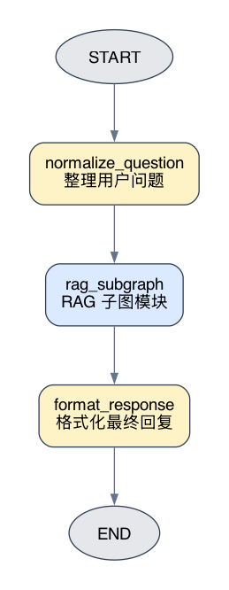
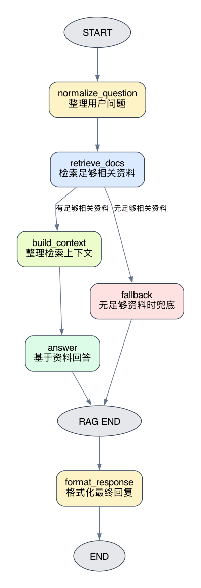

# LangGraph 子图：把复杂 Agent 拆成模块

这篇实验回答一个问题：

```text
在 LangGraph 里，如何把一段复杂流程封装成子图，并确认父图和子图的边界真的存在？
```

第 24 篇已经把一个最小RAG问答链路拆成了几个 LangGraph 节点：

```text
retrieve_docs
 -> build_context
 -> answer

retrieve_docs
 -> fallback
```

如果这个RAG流程只是一个独立实验，平铺在一张图里没有问题。但真实Agent通常不会只有RAG。它可能还要做问题分类、权限判断、工具调用、质检、格式化、审计记录。这个时候，把所有节点都塞进一张图，图会越来越难读。

子图解决的是这个问题：把一段相对独立、内部步骤稳定的流程封装起来，让父图只把它当成一个子图节点使用。

## 1. 实验目标

配套实验目录位于：

```text
labs/langgraph/foundations/experiments/25_rag_subgraph_checkpoint/
```

核心代码：

```text
labs/langgraph/foundations/experiments/25_rag_subgraph_checkpoint/main.py
```

图结构渲染脚本：

```text
labs/langgraph/foundations/experiments/25_rag_subgraph_checkpoint/render_graphviz.py
```

这个实验基于第 24 个客服RAG实验改造，但重点已经不是RAG本身，而是观察四件事：

1. 如何把RAG流程封装成子图。
2. 父图如何把子图当成一个节点使用。
3. 父图和子图如何通过同一份State传递数据。
4. stream namespace和checkpoint namespace如何显示父图、子图的运行边界。

当前实验使用本地Ollama：

```text
Embedding 模型：qwen3-embedding:latest
回答模型：qwen3-coder:30b
```

运行前确认Ollama已启动，并且已经拉取模型：

```bash
ollama pull qwen3-embedding:latest
ollama pull qwen3-coder:30b
```

从仓库根目录运行：

```bash
uv run labs/langgraph/foundations/experiments/25_rag_subgraph_checkpoint/main.py
```

导出图结构图片：

```bash
uv run labs/langgraph/foundations/experiments/25_rag_subgraph_checkpoint/render_graphviz.py
```

## 2. 先看两张图

这个实验会导出两张图。它们不是两套流程，而是同一套流程的两个观察角度。

第一张是父图普通视图：



父图只关心三步：

```text
START
 -> normalize_question
 -> rag_subgraph
 -> format_response
 -> END
```

这里的 `rag_subgraph` 在父图连边时像普通节点一样使用。但从设计语义看，它内部封装的是一整张RAG子图。

第二张是展开视图：



展开视图会把 `rag_subgraph` 内部节点摊开：

```text
retrieve_docs
 -> 有足够相关资料：build_context
 -> answer

retrieve_docs
 -> 无足够相关资料：fallback
```

所以可以这样理解：

```text
父图普通视图：看模块边界。
展开视图：看模块内部。
```

`render_graphviz.py` 里用的是同一个父图对象：

```python
graph = build_parent_graph(checkpointer=InMemorySaver())
```

普通视图：

```python
render_graph(graph.get_graph(), PARENT_GRAPH_PNG)
```

展开视图：

```python
render_graph(graph.get_graph(xray=True), XRAY_GRAPH_PNG)
```

`xray=True` 可以理解成“透视”：父图里原本只显示成一个节点的子图，会被展开成内部节点。

## 3. 子图是怎么嵌进父图的

实现子图的核心步骤很少。

先构建RAG子图：

```python
def build_rag_subgraph():
    builder = StateGraph(RagState, context_schema=RagContext)

    builder.add_node("retrieve_docs", retrieve_docs)
    builder.add_node("build_context", build_context)
    builder.add_node("answer", answer)
    builder.add_node("fallback", fallback)

    builder.add_edge(START, "retrieve_docs")
    builder.add_conditional_edges(
        "retrieve_docs",
        route_after_retrieve,
        {
            "build_context": "build_context",
            "fallback": "fallback",
        },
    )
    builder.add_edge("build_context", "answer")
    builder.add_edge("answer", END)
    builder.add_edge("fallback", END)

    return builder.compile(name="rag_subgraph")
```

然后在父图中创建这个子图，并把它作为节点加入：

```python
def build_parent_graph(checkpointer: InMemorySaver):
    rag_subgraph = build_rag_subgraph()
    builder = StateGraph(RagState, context_schema=RagContext)

    builder.add_node("normalize_question", normalize_question)
    builder.add_node("rag_subgraph", rag_subgraph)
    builder.add_node("format_response", format_response)

    builder.add_edge(START, "normalize_question")
    builder.add_edge("normalize_question", "rag_subgraph")
    builder.add_edge("rag_subgraph", "format_response")
    builder.add_edge("format_response", END)

    return builder.compile(
        checkpointer=checkpointer,
        name="parent_graph",
    )
```

关键就是这两句：

```python
rag_subgraph = build_rag_subgraph()
builder.add_node("rag_subgraph", rag_subgraph)
```

但只有这两句还不够形成完整流程。父图还要给这个子图节点接入边和接出边：

```python
builder.add_edge("normalize_question", "rag_subgraph")
builder.add_edge("rag_subgraph", "format_response")
```

因此，最短的记法是：

```text
子图先 compile。
父图 add_node 时把编译后的子图当成节点加入。
父图再像普通节点一样给它接边。
```

## 4. State 如何在父图和子图之间传递

父图和子图共用同一个 `RagState`：

```python
class RagState(TypedDict, total=False):
    question: str
    normalized_question: str
    retrieved_docs: list[RagDocument]
    context: str
    route: Literal["answer", "fallback"]
    answer: str
    final_response: str
```

这个共享不是checkpoint的作用，而是因为父图和子图使用了同一个State schema。

在本实验中，字段交接是这样的：

```text
父图写入 normalized_question
子图读取 normalized_question

子图写入 retrieved_docs / context / route / answer
父图读取 route / answer / retrieved_docs

父图写入 final_response
```

`normalize_question` 属于父图节点。它只做进入RAG前的输入整理：

```python
def normalize_question(state: RagState) -> RagState:
    raw_question = state.get("question", "")
    if not raw_question.strip():
        raise ValueError("RagState 必须包含非空 question")

    question = raw_question.strip()
    question = question.removeprefix("你好，我想问一下，")
    question = question.removeprefix("你好，我想问一下")
    question = question.replace("？？？", "？")
    question = question.replace("？？", "？")
    question = question.replace("??", "?")

    return {"normalized_question": question}
```

它不是为了做复杂NLP，只是为了制造一个清楚的数据交接点：父图先写入 `normalized_question`，子图后续读取这个字段。

子图里的 `retrieve_docs` 读取的就是 `normalized_question`：

```python
def get_normalized_question(state: RagState) -> str:
    question = state.get("normalized_question")
    if not question:
        raise ValueError("RagState 必须包含非空 normalized_question")
    return question
```

检索节点把检索结果写回 `retrieved_docs`：

```python
return {"retrieved_docs": retrieved_docs}
```

回答路径会继续写入 `context`、`route`、`answer`。fallback路径也会写入 `route` 和 `answer`。最后父图的 `format_response` 读取子图结果，生成 `final_response`。

所以这里要分清楚：

```text
State 负责父图和子图之间传数据。
checkpoint 负责保存 State 的历史快照。
```

## 5. namespace 是用来干什么的

光看代码，读者已经能知道父图里嵌了一个子图。但运行时还需要知道：

```text
某个节点更新到底发生在父图，还是发生在子图内部？
某个 checkpoint 到底属于父图，还是属于子图内部？
```

这就是 namespace 的作用。

在这个实验里，父图节点的 namespace 为空。为了打印友好，实验输出里显示成“父图”。

子图内部节点的 namespace 会类似：

```text
rag_subgraph:一次子图调用ID
```

其中 `rag_subgraph` 来自我们给子图节点起的名字：

```python
builder.add_node("rag_subgraph", rag_subgraph)
```

后面的调用ID由 LangGraph 自动生成。它用于区分某一次具体的子图调用。

这个实验把长ID隐藏掉，只保留层级：

```text
stream 层级
问题：你好，我想问一下，未发货订单能退款吗？？？
- 父图: normalize_question
- 子图 rag_subgraph: retrieve_docs -> build_context -> answer
- 父图: rag_subgraph -> format_response
```

这段输出说明执行顺序是：

```text
先在父图运行 normalize_question。
然后进入 rag_subgraph 子图，运行 retrieve_docs、build_context、answer。
子图结束后回到父图，运行 format_response。
```

如果没有 namespace，stream 里只会看到一串节点更新，读者不容易判断哪些步骤属于父图，哪些步骤属于子图。

## 6. checkpoint namespace 说明什么

checkpoint 是状态快照。启用 checkpointer 后，LangGraph 会保存执行过程中的State快照。

本实验使用内存版 checkpointer：

```python
checkpointer = InMemorySaver()
graph = build_parent_graph(checkpointer)
```

父图编译时挂上 checkpointer：

```python
return builder.compile(
    checkpointer=checkpointer,
    name="parent_graph",
)
```

运行时必须传入 `thread_id`：

```python
config = make_thread_config(thread_id)
final_state = graph.invoke(
    {"question": question},
    config=config,
    context=runtime_context,
)
```

运行结束后，实验通过 `checkpointer.list(config)` 查看这次执行保存了哪些快照：

```python
for checkpoint in checkpointer.list(config):
    checkpoint_config = checkpoint.config.get("configurable", {})
    namespace = checkpoint_config.get("checkpoint_ns")
```

最终只打印聚合结果：

```text
checkpoint namespace
- 父图: 5 个 checkpoint
- rag_subgraph: 5 个 checkpoint
```

这说明两件事：

```text
父图运行过程产生了 checkpoint。
rag_subgraph 子图内部运行过程也产生了 checkpoint。
```

checkpoint namespace 的意义不是让父图和子图共享State。共享State来自同一个State schema。

checkpoint namespace 的意义是：保存快照时，LangGraph 仍然知道这些快照属于父图，还是属于某个子图调用。

## 7. 运行结果如何验证实验成立

运行主实验：

```bash
uv run labs/langgraph/foundations/experiments/25_rag_subgraph_checkpoint/main.py
```

关键输出如下：

```text
实验配置
- 知识库：support_policy_retriever.txt
- 模型：qwen3-embedding:latest / qwen3-coder:30b
- 检索：top_k=2, min_similarity=0.6

========================================================================
stream 层级
问题：你好，我想问一下，未发货订单能退款吗？？？
- 父图: normalize_question
- 子图 rag_subgraph: retrieve_docs -> build_context -> answer
- 父图: rag_subgraph -> format_response
```

这证明执行过程确实从父图进入子图，再回到父图。

第一个问题会命中知识库：

```text
运行结果 1
原始问题：你好，我想问一下，未发货订单能退款吗？？？
标准问题：未发货订单能退款吗？
路径：answer
最终回复：未发货订单可以申请退款，系统会自动拦截发货流程，退款通常在1-3个工作日内原路退回。
参考资料：support_policy_retriever.txt#chunk-1; support_policy_retriever.txt#chunk-2
checkpoint namespace
- 父图: 5 个 checkpoint
- rag_subgraph: 5 个 checkpoint
```

这里能观察到三件事：

- 父图把原始问题整理成了标准问题。
- 子图完成检索、构造上下文和回答。
- 父图和子图都留下了 checkpoint。

第二个问题会走 fallback：

```text
运行结果 2
原始问题：积分可以提现吗？
标准问题：积分可以提现吗？
路径：fallback
最终回复：当前知识库里没有找到足够相关的资料，建议转人工客服或补充更多问题信息。
checkpoint namespace
- 父图: 5 个 checkpoint
- rag_subgraph: 4 个 checkpoint
```

这说明子图内部条件边仍然有效。无足够相关资料时，子图没有进入 `build_context` 和 `answer`，而是走了 `fallback`。

## 8. 什么时候值得拆子图

这个实验里，RAG子图只有几个节点。严格说，如果只是这个最小例子，拆不拆子图都可以。

真正值得拆子图，通常有几个信号：

- 一组节点有明确的共同目标，比如完整RAG、订单处理、报告生成、人工审批。
- 父图只关心这组节点的输入和输出，不关心内部每一步。
- 这组节点可能被多个父图复用。
- 这组节点内部已经有条件分支、fallback 或多步状态更新。
- 调试时希望能单独看这组流程内部的 stream 和 checkpoint。

不值得拆子图的情况也很常见：

- 只有一两个简单节点。
- 拆完以后父图和子图之间字段交接更难理解。
- 子图名字只是为了“看起来工程化”，但没有清楚边界。

子图的价值不是多包一层，而是让复杂Agent的结构分层。

## 9. 小结

这个实验可以压缩成四句话：

```text
子图先 compile，再作为父图的 node 加进去。
父图和子图共享 State，所以可以通过同一份 State 交接数据。
namespace 用来标记运行记录属于父图还是子图。
checkpoint 保存 State 快照，checkpoint namespace 保留这些快照的图层级。
```

因此，理解 LangGraph 子图时，不要只看代码里多了一个 `build_rag_subgraph()`。

更重要的是看这条链路：

```text
父图普通视图：确认子图是父图里的一个节点。
展开视图：确认这个节点内部是一张图。
stream namespace：确认运行时会进入子图再回到父图。
checkpoint namespace：确认状态快照也保留父图和子图边界。
```

这才是第 25 个主题想表达的核心：子图不是把代码缩进一层，而是把一段稳定能力封装成有运行边界、可观察、可恢复的流程模块。
