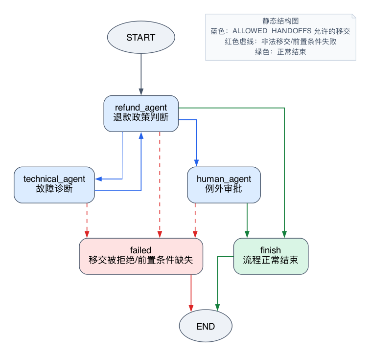
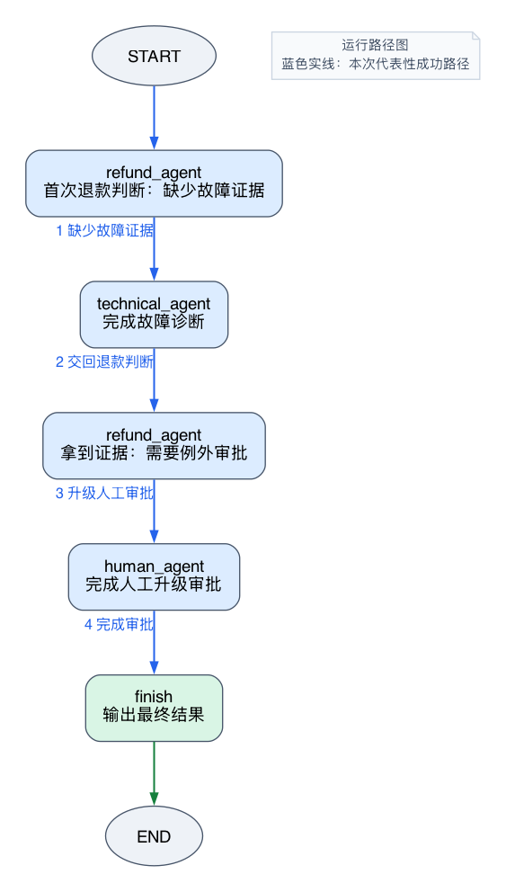

# Handoff 多 Agent：多个 Agent 如何自主移交控制权

这篇实验回答一个问题：

```text
没有统一的中心 Supervisor 时，多个 Agent 如何根据当前结果把控制权交给下一个 Agent？
```

上一篇 Supervisor 多 Agent 的核心是：中心 Agent 统一决定下一步谁来做。专业子Agent做完局部任务后，把结果交回 Supervisor。

Handoff 的控制权关系不一样。它更像真实工作里的“转交工单”：当前处理者发现自己没有权限、缺少信息，或者处理结果要求另一个角色接手，于是主动提出把控制权交给下一个 Agent。

本实验使用一个售后客服工单：

```text
用户购买的智能门锁第 15 天无法连接 App。
用户已经尝试重启和重新配网，但问题没有解决。
用户想退货退款，但普通退货期已经过了。
```

这类任务天然适合 Handoff，因为每个角色的权限不同：

```text
退款 Agent：判断退款政策，但不能诊断技术故障
技术 Agent：判断是否疑似商品故障，但不能批准退款
人工升级 Agent：处理超过普通政策范围的例外审批
```

实验最重要的结论是：

> Handoff 不是固定流水线，也不是让模型随便跳节点。更稳妥的做法是：Agent 负责提出移交意图，程序负责校验合法范围，LangGraph 用 Command 执行通过校验的控制权移交。

## 1. 实验目标与范围

运行并阅读这个实验后，应该能够解释：

- Handoff 与 Supervisor 的控制权差异。
- 当前 Agent 如何提出下一步移交意图。
- 程序如何用目标白名单限制模型不能随意跳转。
- Command 如何同时更新 State 并决定 goto 目标。
- 为什么 Handoff 需要记录移交历史和限制最大移交次数。
- 哪些判断来自模型推断，哪些边界由程序兜底。

当前实验只关注 Agent 之间的控制权移交，不展开以下内容：

- 真实售后系统查询。
- 真实设备日志、检测报告或远程诊断。
- 人工审批中的 interrupt 暂停恢复。
- 多 Agent 并行处理。
- Agent 内部工具循环。

这里先把一个问题讲透：没有中心 Supervisor 时，控制权如何从一个 Agent 合法移交给另一个 Agent。

## 2. 准备实验

实验目录位于：

```text
labs/langgraph/foundations/experiments/27_handoff_support_ticket/
```

配套文件：

```text
main.py                                  # 实验主程序
render_graphviz.py                       # 导出 Graphviz 图片
handoff_support_ticket_architecture.png  # 静态结构图
handoff_support_ticket_runtime.png       # 代表性运行路径图
README.md                                # 实验简要说明
```

本实验使用项目当前配置的本地 Ollama模型：

```text
qwen3-coder:30b
```

项目依赖中使用：

```text
langgraph>=1.2.0
langchain-ollama>=1.1.0
```

运行前确认 Ollama已经启动，并且模型已经准备好：

```bash
ollama pull qwen3-coder:30b
```

从仓库根目录运行实验：

```bash
uv run python labs/langgraph/foundations/experiments/27_handoff_support_ticket/main.py
```

导出静态结构图和代表性运行路径图：

```bash
uv run python labs/langgraph/foundations/experiments/27_handoff_support_ticket/render_graphviz.py
```

## 3. 为什么这个场景适合 Handoff

如果继续用旅行规划讲 Handoff，很容易变成一条固定流水线：

```text
景点规划 -> 预算审查 -> 行程优化 -> 结束
```

这条链路当然能运行，但它不太能证明 Handoff 的必要性。因为旅行规划更像一个需要全局统筹的任务，Supervisor 统一调度反而更自然。

客服工单不一样。它的控制权变化由职责边界驱动：

```text
refund_agent -> technical_agent
technical_agent -> refund_agent
refund_agent -> human_agent
human_agent -> finish
```

每次移交都有具体业务理由：

- 退款 Agent 第一次处理时缺少故障证据，所以不能直接判断退款。
- 技术 Agent 只能判断是否疑似商品故障，不能批准退款。
- 退款 Agent 拿到故障证据后，发现订单超过普通退货期，属于政策例外。
- 人工升级 Agent 负责例外审批，审批完成后结束。

这就不是为了展示循环而循环，而是当前 Agent 真的不能继续处理。

## 4. 先看图结构

静态结构图展示的是程序允许的移交范围：



这张图里，蓝色线来自实验代码中的 ALLOWED_HANDOFFS。它表示当前 Agent 被允许移交给哪些目标。红色虚线表示非法移交、缺少前置条件或超过次数上限后进入 failed。

代表性运行路径图展示本实验默认输入下的一次成功路径：



注意这两张图的区别：

- 静态结构图说明“程序允许什么”。
- 运行路径图说明“这一次实际发生了什么”。

Handoff 实验里，这个区别很重要。模型可以提出下一步，但最终能不能跳过去，要看程序边界。

## 5. State 保存什么

实验中的 State 定义如下：

```python
class SupportState(TypedDict, total=False):
    customer_message: str
    order_days: int
    product_name: str
    amount: int
    refund_case: dict
    technical_diagnosis: dict
    human_review: dict
    current_agent: str
    handoff_count: int
    max_handoff_count: int
    handoff_reason: str
    handoff_history: Annotated[list[dict], operator.add]
    trace: Annotated[list[str], operator.add]
    final_status: str
```

可以把它理解成一份持续更新的工单记录：

```text
customer_message
  用户提交的原始诉求。

order_days / product_name / amount
  工单里的基础业务信息。

refund_case
  退款 Agent 写入的政策判断。

technical_diagnosis
  技术 Agent 写入的初步故障判断。

human_review
  人工升级 Agent 写入的最终审核结果。

handoff_count / max_handoff_count
  控制移交次数，避免 Agent 之间无限转交。

handoff_history
  记录每一次移交从谁到谁、为什么移交、这是第几次移交。
```

这里有一个容易误解的点：State 不是模型的私有记忆，而是 LangGraph 在节点之间传递和合并的共享状态。每个 Agent 都从 State 读取自己需要的信息，再把自己的结果写回 State。

## 6. Agent 返回什么

每个 Agent 调用本地模型，但不是让模型自由返回一段文本。实验用 Pydantic 定义结构化输出。

退款 Agent 返回 RefundResult：

```python
class RefundResult(BaseModel):
    summary: str
    policy_status: Literal[
        "needs_technical_evidence",
        "needs_human_approval",
        "approved",
        "rejected",
    ]
    decision: str
    handoff: HandoffDecision
```

它既包含业务判断，也包含移交意图。

技术 Agent 返回 TechnicalResult：

```python
class TechnicalResult(BaseModel):
    diagnosis: str
    solved_by_troubleshooting: bool
    defect_likely: bool
    evidence: list[str]
    handoff: HandoffDecision
```

这里的 diagnosis 是模型基于用户描述做出的初步判断，不是真实硬件检测结果。实验输入里只有“无法连接 App、重启和重新配网失败”这些文本信息，所以更准确的理解是：

```text
技术 Agent 根据用户描述生成初步诊断和证据整理。
```

而不是：

```text
技术 Agent 已经完成真实设备检测。
```

人工升级 Agent 返回 HumanReviewResult：

```python
class HumanReviewResult(BaseModel):
    final_decision: Literal["approve_refund", "reject_refund", "need_more_info"]
    explanation: str
    handoff: HandoffDecision
```

三个结果对象都有一个共同字段 handoff。它的类型是：

```python
class HandoffDecision(BaseModel):
    target: HandoffTarget
    reason: str
```

也就是说，Agent 不只是说“我做完了”，还要说明：

```text
我建议把控制权交给谁
为什么要交给它
```

## 7. 程序如何限制移交范围

如果完全相信模型返回的 target，Handoff 会变得很危险。

例如退款 Agent 可能直接跳到 finish，绕过技术诊断；技术 Agent 可能直接跳到 human_agent，越过退款政策判断；某个 Agent 也可能因为提示词不稳定进入循环。

所以实验定义了程序白名单：

```python
ALLOWED_HANDOFFS: dict[str, set[HandoffTarget]] = {
    "refund_agent": {"technical_agent", "human_agent", "finish"},
    "technical_agent": {"refund_agent"},
    "human_agent": {"finish"},
}
```

这份白名单表达的是业务权限：

```text
退款 Agent
  可以交给技术 Agent、人工升级 Agent，或者在可直接处理时结束。

技术 Agent
  只能交回退款 Agent，因为它不负责退款。

人工升级 Agent
  审批完成后只能结束。
```

真正执行移交的是 validate_and_execute_handoff：

```python
def validate_and_execute_handoff(
    state: SupportState,
    current_agent: str,
    decision: HandoffDecision,
    update: dict,
) -> Command[HandoffTarget]:
    next_count = state.get("handoff_count", 0) + 1
    max_count = state.get("max_handoff_count", MAX_HANDOFF_COUNT)
    allowed = ALLOWED_HANDOFFS.get(current_agent, set())

    violation = None
    if decision.target not in allowed:
        violation = f"{current_agent} 不允许移交给 {decision.target}"
    elif next_count > max_count:
        violation = f"Handoff 次数 {next_count} 超过上限 {max_count}"

    target: HandoffTarget = decision.target
    if violation:
        target = "failed"
        update["final_status"] = "handoff_rejected"
        update["handoff_reason"] = violation

    record = {
        "from": current_agent,
        "to": target,
        "reason": decision.reason if not violation else violation,
        "count": next_count,
    }

    return Command(
        update={
            **update,
            "current_agent": target,
            "handoff_count": next_count,
            "handoff_reason": record["reason"],
            "handoff_history": [record],
            "trace": [f"{current_agent} -> {target}"],
        },
        goto=target,
    )
```

这段代码做了三件事：

- 统计本次是第几次 Handoff。
- 检查模型提出的目标是否在当前 Agent 的白名单里。
- 如果合法，用 Command 更新 State 并跳到目标节点；如果非法，改跳 failed。

这里的关键点是：

```text
goto 使用的是经过程序校验后的 target，
不是未经检查的 decision.target。
```

这就是“Agent 提出意图，程序执行约束”的边界。

## 8. 退款 Agent 如何主动移交

实验从 refund_agent 开始：

```python
builder.add_edge(START, "refund_agent")
```

默认输入是：

```python
initial_state: SupportState = {
    "customer_message": (
        "我买的智能门锁第15天开始无法连接App，重启和重新配网都失败。"
        "我现在想退货退款，但普通退货期好像已经过了。"
    ),
    "product_name": "智能门锁",
    "order_days": 15,
    "amount": 1299,
    "max_handoff_count": MAX_HANDOFF_COUNT,
}
```

第一次进入退款 Agent 时，State 里还没有 technical_diagnosis。

模型会根据提示词返回退款判断和移交意图，但实验还做了一层程序兜底：

```python
if not isinstance(technical_diagnosis, dict):
    refund_case["policy_status"] = "needs_technical_evidence"
    decision = HandoffDecision(
        target="technical_agent",
        reason="退款判断缺少故障证据，需要技术 Agent 先确认问题性质",
    )
```

这说明一个工程判断：提示词可以要求模型不要越权，但关键业务边界不能只靠提示词。

第一次退款判断的关键输出是：

```text
--- refund_agent 退款判断 ---
订单天数：15
已有技术诊断：None
政策状态：needs_technical_evidence
退款判断：需要先进行技术故障诊断才能判断是否符合退款政策
下一步移交：technical_agent，原因：退款判断缺少故障证据，需要技术 Agent 先确认问题性质
--- refund_agent 判断结束 ---

[refund_agent] handoff -> technical_agent: 退款判断缺少故障证据，需要技术 Agent 先确认问题性质
```

这一段证明：退款 Agent 并没有直接结束，也没有越权做技术判断。它发现缺少前置证据后，把控制权交给技术 Agent。

## 9. 技术 Agent 为什么交回退款 Agent

technical_agent 的职责是诊断，不是退款。

它读取用户诉求、商品名和 refund_case，然后生成初步诊断：

```text
--- technical_agent 技术诊断 ---
诊断商品：智能门锁
诊断结论：疑似商品故障-通信模块故障
是否已通过排障解决：False
是否疑似商品故障：True
故障证据：['智能门锁在正常使用第15天后出现无法连接App的故障', ...]
下一步移交：refund_agent，原因：已完成技术故障诊断，确认为商品本身质量问题，需移交退款审批
--- technical_agent 诊断结束 ---

[technical_agent] handoff -> refund_agent: 已完成技术故障诊断，确认为商品本身质量问题，需移交退款审批
```

这里要分清直接观察和实现推断：

- 直接观察：技术 Agent 生成了 defect_likely 为 True 的初步诊断结果，并把控制权交回 refund_agent。
- 实现推断：因为 ALLOWED_HANDOFFS 中 technical_agent 只能移交给 refund_agent，所以即使模型想跳到 human_agent，也会被程序拒绝。

技术 Agent 交回退款 Agent 是合理的，因为退款政策判断还没有完成。技术 Agent 只是补齐了退款判断需要的证据。

## 10. 第二次退款 Agent 为什么交给人工升级

第二次进入 refund_agent 时，State 已经有了 technical_diagnosis：

```text
已有技术诊断：{
  'diagnosis': '疑似商品故障-通信模块故障',
  'solved_by_troubleshooting': False,
  'defect_likely': True,
  'evidence': [...]
}
```

这时退款 Agent 面对的是另一个问题：

```text
疑似商品故障成立，
但订单已经第 15 天，
超过普通退货期。
```

实验同样用程序兜底：

```python
elif technical_diagnosis.get("defect_likely") and state.get("order_days", 0) > 7:
    refund_case["policy_status"] = "needs_human_approval"
    decision = HandoffDecision(
        target="human_agent",
        reason="技术诊断确认疑似商品故障，但订单已超过普通退货期，需要人工审批",
    )
```

关键输出是：

```text
--- refund_agent 退款判断 ---
订单天数：15
政策状态：needs_human_approval
退款判断：由于技术诊断确认为商品硬件故障（通信模块），且订单已超过7天普通退货期，此情况属于政策例外，需人工审核处理。
下一步移交：human_agent，原因：技术诊断确认疑似商品故障，但订单已超过普通退货期，需要人工审批
--- refund_agent 判断结束 ---

[refund_agent] handoff -> human_agent: 技术诊断确认疑似商品故障，但订单已超过普通退货期，需要人工审批
```

这次移交不是循环，也不是形式。它表达的是权限升级：普通退款政策处理不了例外情况，所以把控制权交给人工升级 Agent。

## 11. 人工升级 Agent 如何结束流程

human_agent 读取退款判断和技术诊断，输出最终审批意见：

```text
--- human_agent 人工升级审批 ---
升级原因：技术诊断确认疑似商品故障，但订单已超过普通退货期，需要人工审批
退款判断：由于技术诊断确认为商品硬件故障（通信模块），且订单已超过7天普通退货期，此情况属于政策例外，需人工审核处理。
技术证据：['智能门锁在正常使用第15天后出现无法连接App的故障', ...]
最终决定：approve_refund
处理说明：技术诊断确认为商品硬件故障（通信模块），且用户已尝试重启和重新配网等常规 troubleshooting 均无效，符合政策例外情况。虽然订单已超过7天普通退货期，但因属于商品功能性缺陷，倾向批准退款。
下一步移交：finish，原因：已完成例外退款审批
--- human_agent 审批结束 ---

[human_agent] handoff -> finish: 已完成例外退款审批
[finish] Handoff 流程正常结束
```

human_agent 的合法目标只有 finish：

```python
"human_agent": {"finish"}
```

所以人工升级 Agent 完成最终处理后，流程进入 finish。最终状态为：

```text
=== 最终状态 ===
success
{'final_decision': 'approve_refund', 'explanation': '...'}
```

## 12. Handoff 历史证明了什么

运行结束后，实验打印 handoff_history：

```text
=== Handoff 历史 ===
{'from': 'refund_agent', 'to': 'technical_agent', 'reason': '退款判断缺少故障证据，需要技术 Agent 先确认问题性质', 'count': 1}
{'from': 'technical_agent', 'to': 'refund_agent', 'reason': '已完成技术故障诊断，确认为商品本身质量问题，需移交退款审批', 'count': 2}
{'from': 'refund_agent', 'to': 'human_agent', 'reason': '技术诊断确认疑似商品故障，但订单已超过普通退货期，需要人工审批', 'count': 3}
{'from': 'human_agent', 'to': 'finish', 'reason': '已完成例外退款审批', 'count': 4}
```

这份历史记录证明了三件事：

- 控制权确实在多个 Agent 之间转移。
- 每次转移都有原因，不是固定按边无脑流动。
- 每次转移都被计数，流程具备循环控制基础。

如果只看最终结果，很难判断多个 Agent 到底怎么协作。handoff_history 把过程留下来，方便调试、解释和审计。

## 13. 边界由哪里保证

默认运行路径证明的是合法 Handoff 如何发生。除此之外，实验代码还放了三道边界，防止 Handoff 变成模型随意跳转。

第一道边界是非法目标检查：

```python
allowed = ALLOWED_HANDOFFS.get(current_agent, set())

if decision.target not in allowed:
    violation = f"{current_agent} 不允许移交给 {decision.target}"
```

例如 technical_agent 的白名单只有 refund_agent：

```python
"technical_agent": {"refund_agent"}
```

所以技术 Agent 即使生成了 human_agent 或 finish，也不会被直接执行。validate_and_execute_handoff 会把目标改成 failed。

第二道边界是前置条件检查。technical_agent 必须先拿到 refund_case，human_agent 必须同时拿到 refund_case 和 technical_diagnosis：

```python
if not isinstance(refund_case, dict):
    reason = "缺少 refund_case，技术诊断无法开始"
    return Command(
        update={
            "current_agent": "failed",
            "handoff_reason": reason,
            "final_status": "missing_prerequisite",
        },
        goto="failed",
    )
```

这说明 Handoff 不是只看目标节点名。即使图上存在目标节点，缺少必要上下文时也不能继续处理。

第三道边界是最大移交次数：

```python
next_count = state.get("handoff_count", 0) + 1
max_count = state.get("max_handoff_count", MAX_HANDOFF_COUNT)

if next_count > max_count:
    violation = f"Handoff 次数 {next_count} 超过上限 {max_count}"
```

默认上限是 6。当前成功路径发生 4 次移交，所以正常结束。如果某次任务在退款、技术、人工之间反复移交，超过上限后会进入 failed。

这里要诚实区分两类证据：

- 直接观察：默认运行输出证明了合法路径和 handoff_history。
- 实现推断：非法目标、缺少前置条件和超出次数上限由代码分支保证；当前主脚本没有单独提供失败场景命令。

如果后续要把实验做成更完整的边界测试，可以增加独立场景，专门触发非法目标、缺少前置 State 和超出最大移交次数。

## 14. Handoff 与 Supervisor 的差异

到这里，可以把 26 和 27 放在一起比较。

| 模式 | 谁决定下一步 | 专业 Agent 做完后交给谁 | 适合任务 |
| --- | --- | --- | --- |
| Supervisor | 中心 Supervisor | 回到 Supervisor | 需要全局统筹、统一排序、统一收尾的任务 |
| Handoff | 当前 Agent | 当前 Agent 提出的下一个 Agent | 当前处理者最知道谁应该接手的任务 |

Supervisor 的典型路径是：

```text
Supervisor -> 子Agent -> Supervisor -> 子Agent -> Supervisor -> finish
```

Handoff 的典型路径是：

```text
Agent A -> Agent B -> Agent A -> Agent C -> finish
```

本实验不是说 Handoff 比 Supervisor 更高级。它们解决的问题不同：

- 如果任务需要一个中心角色保持全局计划，优先考虑 Supervisor。
- 如果任务天然是跨职责转交，当前处理者最清楚下一个接手者，Handoff 更自然。

## 15. 实验边界与可改进点

当前实验已经能说明 Handoff 的核心控制权关系，但它仍然是最小实验。

需要注意几个边界：

- 技术诊断来自模型基于用户描述的初步推断，不是真实设备检测。
- 人工升级 Agent 是模型模拟的审批意见，不是真人审批。
- 实验没有接入真实订单系统、售后系统或设备日志。
- 失败路径主要由代码中的 failed 节点和移交次数限制表达，没有单独提供命令行场景。

如果继续扩展，可以增加三类场景：

- 直接退款：订单未超过普通退货期，refund_agent 可以直接 finish。
- 证据不足：technical_agent 判断无法确认故障，交回 refund_agent 后要求补充信息。
- 移交异常：故意让某个 Agent 提出非法目标，观察程序如何改跳 failed。

但这些都不是当前文章的主线。当前实验只保留一条足够自然的成功路径，把 Handoff 的控制权结构讲清楚。

## 16. 验收清单

读完并运行实验后，可以用下面清单检查自己是否真的理解：

- 能解释为什么第一次 refund_agent 要交给 technical_agent。
- 能解释为什么 technical_agent 不能直接交给 human_agent。
- 能解释为什么第二次 refund_agent 要交给 human_agent。
- 能指出 ALLOWED_HANDOFFS 约束了哪些合法移交。
- 能说明 Command 的 update 和 goto 分别负责什么。
- 能从 handoff_history 还原完整控制权流转。
- 能区分模型提出的移交意图和程序最终执行的跳转。
- 能说清 Handoff 与 Supervisor 的主要区别。

## 17. 小结

Handoff 多 Agent 的关键不是“有多个 Agent”，而是“当前 Agent 能根据自己的处理结果，把控制权交给更合适的下一个 Agent”。

但这个自主不能没有边界。实验里的工程边界是：

```text
Agent 生成业务结果和移交意图
程序校验目标白名单、前置条件和移交次数
LangGraph 用 Command(update=..., goto=...) 执行合法移交
```

所以，本实验里的 Handoff 可以一句话概括：

> 模型提出“我建议交给谁”，程序决定“这个交接是否合法”，LangGraph 负责“真正把流程切过去”。
