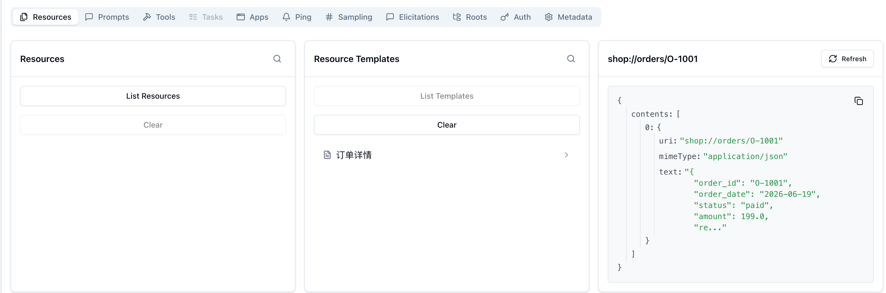
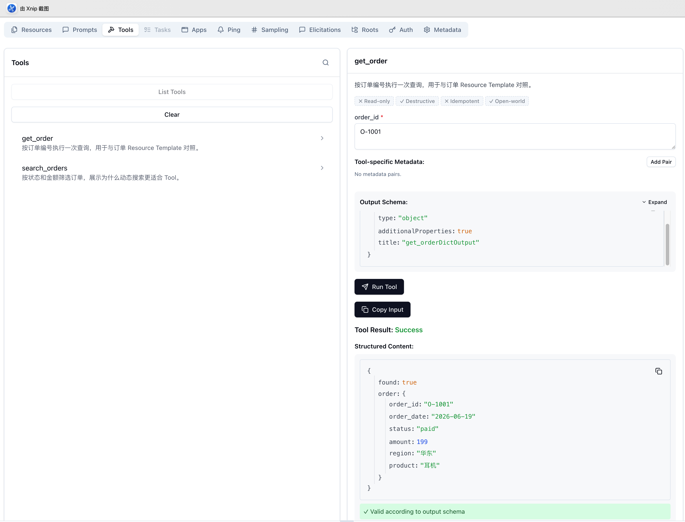
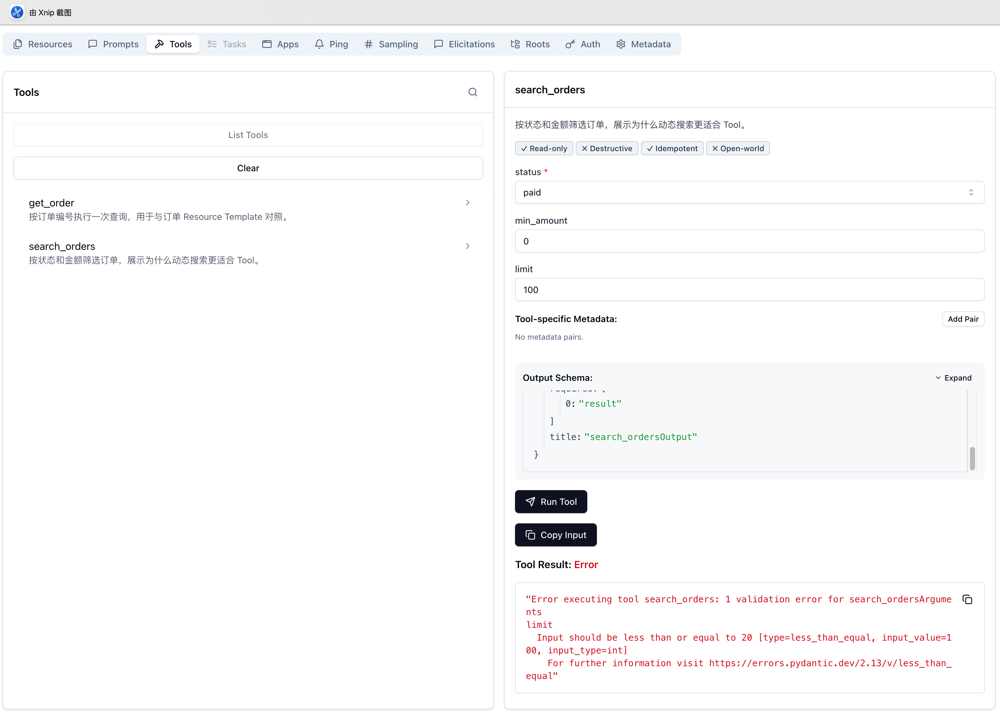
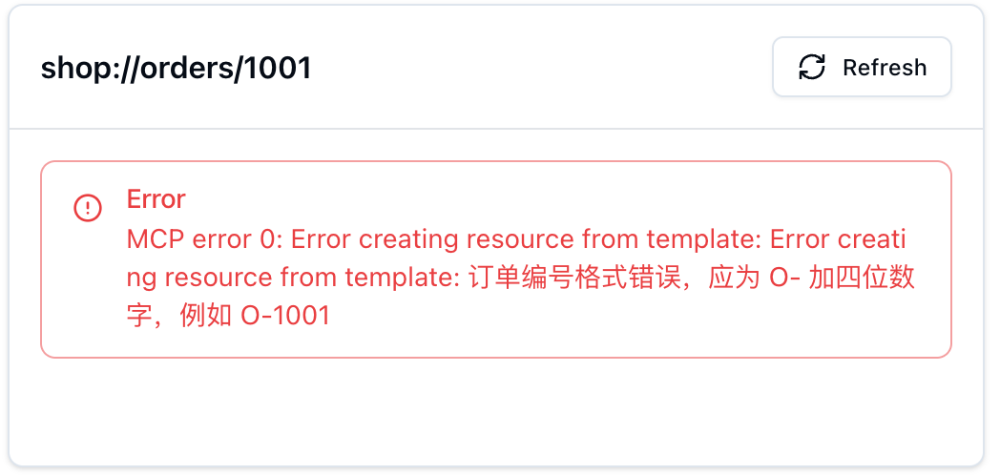
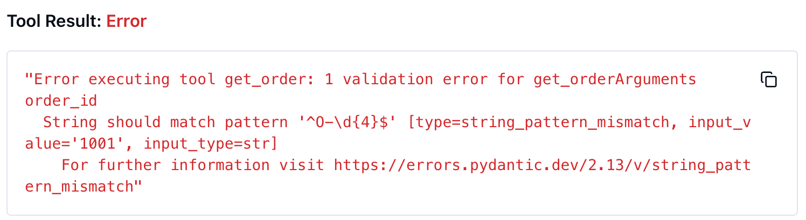
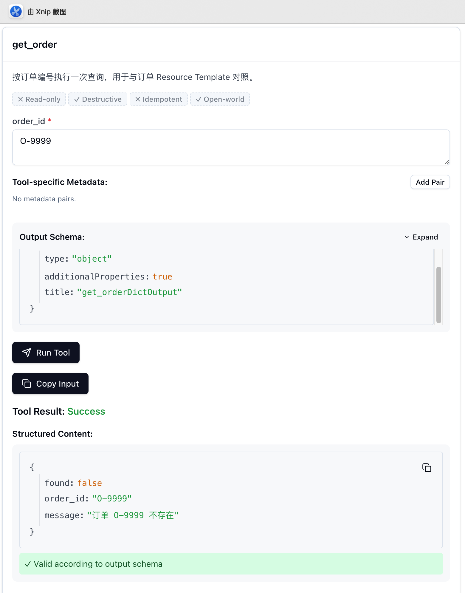
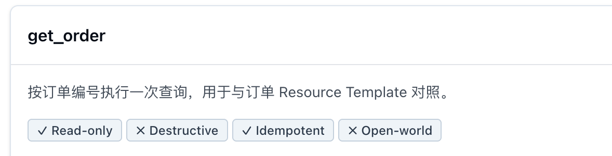
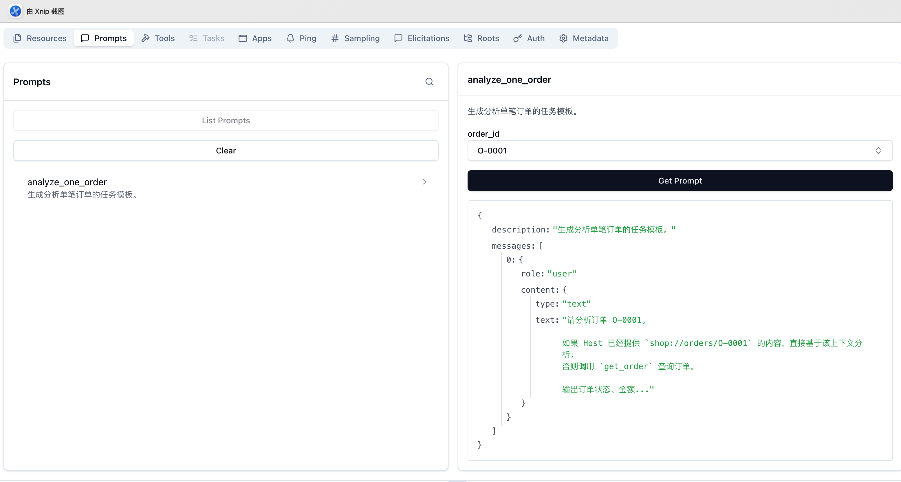

# 03 | MCP Tool、Resource、Prompt：从会用到会设计

前两篇已经回答了 MCP 是什么，以及 Host、Client、Server 如何协作。这一篇不再重复三类 primitive 的定义，而是解决一个更接近开发的问题：

> 面对一项真实业务能力，应该把它设计成 Tool、Resource，还是 Prompt？

本文继续使用订单分析项目。我们会让 Resource Template 和 Tool 查询同一笔订单，再通过 MCP Inspector 对比它们的发现方式、输入输出和失败结果。最后再看输入 Schema、输出 Schema、Tool annotations 和 Prompt 分别承担什么职责。

实验代码在：

```text
examples/shop_order_primitives_server.py
```

它复用第二篇的样例数据库，但注册了独立的 MCP Server，不会改变第二篇使用的 `shop_order_analysis_server.py`。

## 1. 先建立一条选择标准

先看这组订单需求：

| 业务需求 | 更合适的设计 | 原因 |
| --- | --- | --- |
| 读取订单状态字典 | Resource | 它是一份稳定、可读取的上下文 |
| 按订单编号读取订单详情 | Resource Template 或 Tool | 既可以理解为读取对象，也可以理解为执行查询 |
| 筛选退款金额超过 500 元的订单 | Tool | 需要动态参数、筛选和计算 |
| 执行订单退款 | Tool | 会改变外部系统，存在副作用 |
| 提供单笔订单分析流程 | Prompt | 它组织任务步骤，不负责查询或执行 |

可以先记住一句话：

> Resource 以内容为中心，Tool 以操作为中心，Prompt 以任务组织为中心。

但这条规则还不够。例如，“按编号读取订单”既可以设计成 Resource Template，也可以设计成 Tool。要理解这种边界，仅看定义不够，需要观察 Host 实际拿到了什么。

## 2. 启动实验 Server

本项目已经把 MCP SDK 安装在项目虚拟环境中。在当前目录启动 Inspector：

```bash
npx -y @modelcontextprotocol/inspector \
  uv run --no-sync python examples/shop_order_primitives_server.py
```

Server 使用第二篇已经创建的 SQLite 订单数据库：

```python
from shop_order_analysis_server import DB_PATH, ensure_database, rows_to_dicts

mcp = FastMCP("shop-order-primitives")
```

Resource 和 Tool 最终都会调用同一个查询函数：

```python
def find_order(order_id: str) -> Order | None:
    ensure_database()
    with sqlite3.connect(DB_PATH) as conn:
        cursor = conn.execute(
            """
            SELECT order_id, order_date, status, amount, region, product
            FROM orders
            WHERE order_id = ?
            """,
            (order_id,),
        )
        rows = rows_to_dicts(cursor)
    return Order.model_validate(rows[0]) if rows else None
```

这里暂时把 `Order` 理解为一笔订单的结构化数据模型，它的完整定义会在第 5 节展开。

这点很重要：primitive 的区别不一定来自底层实现。即使执行相同 SQL、返回相同订单，Resource 和 Tool 对 Host 表达的语义仍然不同。

## 3. 同一笔订单：Resource Template 与 Tool 有什么不同

### 3.1 Resource Template 表达可寻址内容

固定 Resource 适合暴露已知 URI，例如第二篇里的：

```text
shop://database/schema
```

订单详情需要根据订单编号变化，因此这里使用 Resource Template：

```python
@mcp.resource(
    "shop://orders/{order_id}",
    name="订单详情",
    description="按订单编号读取一笔可寻址的订单上下文",
    mime_type="application/json",
)
def order_detail(order_id: str) -> str:
    if not ORDER_ID_PATTERN.fullmatch(order_id):
        raise ValueError("订单编号格式错误，应为 O- 加四位数字，例如 O-1001")

    order = find_order(order_id)
    if order is None:
        raise ValueError(f"订单 {order_id} 不存在")

    return order.model_dump_json(indent=2)
```

`shop://orders/{order_id}` 是模板，不是一笔具体订单。Host 用具体值替换变量后，才得到可读取的 URI：

```text
shop://orders/O-1001
```

在 Inspector 中读取后，返回结果位于 `contents` 中，并保留 URI 和 MIME type：



从截图可以看到：

- 返回内容对应明确 URI：`shop://orders/O-1001`。
- `mimeType` 是 `application/json`。
- 订单 JSON 位于 Resource 的文本内容中。

这条路径强调的是“读取一份可定位的订单上下文”。当用户已经给出订单编号，Host 可以主动读取这个 URI，再把内容加入模型上下文。

### 3.2 Tool 表达一次带参数的操作

同一个查询也可以设计成 Tool：

```python
@mcp.tool(annotations=READ_ONLY_LOCAL_QUERY)
def get_order(order_id: OrderId) -> OrderFound | OrderNotFound:
    order = find_order(order_id)
    if order is None:
        return OrderNotFound(
            order_id=order_id,
            message=f"订单 {order_id} 不存在",
        )
    return OrderFound(order=order)
```

Inspector 不要求输入 URI，而是根据 Tool 的输入 Schema 生成 `order_id` 参数：



Tool 结果出现在 `structuredContent` 中，Inspector 还会根据输出 Schema 验证结果。

这条路径强调的是“执行一次订单查询”。Host 可以把 Tool 描述交给模型，模型根据当前任务提出调用和参数，Host 再决定是否真正执行。

### 3.3 选择的关键不是代码长什么样

Resource Template 也有 `{order_id}` 变量，Tool 也可以只做读取。因此不能简单地认为“有参数就是 Tool”。

更可靠的判断方式是：

- 已知具体对象，希望 Host 主动读取并加入上下文：优先考虑 Resource。
- 需要模型根据任务决定是否查询：优先考虑 Tool。
- 需要搜索、筛选、聚合或修改外部系统：通常使用 Tool。
- 内容有稳定身份，适合通过 URI 引用和重复读取：通常使用 Resource。

例如：

```text
分析订单 O-1001 为什么退款
```

Host 已经知道对象，可以读取 `shop://orders/O-1001`。

而下面的问题没有给出具体订单：

```text
找出今天退款金额较高的订单
```

这时更适合调用带筛选参数的 Tool。

## 4. 输入 Schema：把调用约束交给 Host

Tool 不只是一个 Python 函数。函数签名会被 SDK 转换成 JSON Schema，成为 Server 对外暴露的调用契约。

订单编号使用 `Annotated` 和 Pydantic `Field` 描述：

```python
OrderId = Annotated[
    str,
    Field(
        pattern=r"^O-\d{4}$",
        description="订单编号，格式为 O- 加四位数字，例如 O-1001",
    ),
]
```

动态订单查询进一步限制状态、金额和返回条数：

```python
OrderStatus = Literal["paid", "cancelled", "refunded"]

@mcp.tool(annotations=READ_ONLY_LOCAL_QUERY)
def search_orders(
    status: OrderStatus,
    min_amount: Annotated[
        float,
        Field(ge=0, description="订单金额下限，单位为元"),
    ] = 0,
    limit: Annotated[
        int,
        Field(ge=1, le=20, description="最多返回多少笔订单"),
    ] = 5,
) -> list[Order]:
    ...
```

这些类型最终表达为：

- `status` 只能是三个枚举值之一。
- `min_amount` 不能小于 0。
- `limit` 必须在 1 到 20 之间。

Inspector 会根据枚举生成下拉框，用户甚至无法在表单中输入 `pending`。但 UI 约束不能取代 Server 校验，因为其他 Client 仍然可以直接发送任意参数。

实验中，Inspector 表单允许输入 `limit = 100`，请求到达 Server 后，被 Pydantic 在函数执行前拒绝：



因此输入 Schema 同时服务三方：

- 模型通过名称、描述和约束生成更合理的参数。
- Host 可以生成表单、提前检查输入或决定是否执行。
- Server 在边界上执行最终校验。

## 5. 输出 Schema：不要只返回一堆未知字典

最初的返回类型是：

```python
list[dict[str, object]]
```

SDK 只能生成一个很宽松的输出 Schema：

```json
{
  "items": {
    "additionalProperties": true,
    "type": "object"
  },
  "type": "array"
}
```

Host 只知道结果是一组对象，不知道每个对象必须有哪些字段。

为此，Server 使用 Pydantic 模型定义订单：

```python
class Order(BaseModel):
    model_config = ConfigDict(extra="forbid")

    order_id: OrderId
    order_date: Annotated[
        str,
        Field(
            pattern=r"^\d{4}-\d{2}-\d{2}$",
            description="下单日期，格式为 YYYY-MM-DD",
        ),
    ]
    status: OrderStatus
    amount: Annotated[float, Field(ge=0, description="订单金额，单位为元")]
    region: str
    product: str
```

重构后的输出 Schema 使用 `$defs.Order` 定义稳定结构，再通过 `$ref` 引用：

```json
{
  "items": {
    "$ref": "#/$defs/Order"
  },
  "type": "array"
}
```

`Order` 中还会包含：

- 六个必需字段。
- 订单编号和日期格式。
- 状态枚举。
- 金额下限。
- `additionalProperties: false`，禁止未声明字段。

输入 Schema 约束“怎样调用”，输出 Schema 约束“会返回什么”。结构越清晰，Host 越容易稳定解析结果，模型也越不需要猜测字段含义。

## 6. 失败不是一种：区分读取失败、Tool 错误和业务结果

MCP Tool 规范区分 JSON-RPC Protocol Error 和 Tool Execution Error。前者表示未知 Tool、请求结构不合法等协议问题；后者通过 Tool Result 中的 `isError: true` 表示，例如输入校验或业务逻辑执行失败。

本次实验没有构造 JSON-RPC Protocol Error，而是观察下面三种情况。

### 6.1 Resource URI 参数格式错误

读取：

```text
shop://orders/1001
```

`order_detail()` 主动检查格式并抛出 `ValueError`。Inspector 显示 Resource 创建失败：



这是一次读取失败，Server 没有返回 Resource 内容。

### 6.2 Tool 输入 Schema 校验失败

调用 `get_order` 时传入 `1001`，参数不符合 `^O-\d{4}$`：



这次错误发生在 Tool 函数执行前。FastMCP 根据输入 Schema 完成校验，`get_order()` 的业务代码没有开始查询数据库。Inspector 将它显示为 `Tool Result: Error`，属于 Tool Execution Error，而不是 JSON-RPC Protocol Error。

### 6.3 参数合法，但业务对象不存在

`O-9999` 格式正确，只是数据库里没有这笔订单。Server 返回：

```python
class OrderNotFound(BaseModel):
    found: Literal[False] = False
    order_id: OrderId
    message: str
```

Inspector 将协议调用显示为 `Success`，结构化业务结果则是 `found: false`：



这里没有协议错误，也没有输入错误。Tool 正常执行并完成查询，只是查询结果为空。

可以把三者放在一起：

| 情况 | 是否进入业务函数 | 调用结果 |
| --- | --- | --- |
| Resource 参数格式错误 | 进入 Resource 函数后主动拒绝 | Resource 读取失败 |
| Tool 参数不符合 Schema | 否 | Tool Execution Error，`isError: true` |
| Tool 参数合法但订单不存在 | 是 | 正常 Tool Result，`found: false` |

“没有查到订单”是否应该算业务成功，要根据 Tool 的语义决定。对查询 Tool 来说，对象不存在通常是调用者需要处理的正常结果；数据库连接失败、权限失败等才更接近执行错误。

## 7. Tool annotations：告诉 Host 这项操作有多危险

Inspector 最初把 `get_order` 显示为非只读、可能破坏数据、非幂等且会访问开放世界。这并不是代码真的具有这些行为，而是 Server 没有声明 annotations 时采用了保守默认值。

两个查询 Tool 都只读取本地 SQLite，因此定义：

```python
READ_ONLY_LOCAL_QUERY = ToolAnnotations(
    readOnlyHint=True,
    destructiveHint=False,
    idempotentHint=True,
    openWorldHint=False,
)
```

并在注册时使用：

```python
@mcp.tool(annotations=READ_ONLY_LOCAL_QUERY)
def get_order(...):
    ...
```

重启 Server 后，Inspector 显示了正确提示：



四个字段分别表达：

| annotation | 含义 | 本例 |
| --- | --- | --- |
| `readOnlyHint` | 是否只读取、不修改外部系统 | `true` |
| `destructiveHint` | 是否可能删除、覆盖或产生破坏性影响 | `false` |
| `idempotentHint` | 非只读 Tool 重复调用时，是否会产生额外影响 | `true`，但对只读 Tool 没有实际判断意义 |
| `openWorldHint` | 是否会访问互联网或开放外部环境 | `false` |

annotations 是给 Host 的行为提示，不是安全机制。Host 不能因为某个 Tool 自称只读，就跳过权限控制。Server 仍然要实现真实的身份验证、授权和输入校验。

规范特别说明，`destructiveHint` 和 `idempotentHint` 只在 `readOnlyHint` 为 `false` 时有意义。本例把 `idempotentHint` 显式写为 `true`，是为了完整展示 Inspector 中的四项提示；真正需要判断幂等性的，是退款、创建订单等会修改外部系统的 Tool。

如果以后增加退款 Tool，它的 annotations 会完全不同：退款不是只读操作，可能具有破坏性；是否幂等则取决于 Server 有没有防止重复退款的设计。

## 8. 本例中的 Prompt 只组织任务，不执行任务

单笔订单分析 Prompt 的实现很简单：

```python
@mcp.prompt()
def analyze_one_order(order_id: str = "O-1001") -> str:
    return f"""请分析订单 {order_id}。

如果 Host 已经提供 `shop://orders/{order_id}` 的内容，直接基于该上下文分析；
否则调用 `get_order` 查询订单。

输出订单状态、金额、区域、商品，以及值得关注的信息。
不要编造查询结果中不存在的数据。
"""
```

在 Inspector 输入 `O-0001` 后，本例的 Server 只是把参数填入模板，返回一条 `role: user` 的消息：



虽然 Prompt 文本中写着“调用 `get_order`”，但 `prompts/get` 不会因此自动触发 `tools/call`。后续仍然是：

```text
用户选择 Prompt
→ Host 获取模板消息
→ Host 决定是否把消息交给模型
→ 模型可能提出 Tool 调用
→ Host 决定是否执行
```

所以本例中的 Prompt 不是工作流执行器。它可以建议读取哪个 Resource、调用哪个 Tool，却不能仅凭一段文本替 Host 完成这些动作。

这里需要补充一个边界：MCP PromptMessage 可以直接包含嵌入式 Resource 内容。因此，“本例没有读取 Resource”是当前实现的选择，不是协议禁止 Prompt 携带资源。无论 Prompt 是否包含嵌入内容，获取 Prompt 本身都不会自动执行 Tool。

## 9. 一套更实用的设计顺序

面对一个新需求，可以按下面顺序判断。

### 9.1 它是在提供内容、执行操作，还是组织任务

- 提供可读取内容：先考虑 Resource。
- 执行查询、计算或修改：先考虑 Tool。
- 提供可复用任务模板：使用 Prompt。

### 9.2 如果是内容，它是否有稳定身份

- 固定内容使用固定 URI。
- 同类对象可以通过参数定位时，使用 Resource Template。
- 如果必须先搜索或计算才能知道对象，通常更适合 Tool。

### 9.3 如果是 Tool，补齐调用契约

- 输入参数要有类型、描述、枚举和范围。
- 输出不要停留在 `dict[str, object]`。
- 区分输入错误、执行错误和正常的业务空结果。
- 正确声明只读、破坏性、幂等和开放世界提示。
- 对可能产生副作用的操作实施真实权限控制和用户确认。

### 9.4 如果是 Prompt，保持职责克制

- Prompt 负责产生 messages。
- Prompt 中可以描述步骤或携带嵌入式 Resource，但不会自动调用 Tool。
- Host 决定是否向用户暴露 Prompt、是否交给模型以及是否执行后续调用。

## 10. 小结

第三阶段的重点不是再背一遍 Tool、Resource 和 Prompt 的定义，而是理解设计选择会怎样改变 Host 的使用方式。

经过 Resource 与 Tool 的对照、Schema 校验、失败实验和 Prompt 获取，可以把这一阶段压缩成三句话：

> Resource 表达“这里有什么内容”。  
> Tool 表达“可以执行什么操作”。  
> Prompt 表达“这项任务可以怎样组织”。

下一篇将进入协议层，沿着 `initialize → tools/list → tools/call` 观察 Inspector 背后的 JSON-RPC 消息。

## 11. 参考资料

- [MCP Tools](https://modelcontextprotocol.io/specification/2025-11-25/server/tools)
- [MCP Resources](https://modelcontextprotocol.io/specification/2025-11-25/server/resources)
- [MCP Prompts](https://modelcontextprotocol.io/specification/2025-11-25/server/prompts)
- [MCP Python SDK](https://github.com/modelcontextprotocol/python-sdk)
