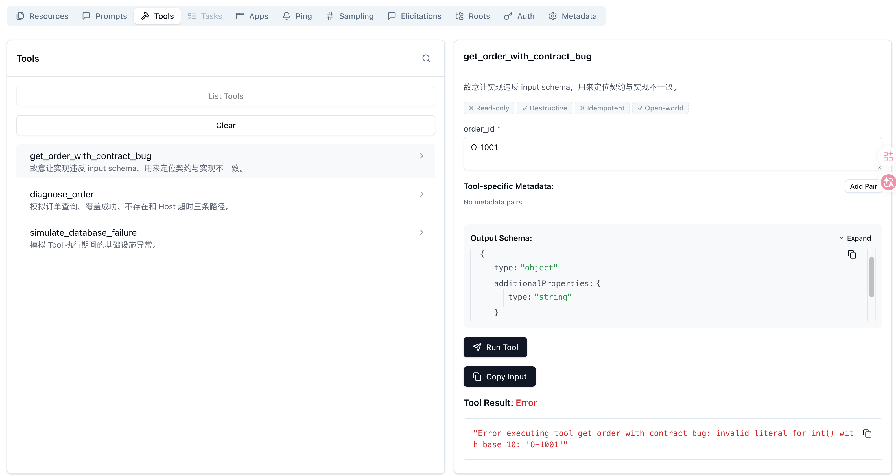
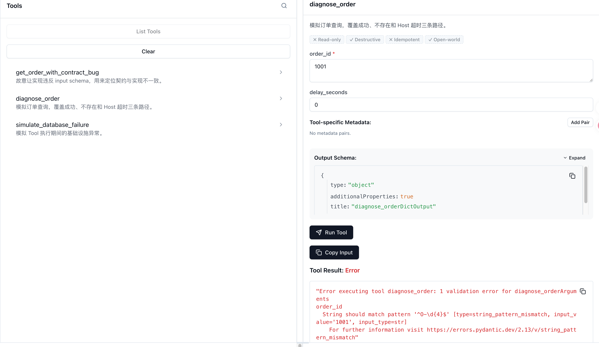
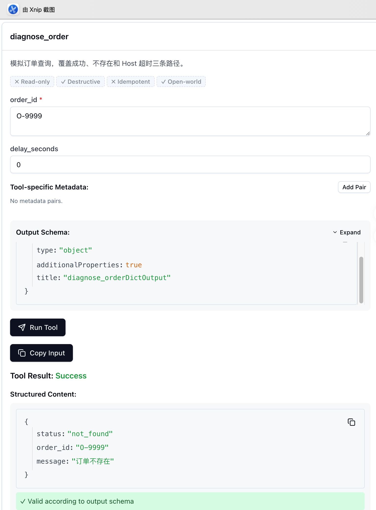
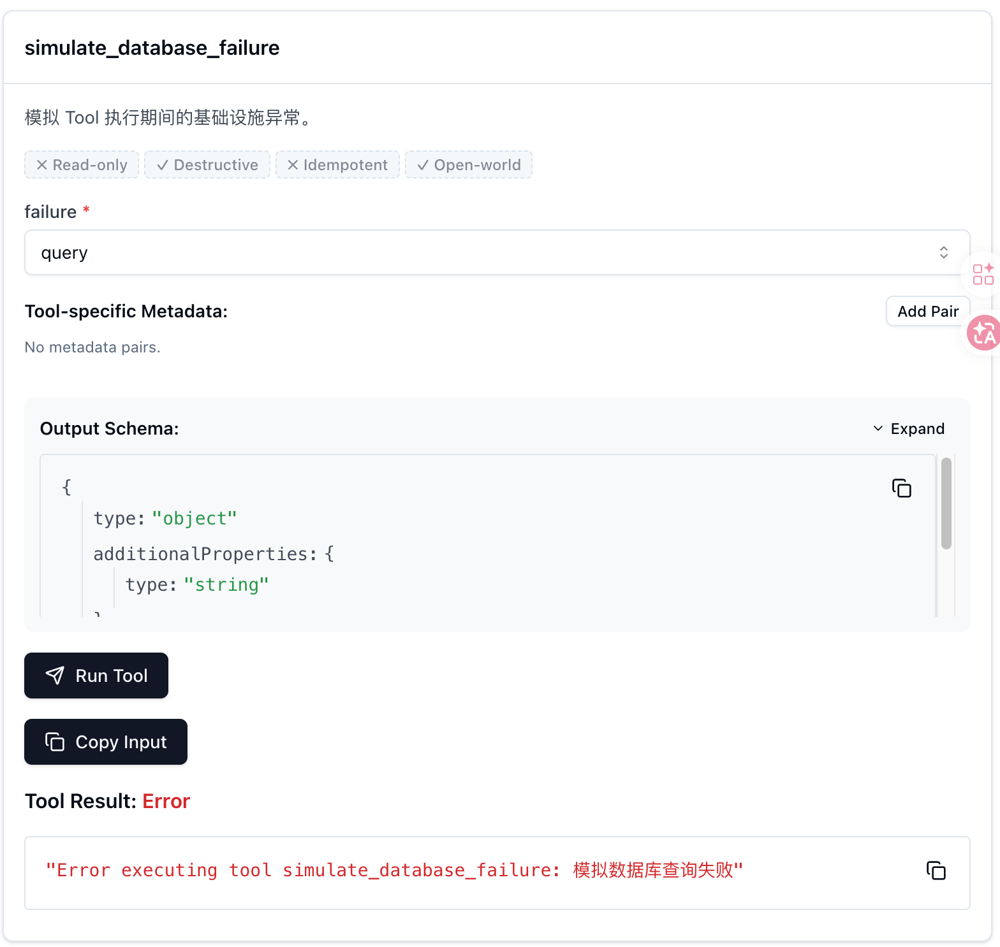

# MCP 调试：从 Server 启动失败到 Tool 调用异常

一次 MCP 调用失败，报错位置不一定就是故障位置。

Client 显示“连接失败”，可能是 Server 命令根本没有启动；Tool 返回错误，可能是参数没通过 schema，也可能是参数已经进入业务代码后才触发异常。要快速定位，关键不是收集更多日志，而是先判断请求走到了哪一层。

本文延续订单分析项目，用一组可重复运行的故障实验建立一条排查顺序：

```text
进程 → Transport → Lifecycle → Discovery → Execution
```

配套代码：

- `examples/debug_order_server.py`：提供会失败、会超时和会返回“订单不存在”的 Tool。
- `examples/debug_client.py`：逐个触发故障并打印最小诊断证据。
- `examples/broken_stdout_server.py`：把普通日志写入 stdout 的错误示例。

本文使用仓库锁定的 MCP Python SDK 1.28.1。涉及协议行为时，以 MCP 2025-11-25 规范和当前官方调试文档为准。

## 1. 先按调用进度分层

一条正常的 stdio 调用至少经过以下步骤：

```text
Host 启动 Server 子进程
  → 建立 stdin/stdout 消息通道
  → initialize 与能力协商
  → tools/list 发现 Tool 和 schema
  → tools/call 执行 Tool
  → Host 处理结果
```

因此，排查也应该沿同一方向进行：

| 层次 | 先问什么 | 最小证据 |
| --- | --- | --- |
| 进程 | Server 是否成功启动？ | 命令、绝对路径、退出码、stderr |
| Transport | MCP 消息能否完整传输？ | stdout 解析错误、HTTP 状态、session header |
| Lifecycle | `initialize` 是否完成？ | initialize 请求、响应和协商结果 |
| Discovery | Client 看到的能力是否正确？ | `tools/list` 返回的名称与 schema |
| Execution | 参数是否通过校验，业务代码是否成功？ | `tools/call` 参数、`isError`、Server 异常 |

不要一看到 Tool 调用失败就先查数据库。如果 `tools/list` 都没有成功，请求还没有走到数据库那一层。

## 2. 运行故障矩阵

在仓库根目录执行全部实验：

```bash
uv run labs/mcp/foundations/examples/debug_client.py all
```

也可以只运行一个场景：

```bash
uv run labs/mcp/foundations/examples/debug_client.py invalid-input
```

脚本提供七个场景：

| 场景 | 对应函数 | 故障位置 | 预期证据 |
| --- | --- | --- | --- |
| `startup` | `startup_failure()` | 进程 | `FileNotFoundError` |
| `stdout` | `stdout_pollution()` | Transport | Client 报 JSON-RPC 消息解析失败 |
| `schema-mismatch` | `schema_mismatch()` | Tool 实现 | 输入符合 schema，但结果 `isError: True` |
| `invalid-input` | `invalid_input()` | Tool 输入边界 | schema 校验失败，结果 `isError: True` |
| `not-found` | `not_found()` | 业务结果 | `isError: False`，`status: not_found` |
| `timeout` | `timeout()` | Host 等待策略 | Host 触发超时并取消等待 |
| `database` | `database_failure()` | Tool 依赖 | Tool 执行异常，结果 `isError: True` |

这张表不是错误名称速查表。它记录的是请求到达的位置：相同的界面提示，在不同 SDK 或 Host 中可能有不同包装方式，但调用进度仍然可以用证据判断。

## 3. 连接前的失败：进程与 Transport

### 3.1 Server 命令错误

对应代码：`debug_client.py` 中的 `startup_failure()`。

`startup` 场景把启动命令故意写成不存在的程序：

```python
await connect(stack, "command-that-does-not-exist", [])
```

第二个参数是操作系统要启动的可执行程序，不是 MCP Server 名称。系统中不存在 `command-that-does-not-exist`，因此会抛出 `FileNotFoundError`。此时 Server 进程尚未创建，MCP 通信也没有开始。

在本实验中，正确连接 `debug_order_server.py` 的写法是：

```python
async with AsyncExitStack() as stack:
    session = await connect(
        stack,
        sys.executable,
        [str(DEBUG_SERVER)],
    )
```

这表示使用当前 Python 解释器启动 Server 脚本，再通过子进程的 stdin/stdout 建立连接。三个启动参数分别是：

| 参数 | 含义 | 本实验示例 |
| --- | --- | --- |
| `command` | 要启动的可执行程序 | `sys.executable`，即当前 uv 环境使用的 Python |
| `args` | 传给可执行程序的参数列表 | `[str(DEBUG_SERVER)]`，即 Server 脚本的绝对路径 |
| `cwd` | Server 子进程启动后的工作目录 | `HERE`，即 `examples/` 目录 |

`connect()` 内部使用这些参数启动 Server、创建 Session 并完成初始化：

```python
parameters = StdioServerParameters(command=command, args=args, cwd=HERE)
read, write = await stack.enter_async_context(stdio_client(parameters))
session = await stack.enter_async_context(ClientSession(read, write))
await session.initialize()
```

优先检查：

1. `command` 是否存在；
2. Server 脚本路径是否正确；
3. `cwd` 和环境变量是否正确；
4. Server 单独运行时是否立即退出。

官方调试指南特别提醒：Client 启动的 stdio Server，其工作目录未必是项目目录。因此不能把“我在终端里能运行”当作 Host 也一定能运行的证据。

### 3.2 stdout 被普通日志污染

对应代码：`debug_client.py` 中的 `stdout_pollution()`。

stdio 模式把 Server 子进程的 stdout 当作 MCP 协议通道。`broken_stdout_server.py` 故意先输出普通文字：

```python
print("这是一条不应该出现在 stdout 的普通日志", flush=True)
```

Client 随即报告：

```text
Failed to parse JSONRPC message from server
Invalid JSON: expected value at line 1 column 1
```

在当前 SDK 中，这条坏消息被记录后，后续合法 MCP 消息仍可能继续处理。因此“最终连接成功”并不能证明 stdout 没有被污染。真正的证据是 Client 已经收到一行无法解析成 JSON-RPC 的内容。

stdio Server 的普通日志必须写 stderr。Streamable HTTP 则应结合 Server 日志、HTTP 状态、`Mcp-Session-Id` 和 SSE 流定位，不能照搬 stdio 的 stdout/stderr 结论。

## 4. 连接后的失败：Lifecycle 与 Discovery

如果进程存在、Transport 也能传消息，下一步先确认 `initialize` 是否完成。只有初始化和能力协商完成后，Client 才应该继续发现和调用能力。

这时最适合使用 Inspector：

```bash
npx -y @modelcontextprotocol/inspector \
  uv run labs/mcp/foundations/examples/debug_order_server.py
```

Inspector 的分工很明确：

- 连接面板验证启动参数和 Transport；
- Tools 页面查看名称、描述和 input schema；
- Tools 页面用最小参数复现调用；
- Notifications 页面查看 Server 日志与通知。

对应代码：`debug_client.py` 中的 `schema_mismatch()`。

例如 `get_order_with_contract_bug` 暴露的 schema 明确要求：

```json
{
  "order_id": "O-1001"
}
```

但实现却错误地执行：

```python
numeric_order_id = int(order_id)
```

调用参数符合发现阶段拿到的 schema，却在执行阶段报 `invalid literal for int()`。这说明问题不在 Client 参数生成，也不在 schema 校验器，而在 Tool 实现违反了自己公开的契约。



截图中的结果符合预期：Inspector 已经发现三个 Tools，`O-1001` 也被正常提交；错误发生在 `get_order_with_contract_bug` 执行期间，正好证明连接、初始化和能力发现都已完成。

排查这类问题时，应保存三份最小证据：

1. `tools/list` 返回的 Tool 定义；
2. 实际 `tools/call` 参数；
3. Tool 结果或 Server 端异常。

只截图最后一条报错，会丢掉最有价值的契约对照。

## 5. Tool 失败不等于业务失败

这个实验最重要的对照，是下面三种结果。

### 5.1 非法参数

对应代码：`debug_client.py` 中的 `invalid_input()`。

调用：

```json
{
  "order_id": "1001"
}
```

它不符合 `^O-\d{4}$`，因此在进入 `diagnose_order` 函数前就被参数校验拒绝。当前 FastMCP 将该失败包装为 Tool result：

```text
isError: True
String should match pattern '^O-\d{4}$'
```



Inspector 中的 `string_pattern_mismatch` 表明失败发生在输入校验阶段，`diagnose_order` 的业务代码尚未执行。

这里要区分协议规范与 SDK 表现。MCP Tool 规范区分两类错误：

- JSON-RPC error：未知 Tool、无效参数等协议或调用问题；
- Tool execution error：通过正常响应返回，并设置 `isError: true`。

本实验记录的是 MCP Python SDK 1.28.1 的实际包装行为，不能据此推断所有 Server 实现都会用完全相同的外层形态。调试时同时看 JSON-RPC 外层和 Tool result，不能只搜索 `error` 字段。

### 5.2 合法查询，但订单不存在

对应代码：`debug_client.py` 中的 `not_found()`。

调用：

```json
{
  "order_id": "O-9999"
}
```

参数合法，查询也正常完成，只是没有这笔订单。Server 返回：

```text
isError: False
structuredContent:
  status: not_found
  order_id: O-9999
```



“对象不存在”是可预期的业务分支，不应该伪装成数据库宕机或协议错误。结构化业务结果也让 Host 能稳定判断下一步，而不必从异常文本中猜测。

### 5.3 Tool 或依赖执行失败

对应代码：`debug_client.py` 中的 `database_failure()`。

`database` 场景在 Tool 内抛出模拟查询异常，结果为 `isError: True`。这说明请求已经完成初始化、能力发现和输入校验，排查范围可以直接缩小到 Tool 实现及其依赖。



日志应包含 Tool 名、耗时、结果状态和可关联的请求标识，但不要直接记录完整订单、数据库连接串、访问令牌或用户隐私。调试需要证据，不需要顺手制造一次数据泄露。

## 6. 超时与取消是谁的责任

对应代码：`debug_client.py` 中的 `timeout()`。

`diagnose_order` 可以模拟一秒查询：

```python
await asyncio.sleep(delay_seconds)
```

Client 只愿等待 0.2 秒：

```python
async with asyncio.timeout(0.2):
    await session.call_tool(
        "diagnose_order",
        {"order_id": "O-1001", "delay_seconds": 1},
    )
```

超时首先表达的是 Host 策略：Host 决定自己愿意等多久，并在超时后停止等待。它不自动证明 Server 已经崩溃，也不自动证明数据库执行失败。

定位超时时至少记录：

- Host 设置的 deadline；
- Tool 名和脱敏后的关键参数；
- Server 是否收到请求；
- Server 端实际耗时；
- 取消信号是否传递、业务操作能否安全停止。

尤其是带副作用的 Tool，Client 超时不等于操作没有发生。后续讨论 MCP 安全时，还会继续分析确认、幂等和审计边界。

## 7. 一份可执行的排查清单

遇到 MCP 调用失败时，按下面顺序收缩范围：

1. 直接验证 Server 命令、路径、工作目录和环境变量；
2. 查看进程退出码与 stderr，确认 Server 是否仍在运行；
3. 检查 Transport 证据：stdio 解析错误，或 HTTP 状态、session header 和流；
4. 对照 `initialize` 请求、响应与双方 capabilities；
5. 用 Inspector 或 Client 保存 primitive discovery 结果；
6. 对照 Tool schema、真实调用参数与 Tool result；
7. 区分非法输入、可预期业务结果和执行异常；
8. 对慢调用同时检查 Host deadline 与 Server 实际耗时；
9. 只保留足够复现的最小日志，并对凭据和业务数据脱敏。

调试的目标不是一次打开所有日志，而是回答一个更小的问题：

> 最后一段已经被证明确实正常的链路在哪里？

找到这个边界，再检查它后面的第一层，通常比从异常堆栈底部向上猜更快。

## 参考资料

- [MCP Debugging](https://modelcontextprotocol.io/docs/tools/debugging)
- [MCP Inspector](https://modelcontextprotocol.io/docs/tools/inspector)
- [MCP Tools specification](https://modelcontextprotocol.io/specification/2025-11-25/server/tools)
- [MCP Base protocol](https://modelcontextprotocol.io/specification/2025-11-25/basic)
