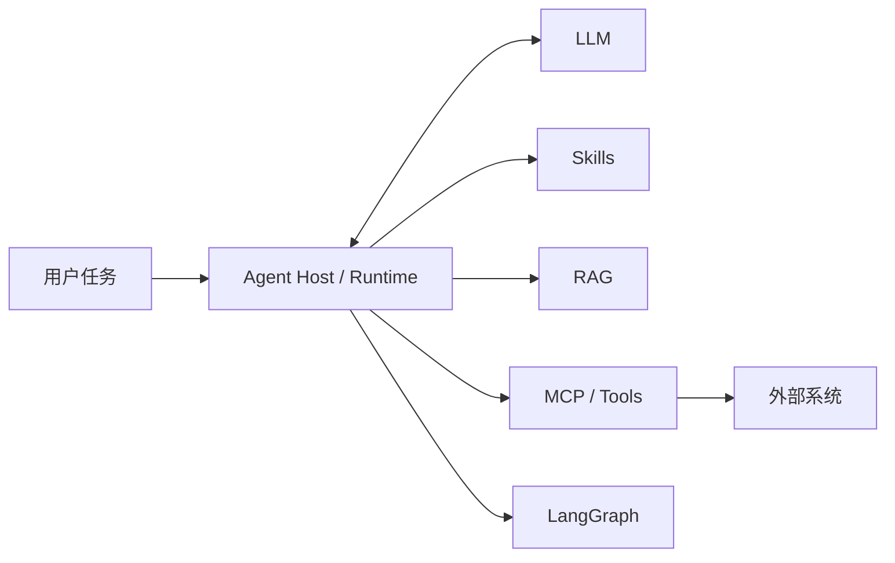

# 01 | Skills 的定位：它在 Agent 架构中解决什么问题

学 Skills 之前，先要弄清楚它在 Agent 系统里负责哪一块。

在工程实践里，Skill 最容易被误解成两种东西：一种是“更长的 Prompt”，另一种是“新的 Tool”。前者会把所有规则、模板和知识都塞进提示词；后者会把 Skill 当成外部动作入口，好像写了 Skill 就等于给模型新增了能力。

这篇文章先把边界放清楚：

> Skill 是面向任务方法的能力包。它描述一类任务什么时候触发、按什么步骤处理、需要读取哪些资料、可以调用哪些工具或脚本，以及最后怎样检查结果。

换句话说，Skill 关心的不是“模型会不会回答”，也不是“系统有没有某个工具”，而是 Agent 遇到一类重复任务时，应该按照什么方法完成。

## 一、一个数字运营助理要学什么

假设团队要养成一个 AI 数字运营助理。它每天面对的通常不是一次性闲聊，而是一批会反复出现的运营工作：整理会议纪要、生成周报、查询制度口径、更新任务系统、初筛合同或报销材料。

这些工作混在一起看，会发现里面至少有四类东西：

- 需要理解和生成：例如把会议记录整理成可读纪要。
- 需要查资料：例如确认某个报销规则或指标口径。
- 需要调用外部系统：例如读取文档、查询数据库、创建任务。
- 需要按流程推进：例如合同初筛要先抽取信息，再查风险条款，最后给出人工确认建议。

如果只靠一次 Prompt，每次都要重新解释背景、格式、检查清单和注意事项。只靠 Tool 也不够，因为 Tool 只说明“能做什么动作”，不说明“这个任务该怎么做”。只靠 RAG 也不够，因为检索能拿到资料，却不会自动形成稳定流程。

Skills 要沉淀的，就是这类可复用的任务方法。

它更像给新员工的工作手册：遇到某类工作时，先判断什么，再查什么资料，需要哪些工具参与，最后交付什么结果。办公软件、知识库和流程图都可能被它引用，但它本身关注的是做事方法。

## 二、用职责边界理解架构位置

先看一张简化图。它只说明职责分工，不表示 Agent 固定有这些层，也不表示一次请求必须从上到下逐层调用。



图里的中心是 `Agent Host / Runtime`。它接收用户任务，组织上下文，决定什么时候调用模型、什么时候加载 Skill、什么时候检索知识、什么时候调用工具，以及什么时候进入显式流程编排。

`LLM` 负责理解、推理和生成。它可以根据上下文生成回答，也可以提出工具调用意图，但它本身不拥有外部系统权限。

`Skills` 负责沉淀任务方法。它说明一类任务的触发条件、处理步骤、参考资料、可用脚本或工具，以及验收标准。

`RAG` 负责取回事实和背景资料。制度条款、产品说明、历史案例、数据库 schema，都更适合作为可检索上下文，而不是一股脑写进 Skill 正文。

`MCP / Tools` 负责暴露可调用动作。Tool 像一个可调用函数；MCP 则把 AI 应用连接外部系统的方式标准化，让 Host 可以发现能力、读取上下文、调用工具。

`LangGraph` 负责复杂流程的状态编排。只要任务需要多步骤状态、分支、回滚、持久化或人工确认，就可以考虑把流程放进图里运行。

所以，说 Skills 是“任务方法层”，不是在规定 Agent 有多少层。它只是说明 Skills 的职责：把一类任务的做法组织起来，让模型、知识、工具和流程编排能按同一套方法协作。

## 三、把 Skill 和几个相邻概念分清楚

### 1、Skill 和 Prompt

Prompt 适合表达当前这一次任务。例如：

```text
请把下面的会议记录整理成一份周报。
```

这句话能启动一次任务，但它没有沉淀“周报应该怎样写”这套方法。下一次换一段材料，用户可能还要重新补充周报结构、保留哪些信息、哪些内容不能编造、缺失数据怎么处理、输出前检查什么。

Skill 更适合保存这些长期规则。

一个 `writing-weekly-report` Skill 可以说明：什么请求会触发它，输入材料应该如何整理，输出结构是什么，哪些结论必须标注为推断，最后如何检查遗漏。用户下一次只要说“根据这些材料写周报”，Agent 就可以先判断是否命中这个 Skill，再加载完整流程。

Prompt 像临时交办，Skill 像岗位 SOP。二者都会影响模型输出，但一个服务当前请求，一个沉淀可复用方法。

### 2、Skill 和 Tool / MCP

Tool 和 MCP 回答的是“Agent 能调用什么”。比如读取文档、查询订单表、创建日历事件、发送邮件、调用审批接口。

但知道有哪些工具，并不等于知道任务该怎么做。

以“生成运营周报”为例，可用工具可能包括读取数据、查询任务系统、打开文档模板和保存文件。可这些工具并不会告诉 Agent：先读数据还是先读会议记录？周报按业务线、项目还是时间组织？缺失数据能不能补？哪些结论要标注为推断？输出前是否需要人工确认？

这些判断标准属于 Skill。

Tool / MCP 提供动作，Skill 规定方法。模型即使命中了某个 Skill，也只是拿到了任务流程说明；真正执行外部动作时，仍然要经过 Host、工具实现、MCP Server 和权限策略。

### 3、Skill 和 RAG

RAG 回答的是“事实去哪儿查”。当 Agent 不确定某个制度、指标、术语或历史案例时，可以从知识库取回相关资料。

Skill 回答的是“任务怎么做”。它可以要求 Agent 在某一步检索资料，也可以引用 `references/` 里的模板和规范，但 Skill 本身不应该变成知识库全文。

比如合同初筛任务里，风险条款清单、法务术语解释、历史案例可以交给 RAG 或 references；Skill 正文只保留流程：先抽取合同关键信息，再检索风险条款，再生成初筛意见，最后标注不确定项和人工确认点。

这样做有两个好处：Skill 更短，路由更清楚；资料可以独立更新，不必每次改流程文件。

### 4、Skill 和 LangGraph

LangGraph 适合承载复杂流程。

如果一个任务需要状态、分支、循环、人工确认或可恢复执行，LangGraph 可以把它显式画成节点和边。比如合同初筛可以拆成：接收合同、提取关键信息、检索风险条款、生成初筛意见、人工确认、输出报告。

Skill 更像这套流程的说明书。它告诉 Agent 什么请求应该进入合同初筛流程，每一步关注哪些输入输出，哪些工具调用必须确认，最终报告如何验收。

任务简单时，Skill 可以只是一段文本流程；任务复杂后，Skill 可以指向一个 LangGraph 实现。Skill 负责“何时用、用来做什么、如何验收”，LangGraph 负责“运行时怎么走”。

## 四、一句话讲给团队新人

可以把 Skills 理解成 Agent 使用的工作手册。

Prompt 说明这一次要做什么，Tool 和 MCP 提供外部能力，RAG 负责查资料，LangGraph 可以承载复杂状态流。Skill 把这些能力组织到一类任务里：什么时候触发，按什么步骤处理，需要读哪些参考资料，允许调用哪些脚本或工具，最后怎么检查结果。

它的价值来自方法沉淀：团队反复执行过的工作，不必每次都让 Agent 从零摸索。

## 五、本文小结

读完这篇文章，只需要先记住一个定位：Skill 管的是任务方法，不是事实知识，也不是外部动作本身。

| 组件 | 解决的问题 | 一句话理解 |
| --- | --- | --- |
| Prompt | 当前这次任务如何表达 | 临时交办 |
| Skill | 重复任务的方法如何沉淀和加载 | 工作手册 / 能力包 |
| RAG | 不确定事实去哪里查 | 知识检索 |
| Tool / MCP | Agent 能执行什么动作、如何连接外部系统 | 外部能力接口 |
| LangGraph | 复杂流程如何按状态推进 | 流程编排 |
| LLM | 如何理解、推理和生成 | 推理与生成核心 |

后续真正写 `SKILL.md` 时，要守住这个边界：资料和工具都服务于任务方法，不能反过来把 Skill 写成资料堆或工具清单。

下一篇进入最小规范：一个可以被发现和使用的 `SKILL.md`，至少应该包含什么。
